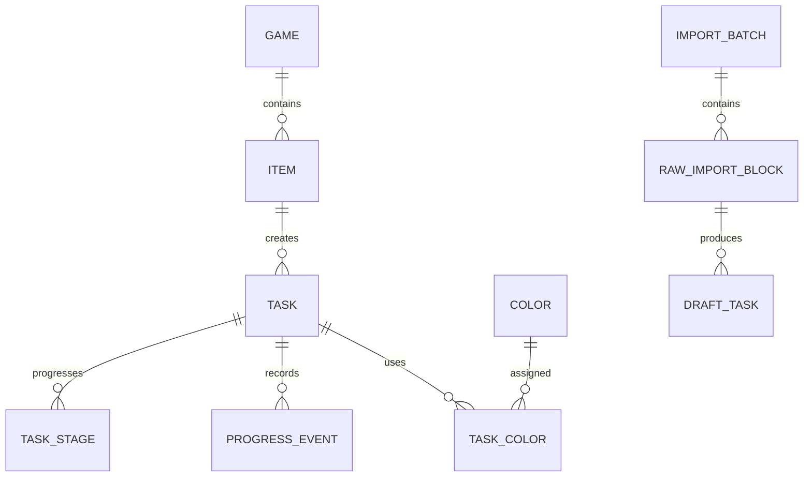

# PnP Üretim Takipçisi — Ana Uygulama Planı

> Sürüm: 1.0  
> Tarih: 2026-08-18  
> Durum: Uygulamaya hazır ana plan  
> İlk hedef: Garuda Linux üzerinde çalışan, yerel ve çevrimdışı masaüstü uygulaması

## 1. Bu belgenin amacı

Bu dosya, PnP masa oyunları için üretilecek 3D baskıları, kartları, mukavva parçalarını ve özel işleri tek uygulamada takip edecek ürünün tek kaynak planıdır. Ürün kararları, veri modeli, ekranlar, içe aktarma davranışları, mimari, testler ve geliştirme fazları bu dosyada tanımlanır.

Kod yazan yapay zekâ bu belgeyi aşağıdaki kurallarla uygulamalıdır:

- Fazları sırayla tamamla; gelecek sürüm özelliklerini ilk sürüme çekme.
- Belirsiz bir noktada kapsam genişletmek yerine bu belgedeki en basit davranışı uygula.
- Kullanıcı verisini sessizce kaybetme, tahminle kesinleştirme veya içe aktarma sırasında atlama.
- Her faz sonunda testleri çalıştır, sonuçları ve kalan riskleri raporla.
- Küçük, anlamlı ve geri alınabilir commitler oluştur.
- Yeni bağımlılık eklemeden önce mevcut standart kütüphanelerle çözüm olup olmadığını kontrol et.
- Kararlı sürümleri kullan; alpha/preview bağımlılıkları açık gerekçe olmadan kullanma.

## 2. Ürün özeti

Kullanıcı farklı masa oyunları için çok sayıda PnP üretim işi yapmaktadır. Aynı oyunda veya farklı oyunlarda aynı renkle basılacak 3D ögeler bulunabilir. Kartların basılması, lamine edilmesi ve kesilmesi; mukavva parçalarının basılması, yapıştırılması ve kesilmesi ayrı aşamalardır. Mevcut Excel listesinde oyun, görev, adet, renk, tamamlanma işaretleri ve notlar serbest metin biçiminde aynı hücrelerde tutulmaktadır.

Uygulama şu problemleri çözer:

- Hangi oyunda hangi ögeden kaç tane gerektiğini gösterir.
- Tüm oyunların 3D görevlerini renklere göre ortak havuzda toplar.
- Tek renk, renk varyantı, çok renkli ve alternatif renkli görevleri ayırır.
- Büyük tabla baskılarında “kaç tane bastım?” yerine “kaç tane eksik/hatalı kaldı?” yaklaşımını kullanır.
- Kart ve mukavva üretimini aşamalar halinde takip eder.
- Tamamlanan görevleri aktif havuzdan çıkarır fakat oyun kaydında ve geçmişte tutar.
- Excel/CSV verilerini ham biçimiyle içe alır ve kullanıcıya elle görev oluşturma imkânı verir.
- İnternet olmadan çalışır; ilk sürümde hesap, backend veya cihazlar arası eşitleme içermez.

## 3. Kesinleşmiş ürün kararları

### 3.1 Platform ve dağıtım

- İlk sürüm yalnızca Linux masaüstünde geliştirilecek ve doğrulanacak.
- Birincil geliştirme/çalıştırma ortamı Garuda Linux’tur.
- Uygulama çevrimdışı ve yerel veritabanıyla çalışacaktır.
- Windows, macOS ve Android ilk sürüm kapsamı dışındadır.
- Kod tabanı gelecekte Compose Multiplatform hedefleri eklenebilecek şekilde düzenlenecektir.

### 3.2 Veri kaynağı

- Excel yalnızca içe aktarma kaynağıdır.
- İlk içe aktarmadan sonra uygulama asıl veri kaynağı olur.
- Uygulama Excel ile çift yönlü senkronizasyon yapmaz.
- Aynı dosyanın yanlışlıkla iki kez içe aktarılmasını önlemek için dosya parmak izi ve içe aktarma kaydı tutulur.
- Kullanıcı isterse yeni bir Excel/CSV dosyasını ayrı bir içe aktarma işlemi olarak sonradan ekleyebilir; otomatik birleştirme yapılmaz.

### 3.3 Otomatik ayrıştırma

- Karmaşık Excel hücreleri otomatik olarak nihai görevlere parçalanmayacaktır.
- Hücrenin tam metni bir `RawImportBlock` olarak içe alınacaktır.
- Kullanıcı metinden istediği ifadeyi seçerek veya elle yazarak görev taslakları oluşturacaktır.
- Uygulama sütuna göre havuz önerisi, `**` tamamlanma işareti ve yeşil oyun hücresi gibi güvenli ipuçları sunabilir.
- İpucu hiçbir zaman kullanıcı onayı olmadan kesin görev verisine dönüşmemelidir.
- Çalışma zamanında bulut yapay zekâsı, API anahtarı veya yerel LLM gerekmeyecektir.

### 3.4 Havuzlar

Uygulamada dört üretim havuzu vardır:

1. **3D Baskı Havuzu**
2. **Kart Havuzu**
3. **Mukavva Havuzu**
4. **Özel Havuz**

Özel Havuz boşsa ana ekranda ve ana gezinmede gösterilmez. İlk özel görev oluşturulduğunda diğer havuzların yanında görünür.

### 3.5 Oyun ve görev tamamlanması

- Oyun tamamlanması kullanıcı tarafından ayrıca işaretlenir.
- Bir oyunun bütün görevlerinin tamamlanması oyunu otomatik tamamlamaz.
- Bir oyun tamamlanmış olsa bile o oyuna yeni üretim görevleri eklenebilir ve aktif kalabilir.
- Excel’de oyun adının hücresi yeşilse bu, içe aktarma sırasında “oyun tamamlandı” ipucu olarak alınır.
- Excel’de `**` ile biten renk veya öge ifadesi, ilgili görevin tamamlandığına dair ipucudur.
- Root ve Splendor gibi elle tutulmuş listedeki istisnalar nedeniyle bütün içe aktarma ipuçları onay ekranında değiştirilebilir olmalıdır.

## 4. Kapsam dışı özellikler

Aşağıdakiler ilk sürüme eklenmeyecektir:

- Kullanıcı hesabı, giriş veya yetkilendirme
- Backend, PostgreSQL veya FastAPI
- Cihazlar arası eşitleme
- Gerçek zamanlı ortak çalışma veya paylaşım bağlantıları
- Android, Windows veya macOS dağıtımı
- Filament stok, makara, gramaj, maliyet veya marka takibi
- Yazıcıya doğrudan iş gönderme
- STL dosyası yönetimi veya dilimleyici entegrasyonu
- Kart/board tasarlama ve düzenleme
- Bulut yapay zekâsıyla otomatik metin ayrıştırma
- Ayrı fiziksel alt parça modeli

## 5. Temel kavramlar ve veri modeli

### 5.1 Genel ilişki



### 5.2 Kimlikler ve silme

- Bütün kalıcı varlıkların kimliği uygulama tarafında üretilen UUID olmalıdır.
- Veritabanında auto-increment kimlikler domain kimliği olarak kullanılmamalıdır.
- Kullanıcı tarafından silinen oyun ve görevler hemen fiziksel olarak silinmemelidir.
- `deletedAt` alanı veya eşdeğer bir tombstone kullanılmalıdır.
- Kalıcı fiziksel temizleme yalnızca açık bir bakım işlemi olarak ve yedek alındıktan sonra yapılabilir.
- Bu tercih ilk sürümde eşitleme olmasa da gelecekte eşitleme eklenmesini kolaylaştırır.

### 5.3 Game

Önerilen alanlar:

- `id`
- `name`
- `notes`
- `isManuallyCompleted`
- `completedAt`
- `createdAt`
- `updatedAt`
- `deletedAt`
- `sourceImportBatchId`

Kurallar:

- Oyun tamamlanması yalnızca kullanıcı eylemi veya onaylanmış içe aktarma ipucuyla değişir.
- Alt görevlerin durumu oyun durumunu değiştirmez.
- Tamamlanan oyunlar gizlenmez; filtrelenebilir.

### 5.4 Item

`Item`, bir oyundaki mantıksal ögeyi temsil eder. Örnekler: Token, Kılıç, Survivor, Bird Cards, Player Board.

Önerilen alanlar:

- `id`
- `gameId`
- `name`
- `notes`
- `createdAt`
- `updatedAt`
- `deletedAt`

Bir `Item` bir veya daha fazla `Task` içerebilir. Renk varyantları aynı `Item` altında ayrı görevlerdir.

### 5.5 Task

Ortak görev alanları:

- `id`
- `itemId`
- `poolType`: `THREE_D`, `CARD`, `BOARD`, `SPECIAL`
- `trackingMode`: `THREE_D_BATCH`, `PIPELINE`, `CHECKLIST`, `COUNTED`
- `name`
- `requiredQuantity` — bilinmiyorsa `null`
- `notes`
- `isArchived`
- `createdAt`
- `updatedAt`
- `deletedAt`
- `sourceRawImportBlockId`

Görev durumu mümkün olduğunca temel alanlardan ve olaylardan türetilmelidir. Gösterim için cache tutulsa bile kaynak gerçek olaylar ve sayılardır.

### 5.6 Color

Renkler serbest metin yerine global kayıt olarak tutulur.

Önerilen alanlar:

- `id`
- `canonicalName`
- `hex`
- `aliases`
- `sortOrder`
- `isArchived`

Excel dosyasında görülen başlangıç renkleri:

- Beyaz
- Siyah
- Gri
- Kahverengi
- Kırmızı
- Sarı
- Yeşil
- Mavi
- Açık Mavi
- Turuncu
- Mor
- Pembe

Kurallar:

- `gri`, `Gri` ve `GRİ` aynı kanonik renge eşlenmelidir.
- Renk adıyla birlikte renk örneği gösterilmelidir; anlam yalnızca görsel renge bırakılmamalıdır.
- Kullanıcı yeni renk ekleyebilir, adını/hex değerini düzenleyebilir ve kullanılmayan rengi arşivleyebilir.
- İlk sürümde renk gruplaması yalnızca renge göre yapılır; filament malzemesi gruplamaya dâhil değildir.

### 5.7 TaskColor

Bir görevin renk ilişkisi aşağıdaki biçimlerden biridir:

- `REQUIRED`: Renk bu görevin zorunlu rengidir.
- `ALTERNATIVE`: Kullanılabilecek renk seçeneklerinden biridir.

Kurallar:

- Tek renkli görev: bir `REQUIRED` renk.
- Çok renkli görev: birden fazla `REQUIRED` renk ve tek görev sayacı.
- Alternatif renkli görev: birden fazla `ALTERNATIVE` renk; aktif havuza girmeden önce kullanıcı birini seçer.
- Renk varyantları: aynı `Item` altında, her biri bir zorunlu renge ve kendi adedine sahip ayrı `Task` kayıtları.
- Ayrı fiziksel parça modeli yoktur. Kullanıcı bıçak ve kabzayı ayrı takip etmek isterse bunları iki bağımsız görev olarak ekler.

Örnekler:

```text
Token
├── Gri token — 14 adet — REQUIRED[Gri]
├── Sarı token — 15 adet — REQUIRED[Sarı]
└── Yeşil token — 15 adet — REQUIRED[Yeşil]

Kılıç
└── Kılıç — 10 adet — REQUIRED[Gri, Siyah]

Whale
└── Whale — 5 adet — ALTERNATIVE[Mavi, Açık Mavi]
    Seçilen baskı rengi: Açık Mavi
```

## 6. 3D baskı ilerleme modeli

### 6.1 Neden “basılan adet” girilmez?

Kullanıcı aynı tablaya 30–40 parça yerleştirebilir. Bu nedenle `+5 basıldı`, `+6 basıldı` biçimi ana kullanım değildir. Ana senaryo, bütün gerekli parçaların bir baskı denemesinde üretilmesi ve yalnızca eksik/hatalı parçaların bildirilmesidir.

### 6.2 Alanlar

3D görev ayrıntısı aşağıdaki bilgileri tutar:

- `primaryBatchCompleted`: ana tabla baskısı yapıldı mı?
- `currentMissingQuantity`: hâlen yeniden basılması gereken miktar
- `failureTotal`: geçmişte bildirilen toplam hatalı/eksik baskı; olaylardan türetilir
- `manualCompletionOverride`: yalnızca adedi bilinmeyen eski görevlerde kullanılabilir

Başlangıç davranışı:

- Yeni görev `NOT_STARTED` durumundadır.
- `currentMissingQuantity` başlangıçta `0` olur; çünkü bu alan “henüz basılmayan toplam” değil, baskı sonrasında eksik/hatalı kalan miktardır.
- Kullanıcı ana baskıyı tamamlayınca `primaryBatchCompleted = true` olur.
- Ana baskı tamamlandı ve eksik miktar `0` ise görev tamamlanır.

### 6.3 Eylemler

#### Ana baskıyı tamamla

- `primaryBatchCompleted` değerini etkinleştirir.
- Eksik miktar sıfırsa görev aktif havuzdan çıkar.
- Görev oyun kaydında ve geçmişte kalır.

#### Eksik/hatalı bildir

- Görev satırındaki küçük bir hızlı eylem düğmesiyle sayı seçilir.
- Seçilen sayı `currentMissingQuantity` değerine eklenir.
- Aynı miktarda bir `FailureReported` olayı oluşturulur.
- İsteğe bağlı not girilebilir.
- Ana baskı daha önce tamamlandı olarak işaretlenmemişse, eksik/hata bildirimi baskı denemesi yapıldığını varsayar ve `primaryBatchCompleted` değerini etkinleştirir.
- Görev `NEEDS_REPRINT` durumuna döner veya bu durumda kalır.
- Eylem tamamlanan görevlerin geçmiş görünümünde de kullanılabilir; yeni bir eksik/hata bildirimi görevi yeniden aktif havuza taşır.

#### Eksik giderildi

- Kullanıcı yeniden basılan başarılı miktarı seçer.
- Seçilen sayı `currentMissingQuantity` değerinden düşülür.
- Değer sıfırın altına inemez.
- Eksik miktar sıfıra indiğinde görev tamamlanır.
- Geçmiş hata toplamı silinmez.

### 6.4 Türetilen değerler

Gerekli adet biliniyorsa ve ana baskı tamamlandıysa:

```text
hazırAdet = gerekliAdet - mevcutEksikAdet
```

Kurallar:

- `currentMissingQuantity`, gerekli adedi aşamaz.
- `failureTotal`, tekrar tekrar yapılan hatalı baskılar nedeniyle gerekli adedi aşabilir.
- Gerekli adet bilinmiyorsa görev `BILGI_EKSIK` durumunda tutulabilir veya kullanıcı manuel tamamlanma kullanabilir.
- Tamamlanma durumu ayrı, bağımsız ve kolayca tutarsızlaşabilecek bir boolean olarak saklanmamalıdır; yukarıdaki verilerden türetilmelidir.

## 7. Kart üretim hattı

### 7.1 Kart grupları

Aynı oyundaki farklı kart türleri ayrı görevler olabilir:

```text
Wingspan
├── Bird Cards — 170 adet
└── Bonus Cards — 26 adet
```

Kullanıcı Excel’deki tek hücreyi içe aktardıktan sonra bu grupları elle ayırır.

### 7.2 Sabit aşamalar

Kart görevleri üç aşamalıdır:

1. Basıldı
2. Lamine edildi
3. Kesildi

Her aşama ayrı tamamlanan adet tutar.

Kurallar:

```text
0 <= kesilen <= lamineEdilen <= basılan <= toplam
```

- Sonraki aşamadaki adet önceki aşamayı geçemez.
- Bütün aşamalar toplam adede ulaştığında kart görevi tamamlanır.
- Aşama başına eksik sayı `toplam - aşamaTamamlanan` olarak türetilir.
- Toplam adet bilinmiyorsa kullanıcı önce toplamı girmeli veya görevi checklist moduna çevirmelidir.

### 7.3 Açılır rozet

Dar görev satırında küçük bir rozet gösterilir:

```text
Bird Cards
[Laminasyon: 167/170 · 3 eksik]
```

Rozet tıklanınca genişler ve üç aşamanın sayaçları düzenlenebilir:

```text
Basıldı        170/170
Lamine edildi  167/170
Kesildi        150/170
```

Rozet şu aşamayı göstermelidir:

- İlk tamamlanmamış aşama, veya
- Bütün aşamalar tamamlandıysa `Tamamlandı`.

### 7.4 Eksik kart ayrıntıları

Kart görevine isteğe bağlı eksik kart kayıtları eklenebilir:

- Kart adı veya numarası
- Adet
- Hangi aşamada fark edildiği
- Not
- Çözüldü durumu

Yalnızca eksik sayıyı tutmak da geçerlidir; isim/numara zorunlu değildir.

## 8. Mukavva üretim hattı

Mukavva görevleri üç aşamalıdır:

1. Basıldı
2. Yapıştırıldı
3. Kesildi

Kart görevleriyle aynı genel `TaskStage` altyapısını kullanır. Ayrı kod yolları yerine kategoriye göre aşama şablonu seçilmelidir.

Kurallar:

```text
0 <= kesilen <= yapıştırılan <= basılan <= toplam
```

Örnekler:

- Board
- Player board
- Tile
- Mukavva token
- Factory display

Kart havuzundaki açılır rozet davranışı mukavva havuzunda da kullanılmalıdır.

## 9. Özel havuz

Özel havuz aşağıdaki gibi standart üç üretim hattına girmeyen görevleri tutar:

- Zar
- Zarf
- Bez çanta
- Scoresheet
- Standee aparatı
- Diğer el işi veya satın alma görevleri

Davranış:

- Özel görevler checklist veya adetli görev olabilir.
- Henüz hiç silinmemiş özel görev yokken Özel havuz ana gezinmede ve ana ekran özetlerinde görünmez.
- İlk özel görev oluşturulduğunda otomatik görünür.
- Son özel görev tamamlandığında havuz görünür kalır ve aktif görev sayısını `0` gösterir.
- Havuz ancak içindeki tüm görevler silinirse veya kullanıcı havuzu açıkça gizlerse yeniden saklanır; geçmiş kayıtlar silinmez.

## 10. Eksik ve ödünç parça işaretleri

`Eksik` ve `Ödünç Parçalar` birer üretim havuzu değildir. Bunlar görev üzerinde bayrak/bağlamdır:

- `MISSING`
- `BORROWED`
- `NEEDS_INFO`
- `NEEDS_CLASSIFICATION`

İçe aktarma sırasında:

- `Eksik` sütunundaki ham metin görev taslağına `MISSING` bayrağıyla gelir.
- `Ödünç Parçalar` sütunundaki ham metin `BORROWED` bayrağıyla gelir.
- Kullanıcı görevi 3D, Kart, Mukavva veya Özel havuza yerleştirir.
- Metinden güvenli biçimde tür belirlenemiyorsa görev `NEEDS_CLASSIFICATION` olarak kalır ve hiçbir üretim havuzuna sessizce eklenmez.

## 11. Excel ve CSV içe aktarma

### 11.1 Referans dosya

İlk gerçek kaynak dosya: `Kitap1(1).xlsx`

Mevcut sütunlar:

| Kaynak sütun | Varsayılan yorum |
|---|---|
| Oyun adı | `Game` |
| 3D Print (Figür vb.) | 3D görev ham blokları |
| Laminasyon (Kart vb.) | Kart görev ham blokları |
| Mukavva (Board, Token vb.) | Mukavva görev ham blokları |
| Özel | Özel görev ham blokları |
| Eksik | `MISSING` bayraklı, sınıflandırılacak ham bloklar |
| Ödünç Parçalar | `BORROWED` bayraklı, sınıflandırılacak ham bloklar |

Boş görev hücreleri görev oluşturmaz fakat oyun satırı yine içe aktarılabilir.

### 11.2 ImportBatch

Her içe aktarma işlemi aşağıdakileri kaydeder:

- Dosya adı
- SHA-256 dosya parmak izi
- İçe aktarma tarihi
- Sayfa adı
- Algılanan satır/sütun aralığı
- Oluşturulan oyun, ham blok ve görev sayıları
- Durum: `DRAFT`, `CONFIRMED`, `ROLLED_BACK`

Kullanıcı onaylamadan önce bütün içe aktarma taslak olarak kalır.

### 11.3 RawImportBlock

Her dolu kaynak hücre için:

- Orijinal hücre metni
- Dosya/sayfa/satır/sütun bilgisi
- Kaynak sütun türü
- Hücre biçiminden gelen ipuçları
- Kullanıcının oluşturduğu görev taslakları
- İşlenmemiş kalan metin aralıkları

tutulur.

Orijinal metin hiçbir zaman sessizce değiştirilmez veya kaybedilmez.

### 11.4 İçe aktarma inceleme ekranı

Önerilen düzen:

```text
┌──────────────────────────────┬──────────────────────────────┐
│ Kaynak hücrenin ham metni    │ Oluşturulan görev taslakları │
│                              │                              │
│ Kullanıcı metni seçebilir    │ Ad / havuz / renk / adet     │
│ veya satıra tıklayabilir     │ durum / not                  │
└──────────────────────────────┴──────────────────────────────┘
```

İşlemler:

- Seçili metinden görev oluştur
- Elle boş görev oluştur
- Görevi bir havuza ata
- Renk veya alternatif renk seç
- Adet gir veya bilinmiyor olarak bırak
- `**` ipucunu kabul et/reddet
- Yeşil oyun hücresi ipucunu kabul et/reddet
- Görevi mevcut bir `Item` altına bağla
- Ham bloğu işlendi olarak işaretle
- İçe aktarma grubunu topluca onayla veya geri al

### 11.5 Excel biçim işaretleri

- `**` tamamlanma ipucudur; gösterim adından temizlenir.
- Yeşil oyun hücresi oyun tamamlanma ipucudur.
- Mavi, turuncu, kırmızı gibi yazı renkleri yalnızca insanın renk bilgisini daha kolay görmesi için kullanılmıştır.
- Yazı rengi kaynak gerçek değildir; metindeki renk adı ve kullanıcının onayı esas alınır.
- Renkli yazı ile metindeki renk uyuşmazsa kullanıcıya uyarı gösterilebilir.

### 11.6 Alternatif renk ifadeleri

Aşağıdaki ifadeler çok renkli görev olarak yorumlanmaz:

- `Mavi/Açık Mavi`
- `Beyaz/Gri`
- `Açık Mavi veya Mavi`

Bunlar alternatif renk seçenekleridir. Kullanıcı gerçek baskı rengini seçene kadar görev 3D renk havuzuna girmez ve `Renk seçilecek` listesinde kalır.

### 11.7 Bilinmeyen veya belirsiz değerler

Uygulama aşağıdakileri desteklemelidir:

- Rengi bilinmeyen görev
- Adedi bilinmeyen görev
- “Sayısına bakılacak” notu
- “Basmışken çok bas” gibi kesin olmayan miktar
- “5 farklı renk” denmiş fakat renkleri yazılmamış görev
- Aynı hücrede birden fazla görev ve not

Bu kayıtlar `NEEDS_INFO` olarak işaretlenir. Gerekli bilgi tamamlanmadan ilgili aktif havuza eklenmeleri isteğe bağlı olarak engellenebilir; varsayılan davranış engellemektir.

### 11.8 CSV

CSV içe aktarma desteklenir fakat Excel biçim ipuçları bulunmaz. En az şu kolonlar tanınmalıdır:

```text
game,source_type,raw_text
```

Gelecekte yapılandırılmış dışa aktarma için şu kolonlar kullanılabilir:

```text
game,item,task,pool,color_mode,colors,required_quantity,status,notes
```

## 12. Kullanıcı arayüzü ve gezinme

### 12.1 Masaüstü düzeni

Birincil masaüstü gezinmesi sol kenar çubuğu veya eşdeğer geniş ekran navigasyonu kullanır:

- Ana Sayfa
- Oyunlar
- 3D Baskı
- Kartlar
- Mukavva
- Özel — en az bir silinmemiş özel görev varsa
- İçe Aktarma
- Geçmiş
- Renkler
- Ayarlar

### 12.2 Ana sayfa

Ana sayfanın üst bölümünde oyunlar bulunur:

- Arama
- Yeni oyun
- Excel/CSV içe aktar
- Aktif oyunlar
- Tamamlanan oyunlar
- Son kullanılan veya sabitlenen oyunlar

Oyunların altında havuz özetleri bulunur:

```text
3D Baskı
• Aktif görev sayısı
• Yeniden basılması gereken eksik/hatalı parça sayısı
• Renk kararı bekleyen görev sayısı

Kartlar
• Baskı bekleyen
• Laminasyon bekleyen
• Kesim bekleyen

Mukavva
• Baskı bekleyen
• Yapıştırma bekleyen
• Kesim bekleyen

Özel
• Yalnızca boş değilse gösterilir
```

Özet kartına tıklamak ilgili havuza götürür.

### 12.3 Oyunlar ekranı

- Oyun adına göre arama
- Aktif/tamamlanan filtresi
- Manuel tamamla/yeniden aç eylemi
- Oyun başına aktif ve tamamlanan görev sayıları
- Oyun detayına geçiş

### 12.4 Oyun detay ekranı

- Oyun başlığı ve manuel tamamlanma durumu
- Notlar
- Havuzlara göre görev bölümleri
- Yeni görev ekleme
- Ham içe aktarma kaynağına geri dönme
- Tamamlanan görevleri göster/gizle
- Oyun silme/arşivleme

### 12.5 3D Baskı Havuzu

Aktif görevler aşağıdaki sırayla gösterilir:

1. Renk seçimi gereken görevler
2. Tek renkli görevler — kanonik renge göre gruplu
3. Çok renkli görevler — ayrı bölüm

Her renk grubunda:

- Renk adı ve örneği
- Gruptaki görev sayısı
- İlgili toplam gerekli adet
- Eksik/hatalı yeniden baskı adedi
- Oyun / öge / görev satırları

Görev satırı:

- Oyun adı
- Öge/görev adı
- Gerekli adet
- Ana baskı durumu
- Mevcut eksik adet
- Toplam hata kaydı
- `Ana baskıyı tamamla`
- `Eksik/hatalı bildir`
- `Eksik giderildi`

Tamamlanan görev aktif listeden çıkar; `Tamamlananları göster` filtresiyle görülebilir.

### 12.6 Kart Havuzu

- Oyuna göre gruplanabilir.
- İlk tamamlanmamış aşamaya göre filtrelenebilir.
- Görev satırında açılır aşama rozeti bulunur.
- Eksik kart adı/numarası eklenebilir.
- Toplam ve aşama sayaçları hızlı düzenlenebilir.

### 12.7 Mukavva Havuzu

- Kart havuzuyla benzer görünür.
- Aşamalar `Basıldı`, `Yapıştırıldı`, `Kesildi` olarak sabittir.
- Board, tile ve token türüne göre filtre isteğe bağlıdır.

### 12.8 Özel Havuz

- Checklist ve adetli görevleri destekler.
- Boşken görünmez.
- Görevlerin oyun bağlantısı açıkça gösterilir.

### 12.9 Geçmiş

Geçmiş ekranı en az şunları gösterir:

- Tamamlanan görevler
- 3D eksik/hatalı baskı kayıtları
- Eksik giderme hareketleri
- Kart/mukavva aşama değişiklikleri
- İçe aktarma ve geri alma işlemleri
- Silinen/arşivlenen kayıtlar

## 13. Arama, filtreleme ve sıralama

İlk sürümde:

- Oyun, öge ve görev adında metin arama
- Havuz filtresi
- Renk filtresi
- Aktif/tamamlandı/bilgi eksik filtresi
- `MISSING` ve `BORROWED` bayrak filtresi
- 3D görevlerinde eksik/hatalı baskısı olanları öne alma
- Kart/mukavvada ilk tamamlanmamış aşamaya göre filtreleme

bulunmalıdır.

Varsayılan sıralama:

- Renk grupları kullanıcının renk sırasına göre
- Grup içinde önce eksik/hatalı baskılar, sonra oyun adı ve görev adı
- Kart/mukavvada üretim hattında daha ileride olan görevler değil, sıradaki işi yapılabilir olan görevler öne çıkar

## 14. Mimari ve teknoloji seçimi

### 14.1 İstemci

- Kotlin
- Compose Multiplatform
- İlk etkin hedef: JVM Desktop/Linux
- Ortak domain ve veri katmanı `commonMain` altında
- Linux dosya sistemi, Excel okuma ve paketleme kodu `desktopMain` altında
- Coroutines ve Flow
- Compose Multiplatform Navigation veya uyumlu kararlı gezinme çözümü
- Basit constructor tabanlı dependency injection; başlangıçta ağır DI framework’ü ekleme

### 14.2 Yerel veri

- Room KMP
- Bundled SQLite sürücüsü
- Şema dışa aktarma ve migration testleri
- Veritabanı yolu Linux XDG dizin kurallarına uymalıdır.
- Geçici dizine veya proje klasörüne kullanıcı verisi yazılmamalıdır.

Önerilen yerler:

```text
$XDG_DATA_HOME/pnp-tracker/pnp.db
$XDG_DATA_HOME/pnp-tracker/backups/
$XDG_CONFIG_HOME/pnp-tracker/settings.json
```

XDG değişkeni tanımlı değilse standart kullanıcı dizini fallback’i kullanılmalıdır.

### 14.3 Excel/CSV

- JVM masaüstünde `.xlsx` okumak için Apache POI veya eşdeğer olgun JVM kütüphanesi
- Hücre metni, satır/sütun, sayfa, dolgu rengi ve gerektiğinde rich-text bilgisi okunabilmeli
- CSV için küçük, test edilebilir ve RFC uyumlu ayrıştırıcı
- Kaynak dosya hiçbir zaman yerinde değiştirilmemeli

### 14.4 Yedekleme ve dışa aktarma

- Uygulama verisi sürümlü JSON olarak dışa aktarılabilir.
- Kullanıcı manuel yedek oluşturabilir.
- Büyük içe aktarma ve migration öncesinde otomatik snapshot alınır.
- En az son birkaç otomatik snapshot döngüsel biçimde korunur; kesin sayı ayarlardan değiştirilebilir veya başlangıçta 7 olabilir.
- Yapılandırılmış görevler CSV olarak dışa aktarılabilir.

### 14.5 Ağ

- İlk sürümde uygulama hiçbir ağ servisine ihtiyaç duymaz.
- Telemetri varsayılan olarak yoktur.
- Gelecekte senkronizasyon eklenebilmesi için repository ve domain katmanı UI’dan ayrılır; ancak kullanılmayan backend soyutlamaları şimdiden yazılmaz.

### 14.6 Teknik doğrulama kaynakları

Kütüphane sürümleri geliştirmeye başlanırken uyumluluk matrisiyle birlikte sabitlenmelidir. Mimari kararlar için birincil başvuru kaynakları:

- [Compose Multiplatform masaüstü dağıtımları](https://kotlinlang.org/docs/multiplatform/compose-native-distribution.html)
- [Room KMP kurulumu ve JVM Desktop desteği](https://developer.android.com/kotlin/multiplatform/room)
- [Apache POI HSSF/XSSF kullanım rehberi](https://poi.apache.org/components/spreadsheet/quick-guide.html)

## 15. Önerilen modül/dizin yapısı

```text
app/
  src/commonMain/
    app/
    domain/
      model/
      rules/
      repository/
      usecase/
    data/
      database/
      repository/
      backup/
    feature/
      home/
      games/
      printpool/
      cards/
      board/
      special/
      importreview/
      history/
      colors/
      settings/
    ui/
      components/
      theme/
      navigation/
  src/desktopMain/
    platform/
      files/
      xlsx/
      packaging/
  src/commonTest/
  src/desktopTest/
```

Tek modülle başlanabilir. Kod büyümeden gereksiz Gradle modüllerine ayrılmamalıdır.

## 16. Dayanıklılık kuralları

- Bütün yazma işlemleri transaction içinde yapılmalıdır.
- Aynı olay iki kez uygulanmamalıdır; progress olaylarının benzersiz UUID’si bulunmalıdır.
- `currentMissingQuantity` ve aşama sayaçları negatif olamaz.
- Kart/mukavva aşama sırası bozulamaz.
- Silinen renk kullanımda ise fiziksel olarak kaldırılamaz; arşivlenir.
- İçe aktarma sırasında tek bir hücredeki hata bütün dosya aktarımını kaybettirmemelidir.
- Uygulama kapanırsa onaylanmamış import taslağı yeniden açılabilmelidir.
- Import rollback yalnızca ilgili import batch’in oluşturduğu kayıtları hedeflemelidir.
- Kullanıcının sonradan düzenlediği kayıtlar geri alma sırasında sessizce silinmemeli; uyarı veya korumalı rollback uygulanmalıdır.

## 17. Erişilebilirlik ve kullanım kuralları

- Renk hiçbir zaman tek bilgi taşıyıcısı olmamalıdır; her renk örneğinin yazılı adı bulunmalıdır.
- Klavye ile bütün ana eylemlere ulaşılabilmelidir.
- Odak sırası ve görünür odak göstergesi bulunmalıdır.
- Metin ölçekleme ve yüksek DPI ekranlar desteklenmelidir.
- Sayaç düğmelerinin erişilebilir adları olmalıdır.
- Silme, import rollback ve büyük toplu değişikliklerde onay istenmelidir.
- Türkçe karakterlerde büyük/küçük harf normalizasyonu doğru yapılmalıdır.
- Uygulama metinleri kaynak dosyalarında tutulmalı, UI içine dağınık biçimde hardcode edilmemelidir.
- İlk dil Türkçedir; yapı gelecekte başka dil eklemeyi engellememelidir.

## 18. Üç geliştirme fazı

### Faz 1 — Temel, veri modeli ve içe aktarma çekirdeği

#### Amaç

Linux’ta çalışan uygulama iskeletini, kalıcı domain modelini ve en riskli özellik olan Excel/ham metin inceleme akışını doğrulamak.

#### İşler

1. Compose Multiplatform JVM Desktop projesini oluştur.
2. Kararlı Kotlin/Compose/Room sürümlerini version catalog ile sabitle.
3. Linux XDG veri/config dizinlerini uygula.
4. Room KMP veritabanını ve ilk migration şemasını oluştur.
5. `Game`, `Item`, `Task`, `Color`, `TaskColor`, `ImportBatch`, `RawImportBlock`, `DraftTask` tablolarını ekle.
6. UUID üretimi, timestamp ve soft-delete ortak altyapısını kur.
7. Temel masaüstü pencere, tema ve navigasyon iskeletini oluştur.
8. Excel dosya seçme ve çalışma sayfası okuma akışını uygula.
9. `Kitap1(1).xlsx` yapısını fixture/test girdisi olarak destekle; kişisel dosyanın kendisini repoya koyma, anonimleştirilmiş küçük fixture oluştur.
10. Satırdaki oyun adını ve bütün dolu hücreleri `RawImportBlock` olarak kaydet.
11. Sütun türüne göre önerilen havuzu belirle.
12. `**` ve yeşil hücre ipuçlarını algıla fakat kullanıcı onayına kadar uygulama.
13. İki bölmeli içe aktarma inceleme ekranının çalışan prototipini yap.
14. Ham metinden manuel seçim/elle yazma yoluyla görev taslağı oluştur.
15. Import batch’i onaylama, taslak olarak kapatma ve yeniden açmayı uygula.
16. Oyun listesi ve manuel oyun tamamlanma durumunu temel düzeyde göster.

#### Faz 1 testleri

- Veritabanı oluşturma ve yeniden açma
- UUID benzersizliği
- Soft delete filtreleri
- Excel satır/sütun eşlemesi
- Çok satırlı hücrelerin eksiksiz korunması
- Boş hücrelerin görev oluşturmaması
- `**` ipucunun algılanması ve metinden temizlenmesi
- Yeşil oyun hücresi ipucunun algılanması
- Aynı dosyanın parmak iziyle tekrar tanınması
- Import taslağının uygulama yeniden açılınca devam etmesi
- Import onayının transaction içinde tamamlanması

#### Faz 1 tamamlanma ölçütü

- Uygulama Garuda Linux’ta açılır.
- Referans yapısındaki Excel dosyası okunur.
- Hiçbir dolu hücre veya ham metin kaybolmaz.
- Kullanıcı en az bir ham bloktan elle görev taslağı oluşturup oyuna kaydedebilir.
- Uygulama kapatılıp açıldığında oyunlar, ham bloklar ve taslaklar korunur.
- Test ve lint kontrolleri başarılıdır.

### Faz 2 — Üretim havuzları ve tam günlük kullanım

#### Amaç

Uygulamanın Excel’den bağımsız olarak günlük üretim takibinde kullanılabilir hâle gelmesi.

#### İşler

1. Ana sayfayı oyunlar üstte, havuz özetleri altta olacak şekilde tamamla.
2. Oyun listesi ve oyun detay ekranını tamamla.
3. Manuel tek görev ve toplu görev ekleme akışını oluştur.
4. Global renk kataloğunu ve renk yönetimini uygula.
5. Tek renk, renk varyantı, çok renkli ve alternatif renk davranışlarını uygula.
6. Alternatif renk seçilmeden görevin renk havuzuna girmemesini sağla.
7. 3D Baskı Havuzunu renk grupları ve ayrı çok-renkli bölümle tamamla.
8. `Ana baskıyı tamamla`, `Eksik/hatalı bildir` ve `Eksik giderildi` eylemlerini uygula.
9. Hata/eksik geçmişini ve isteğe bağlı notu uygula.
10. Kart Havuzunu üç aşamalı sayaç ve açılır rozetle oluştur.
11. Eksik kart adı/numarası kayıtlarını ekle.
12. Mukavva Havuzunu üç aşamalı sayaç ve açılır rozetle oluştur.
13. Özel Havuzu ve boşken gizlenme davranışını uygula.
14. `MISSING`, `BORROWED`, `NEEDS_INFO`, `NEEDS_CLASSIFICATION` bayraklarını uygula.
15. Arama, renk, durum ve havuz filtrelerini ekle.
16. Tamamlanan görevlerin aktif havuzdan çıkmasını ve isteğe bağlı gösterilmesini sağla.
17. Excel içe aktarma inceleme ekranını bütün havuz tipleriyle tamamla.
18. CSV içe aktarma ve yapılandırılmış görev dışa aktarma ekle.

#### Faz 2 testleri

- Renk varyantlarının ayrı sayaçları
- Çok renkli görevin tek sayacı
- Alternatif renkten tek seçim
- Ana baskı tamamlanma durumu
- Eksik miktar artırma ve azaltma
- Failure event toplamı ve tekrar işleme koruması
- Kart aşama invariantları
- Mukavva aşama invariantları
- Eksik kart ayrıntılarının eklenmesi/çözülmesi
- Hiç silinmemiş özel görev yokken Özel havuzun gizlenmesi
- Oyun tamamlanması ile görev tamamlanmasının bağımsızlığı
- Arama ve filtrelerin Türkçe karakterlerle çalışması
- Tamamlanan görevin aktif havuzdan çıkması

#### Faz 2 tamamlanma ölçütü

- Kullanıcı Excel olmadan yeni oyun ve görev oluşturabilir.
- Bütün dört havuz beklenen kurallarla çalışır.
- 3D görevleri renklere göre doğru gruplandırılır.
- Kart ve mukavva üretimi aşamalarla takip edilir.
- Eksik/hatalı 3D parçalar kaydedilip sonradan giderilebilir.
- Tamamlanan görevler geçmişleri kaybolmadan aktif listeden çıkar.
- Referans Excel’deki karmaşık örnekler kullanıcı tarafından manuel olarak doğru görevlere dönüştürülebilir.

### Faz 3 — Güvenilirlik, yedekleme ve Linux sürümü

#### Amaç

Kişisel kullanımda veri kaybı riski düşük, test edilmiş ve Garuda Linux’a dağıtılabilir ilk kararlı sürümü hazırlamak.

#### İşler

1. Geçmiş ekranını tamamla.
2. Import batch rollback ve korumalı geri alma davranışını tamamla.
3. Sürümlü JSON yedek/dışa aktarma ve geri yükleme ekle.
4. Import ve migration öncesi otomatik snapshot oluştur.
5. CSV görev dışa aktarmayı doğrula.
6. Veritabanı migration testlerini oluştur.
7. Beklenmeyen kapanış ve bozuk import durumlarına karşı kurtarma akışını ekle.
8. Klavye kullanımı, odak yönetimi, renk dışı etiketler ve yüksek DPI kontrolünü tamamla.
9. Büyük ama gerçekçi veri setiyle performans testi yap.
10. Loglama ve kullanıcıya anlaşılır hata mesajları ekle; hassas kullanıcı içeriğini loglara gereksiz yazma.
11. Self-contained Linux uygulama dağıtımı üret.
12. Garuda/Arch için kurulabilir paket veya açıkça belgelenmiş taşınabilir paket oluştur.
13. Temiz Garuda ortamında kurulum, açılış, veri dizini, güncelleme ve kaldırma testi yap.
14. README, kullanıcı kılavuzu, örnek içe aktarma belgesi ve katkı yönergelerini yaz.
15. Açık kaynak lisansını sürüm kapısı olarak seç ve `LICENSE` ekle.
16. GitHub Actions üzerinde Linux build, test ve sürüm artifact’i üretimini yapılandır.

#### Faz 3 testleri

- JSON yedekle/geri yükle round-trip
- CSV dışa aktarma doğruluğu
- Migration geriye dönük fixture testleri
- Import rollback’in yalnızca ilgili batch’i etkilemesi
- Kullanıcı tarafından düzenlenmiş kayıtların korumalı rollback’i
- 1.000+ görevle açılış, arama ve havuz filtreleme performansı
- Klavye navigasyonu
- Yüksek DPI ve büyük metin
- Paketlenmiş uygulamanın temiz Garuda kurulumunda çalışması
- Uygulama güncellemesinde veritabanının korunması

#### Faz 3 tamamlanma ölçütü

- Tek komutla test ve paket oluşturma süreci belgelenmiştir.
- Garuda Linux için çalışan self-contained dağıtım vardır.
- Kullanıcı manuel ve otomatik yedeklerden verisini geri yükleyebilir.
- Kritik erişilebilirlik ve veri bütünlüğü testleri geçer.
- README ve kurulum belgesi uygulamayı sıfırdan kullanmaya yeterlidir.
- İlk açık kaynak sürüm yayımlanabilir durumdadır.

## 19. Referans kabul senaryoları

### Senaryo 1 — Harmonies renk varyantları

Kaynak:

```text
15 KIRMIZI** 19 YEŞİL** 19 SARI** 21 KAHVERENGİ** 23 MAVİ** 23 GRİ TOKENLER
66 ADET TURUNCU KÜÇÜK KÜP
4 ADET BEYAZ KÜP
```

Beklenti:

- Kullanıcı ham bloktan renk başına ayrı token görevleri oluşturabilir.
- `**` görülen ifadeler tamamlanmış görev ipucu alır.
- Turuncu küçük küp ve beyaz küp ayrı görev olabilir.
- Tamamlanma ipuçları kullanıcı tarafından değiştirilebilir.

### Senaryo 2 — Ticket to Ride çoklu görev

Kaynak:

```text
MAVİ** KIRMIZI** YEŞİL** SARI** SİYAH** RENKLERDE
45'ER TREN VE 3 İSTASYON VE 1'ER DAİRE TOKEN
```

Beklenti:

- Ham metin korunur.
- Kullanıcı tren, istasyon ve daire tokenlerini ayrı görevler olarak oluşturabilir.
- Her görev renk varyantlarına ayrılabilir.
- Uygulama otomatik ve geri döndürülemez biçimde 15 görev üretmez; kullanıcı onayı gerekir.

### Senaryo 3 — Alternatif renk

Kaynak:

```text
5 MAVİ/AÇIK MAVİ WHALE
```

Beklenti:

- Mavi ve Açık Mavi alternatiflerdir.
- Kullanıcı bir renk seçmeden görev renk grubuna girmez.
- Seçim değiştirilebilir ve görev yeni renk grubuna taşınır.

### Senaryo 4 — Tek çok renkli model

Kaynak:

```text
RESEARCH STATION BEYAZ KAHVERENGİ
```

Beklenti:

- Kullanıcı bunu tek görev ve iki zorunlu renk olarak tanımlayabilir.
- Tek gerekli adet ve tek eksik/hata sayacı vardır.
- Alt parça kaydı oluşturulmaz.

### Senaryo 5 — Oyun tamamlanması bağımsızdır

- Oyun içe aktarımda yeşil görünür ve kullanıcı tamamlanma ipucunu kabul eder.
- Oyunun aktif 3D görevi bulunabilir.
- Oyun tamamlandı kalırken görev 3D havuzunda görünmeye devam eder.

### Senaryo 6 — 3D eksik/hatalı baskı

- Görev: 40 token.
- Kullanıcı ana baskıyı tamamlar.
- `Eksik/hatalı bildir` ile 3 ekler.
- Görev `NEEDS_REPRINT`, mevcut eksik `3`, hazır adet `37`, hata toplamı `3` olur.
- Kullanıcı `Eksik giderildi` ile 3 düşer.
- Görev tamamlanır; hata toplamı geçmişte `3` kalır.

### Senaryo 7 — Kart üretim hattı

- Bird Cards toplam 170.
- Basıldı 170, lamine edildi 167, kesildi 150.
- Rozet `Laminasyon: 167/170 · 3 eksik` veya tanımlanan ilk eksik aşamayı gösterir.
- Kullanıcı üç eksik karttan ikisinin numarasını yazabilir, üçüncünü yalnız sayı olarak bırakabilir.
- Kesilen değer lamine edilenin üstüne çıkarılamaz.

### Senaryo 8 — Mukavva üretim hattı

- 16 plaj tile için basıldı 16, yapıştırıldı 12, kesildi 8 girilir.
- Eksik değerler otomatik hesaplanır.
- Kesilen değer yapıştırılanı geçemez.

### Senaryo 9 — Özel havuz görünürlüğü

- Hiç özel görev yokken Özel havuz ana sayfada görünmez.
- `8 özel zar` görevi eklenince Özel havuz görünür.
- Görev tamamlanınca havuz görünür kalır ve `0 aktif` gösterir; geçmiş kaydı korunur.
- Havuz, tüm özel görevler silinmedikçe veya kullanıcı açıkça gizlemedikçe saklanmaz.

### Senaryo 10 — Bilgi eksik görev

Kaynak:

```text
MAVİ DÜĞMELER
```

Beklenti:

- Mavi renk tanınabilir.
- Adet boş kalır ve görev `NEEDS_INFO` olur.
- Kullanıcı adet eklemeden aktif üretim havuzuna göndermek isterse uyarı alır.

## 20. Test ve kalite stratejisi

### Birim testleri

- Domain durum hesapları
- Renk normalizasyonu
- Alternatif/çok renkli kuralları
- 3D eksik ve failure event hesapları
- Kart/mukavva aşama invariantları
- Oyun ve görev tamamlanmasının bağımsızlığı
- Import ipucu algılama

### Veritabanı testleri

- DAO sorguları
- Transaction rollback
- Soft delete
- Migration
- Import batch ilişkileri
- Olay tekrar işleme koruması

### Entegrasyon testleri

- Excel → RawImportBlock → DraftTask → Task
- Import rollback
- Yedek → temiz veritabanı → geri yükle
- Tamamlanan görevin aktif havuz sorgusundan çıkması

### UI testleri

- Ana sayfa havuz özetleri
- Özel havuzun koşullu görünmesi
- Renk seçimi gereken görev
- Açılır kart/mukavva rozeti
- Eksik/hatalı bildir popover/dialog
- Büyük metin ve klavye odağı

### Her fazda çalıştırılacak kontroller

En az:

```text
./gradlew clean check
./gradlew run
```

Paketleme fazında dağıtım görevi ayrıca çalıştırılmalı ve gerçek kurulum testi yapılmalıdır. Gradle görev adı seçilen Compose sürümünün resmî görevleri doğrulandıktan sonra README’ye yazılmalıdır.

## 21. Git ve uygulama disiplini

- Yeni ve bağımsız bir git deposu kullan.
- `main` her zaman çalışır durumda kalsın.
- Her faz için bir ana feature branch veya küçük görev branch’leri kullanılabilir.
- Commitler tek sorumluluk taşımalıdır.
- Şema değişikliği migration ve test olmadan commitlenmemelidir.
- Kullanıcıya ait gerçek Excel dosyası ve gerçek üretim verileri repoya eklenmemelidir.
- Test fixture’ları anonimleştirilmiş ve küçültülmüş olmalıdır.
- Secret, API key veya kişisel dosya yolu commitlenmemelidir.

Her faz sonunda rapor:

- Tamamlanan işler
- Değişen ana dosyalar
- Oluşturulan migrationlar
- Çalıştırılan komutlar
- Test sonuçları
- Bilinen sınırlamalar
- Sonraki faza geçiş kararı

içermelidir.

## 22. Gelecek sürümler — ilk üç faza dâhil değildir

### Çoklu masaüstü platformları

- Windows paketleme
- macOS paketleme, imzalama ve notarization kararı
- Her işletim sistemi için ayrı CI runner

### Android yardımcı uygulaması

- Oyun ve havuzları görüntüleme
- 3D eksik/hatalı parça bildirme
- Kart/mukavva aşama sayaçlarını güncelleme
- Masaüstündeki tam içe aktarma ve toplu düzenleme özelliklerinin Android’e taşınması zorunlu değildir.

### Eşitleme

- Önce kişisel cihazlar arası otomatik eşitleme
- İstemci tarafından üretilen UUID ve tombstone modelini kullanma
- İdempotent olaylar
- 3D sayaçlarında delta/event yaklaşımı
- Metadata alanlarında sürümleme veya alan bazlı conflict politikası
- Backend ve barındırma kararı ayrı bir tasarım belgesinde verilmelidir.

### Paylaşım ve ortak çalışma

- Salt okunur paylaşım
- Kullanıcı hesapları
- Rol ve izinler
- Gerçek zamanlı ortak düzenleme

### İleri üretim özellikleri

- Filament stok ve malzeme türü
- Baskı süresi ve maliyet tahmini
- STL bağlantıları
- Yazıcı profilleri
- Hata istatistikleri
- Kart/mukavva için özel aşama şablonları

## 23. Nihai Definition of Done

İlk Linux sürümü ancak aşağıdakilerin tamamı sağlandığında bitmiş sayılır:

- Garuda Linux’ta temiz kurulumdan açılır.
- İnternet olmadan bütün ana işlevler çalışır.
- Oyunlar ve dört havuz tanımlanan kurallara uyar.
- Hiç silinmemiş özel görev yokken Özel havuz görünmez.
- 3D görevleri renklere doğru gruplanır.
- Renk varyantı, çok renkli ve alternatif renk ayrımı çalışır.
- Ayrı fiziksel parça modeli bulunmaz.
- 3D görevlerinde ana baskı, eksik/hatalı bildirim ve eksik giderme çalışır.
- Kartlar Basıldı → Lamine Edildi → Kesildi hattıyla takip edilir.
- Mukavva işleri Basıldı → Yapıştırıldı → Kesildi hattıyla takip edilir.
- Oyun tamamlanması görevlerden bağımsızdır.
- Excel’deki bütün dolu hücreler ham kaynak olarak korunur.
- Kullanıcı ham hücreleri elle görevlere ayırabilir.
- `**`, yeşil hücre ve alternatif renk ipuçları kullanıcı onayıyla işlenir.
- Bilinmeyen renk/adet ve sınıflandırılmamış işler kaybolmaz.
- Tamamlanan görev aktif havuzdan çıkar, oyun ve geçmişte kalır.
- JSON yedekleme ve geri yükleme doğrulanmıştır.
- Şema migrationları testlidir.
- Kritik domain, veritabanı ve UI testleri geçer.
- Kullanıcı arayüzü klavye ve büyük metinle kullanılabilir.
- README, kurulum ve temel kullanım belgeleri tamamdır.
- Kaynak kodu açık kaynak yayına hazırdır.
