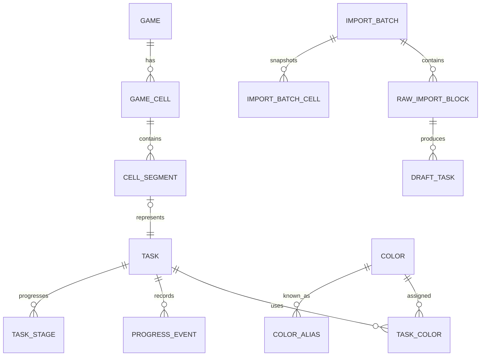

# PnP Üretim Takipçisi — Ana Uygulama Planı

> Sürüm: 2.0
>
> Tarih: 2026-08-22
>
> Durum: Uygulamaya hazır ana plan — tablo öncelikli çalışma akışına göre yeniden hizalandı
>
> İlk hedef: Garuda Linux üzerinde çalışan, yerel ve çevrimdışı masaüstü uygulaması

## 1. Bu belgenin amacı

Bu dosya, PnP masa oyunları için üretilecek 3D baskıları, kartları, mukavva parçalarını ve özel işleri tek uygulamada takip edecek ürünün tek kaynak planıdır. Ürün kararları, veri modeli, ekranlar, içe aktarma davranışları, mimari, testler ve geliştirme fazları bu dosyada tanımlanır.

Kod yazan yapay zekâ bu belgeyi aşağıdaki kurallarla uygulamalıdır:

- Fazları sırayla tamamla; gelecek sürüm özelliklerini ilk sürüme çekme.
- Belirsiz bir noktada kapsam genişletmek yerine bu belgedeki en basit davranışı uygula.
- Kullanıcı verisini sessizce kaybetme, tahminle kesinleştirme veya içe aktarma sırasında atlama.
- Her faz sonunda testleri çalıştır, sonuçları ve kalan riskleri raporla.
- Küçük, anlamlı ve geri alınabilir commitler oluştur.
- Yeni bağımlılık eklemeden önce mevcut standart kütüphanelerle çözüm olup olmadığını kontrol et.
- Kararlı sürümleri kullan; alpha/preview bağımlılıkları açık gerekçe olmadan kullanma.

## 2. Ürün özeti

Kullanıcı farklı masa oyunları için çok sayıda PnP üretim işi yapmaktadır. Aynı oyunda veya farklı oyunlarda aynı renkle basılacak 3D ögeler bulunabilir. Kartların basılması, lamine edilmesi ve kesilmesi; mukavva parçalarının basılması, yapıştırılması ve kesilmesi ayrı aşamalardır. Mevcut Excel listesinde oyun, görev, adet, renk, tamamlanma işaretleri ve notlar serbest metin biçiminde aynı hücrelerde tutulmaktadır.

Uygulamanın temel çalışma yüzeyi Excel benzeri bir **oyun tablosudur**. Her oyun bir satırdır ve satırın hücrelerinde kullanıcının kendi yazdığı serbest metin bulunur. Kullanıcı bu metnin bir parçasını seçip göreve dönüştürür; görev metnin içinde kalır ve orada takip edilir.

Uygulama şu problemleri çözer:

- Bütün oyunları tek tabloda, satır satır gösterir.
- Hangi oyunda hangi işten kaç tane gerektiğini hücrenin içinde gösterir.
- Serbest metni kaybetmeden, kullanıcının seçtiği ifadeleri takip edilebilir görevlere dönüştürür.
- Tüm oyunların 3D görevlerini renklere göre ortak havuzda toplar.
- Tek renkli, tek öge çok renkli ve renksiz görevleri ayırır.
- Büyük tabla baskılarında “kaç tane bastım?” yerine “kaç tane eksik/hatalı kaldı?” yaklaşımını kullanır.
- Kart ve mukavva üretimini aşamalar halinde takip eder.
- Tamamlanan görevleri aktif havuzdan çıkarır fakat hücrede, oyun kaydında ve geçmişte tutar.
- Excel/CSV verilerini ham biçimiyle içe alır ve kullanıcıya elle görev oluşturma imkânı verir.
- İnternet olmadan çalışır; ilk sürümde hesap, backend veya cihazlar arası eşitleme içermez.

## 3. Kesinleşmiş ürün kararları

### 3.1 Platform ve dağıtım

- İlk sürüm yalnızca Linux masaüstünde geliştirilecek ve doğrulanacak.
- Birincil geliştirme/çalıştırma ortamı Garuda Linux’tur.
- Uygulama çevrimdışı ve yerel veritabanıyla çalışacaktır.
- Windows, macOS ve Android ilk sürüm kapsamı dışındadır.
- Kod tabanı gelecekte Compose Multiplatform hedefleri eklenebilecek şekilde düzenlenecektir.

### 3.2 Veri kaynağı

- Excel yalnızca içe aktarma kaynağıdır.
- İlk içe aktarmadan sonra uygulama asıl veri kaynağı olur.
- Uygulama Excel ile çift yönlü senkronizasyon yapmaz.
- Aynı dosyanın yanlışlıkla iki kez içe aktarılmasını önlemek için dosya parmak izi ve içe aktarma kaydı tutulur.
- Kullanıcı isterse yeni bir Excel/CSV dosyasını ayrı bir içe aktarma işlemi olarak sonradan ekleyebilir; otomatik birleştirme yapılmaz.

### 3.3 Otomatik ayrıştırma

- Karmaşık Excel hücreleri otomatik olarak nihai görevlere parçalanmayacaktır.
- Hücrenin tam metni bir `RawImportBlock` olarak içe alınacaktır.
- Kullanıcı metinden istediği ifadeyi seçerek veya elle yazarak görev taslakları oluşturacaktır.
- Uygulama sütuna göre havuz önerisi, `**` tamamlanma işareti ve yeşil oyun hücresi gibi güvenli ipuçları sunabilir.
- İpucu hiçbir zaman kullanıcı onayı olmadan kesin görev verisine dönüşmemelidir.
- Çalışma zamanında bulut yapay zekâsı, API anahtarı veya yerel LLM gerekmeyecektir.

### 3.4 Havuzlar

Uygulamada dört üretim havuzu vardır:

1. **3D Baskı Havuzu**
2. **Kart Havuzu**
3. **Mukavva Havuzu**
4. **Özel Havuz**

Özel Havuz boşsa ana ekranda ve ana gezinmede gösterilmez. İlk özel görev oluşturulduğunda diğer havuzların yanında görünür.

### 3.5 Oyun ve görev tamamlanması

- Oyun tamamlanması kullanıcı tarafından ayrıca işaretlenir.
- Bir oyunun bütün görevlerinin tamamlanması oyunu otomatik tamamlamaz.
- Kullanıcı oyun satırındaki tamamlanma tikine bastığında, bitmemiş iş varsa tek bir onay sorulur; onaylanırsa oyuna ait bütün görevler ve üretim aşamaları tek transaction içinde tamamlanır.
- Tamamlanmış bir oyunda eksik parça bildirilmesi oyunu kendiliğinden Devam Eden durumuna geri döndürür.
- Bir oyun tamamlanmış olsa bile o oyuna yeni üretim görevleri eklenebilir ve aktif kalabilir.
- Tamamlamak arşivlemek değildir; uygulamada oyun arşivi bulunmaz.
- Excel’de oyun adının hücresi yeşilse bu, içe aktarma sırasında “oyun tamamlandı” ipucu olarak alınır.
- Excel’de `**` ile biten renk veya öge ifadesi, ilgili görevin tamamlandığına dair ipucudur.
- Root ve Splendor gibi elle tutulmuş listedeki istisnalar nedeniyle bütün içe aktarma ipuçları onay ekranında değiştirilebilir olmalıdır.

## 4. Kapsam dışı özellikler

Aşağıdakiler ilk sürüme eklenmeyecektir:

- Kullanıcı hesabı, giriş veya yetkilendirme
- Backend, PostgreSQL veya FastAPI
- Cihazlar arası eşitleme
- Gerçek zamanlı ortak çalışma veya paylaşım bağlantıları
- Android, Windows veya macOS dağıtımı
- Filament stok, makara, gramaj, maliyet veya marka takibi
- Yazıcıya doğrudan iş gönderme
- STL dosyası yönetimi veya dilimleyici entegrasyonu
- Kart/board tasarlama ve düzenleme
- Bulut yapay zekâsıyla otomatik metin ayrıştırma
- Ayrı fiziksel alt parça modeli
- Oyun arşivi, renk arşivi veya herhangi bir arşivleme işlemi
- `ALTERNATIVE` renk ilişkisi ve “alternatiflerden birini sonra seç” davranışı
- Adsız, kaydedilmemiş veya tek kullanımlık renk
- Ayrı oyun listesi ve oyun detay ekranı üzerinden yürüyen görev düzenleme akışı
- Kullanıcıya gösterilen `Item` (öge) kavramı ve öge altında görev gruplama
- Kullanıcıya ayrı bir özellik olarak sunulan renk alias yönetimi

## 5. Temel kavramlar ve veri modeli

### 5.1 Genel ilişki



Zincir `Game → GameCell → CellSegment → Task` biçimindedir. Görev ile onu gösteren
metin parçası arasında birebir ilişki vardır; arada gruplayıcı bir katman yoktur.

### 5.2 Kimlikler ve silme

- Bütün kalıcı varlıkların kimliği uygulama tarafında üretilen UUID olmalıdır.
- Veritabanında auto-increment kimlikler domain kimliği olarak kullanılmamalıdır.
- Kullanıcı tarafından silinen oyun ve görevler hemen fiziksel olarak silinmemelidir.
- `deletedAt` alanı veya eşdeğer bir tombstone kullanılmalıdır.
- Kalıcı fiziksel temizleme yalnızca açık bir bakım işlemi olarak ve yedek alındıktan sonra yapılabilir.
- Bu tercih ilk sürümde eşitleme olmasa da gelecekte eşitleme eklenmesini kolaylaştırır.
- **Renk bu kuralın açık istisnasıdır.** Renk kullanıcı onayıyla fiziksel olarak
  silinir; renk için tombstone, arşiv veya geri açma yoktur. Renk silindiğinde
  yalnız rengin kendisi ve renk ilişkileri kaldırılır; görev ve oyun kayıtları
  korunur. Ayrıntı `5.9`'dadır.
- Bir görevi metne geri döndürme (`12.8`) silme değildir: görev kaydı kaldırılır
  fakat görevin adı aynı yerde düz metin olarak kalır.
- İçe aktarmayı geri alma (`11.4.4`) da bu kuralın içindedir: geri alınan görevler
  tombstone ile görünürden çıkar, fiziksel olarak silinmez. Geri alma hiçbir
  `ProgressEvent` veya `HistoryEvent` satırını silmez.
- Tombstone yedeğin de parçasıdır: `14.4`'teki yedek, kaydın **silinmiş olduğu
  bilgisini** taşır ve geri yükleme onu aynen geri koyar. Tombstone'ları atan bir
  yedek, kullanıcının silme kararını sessizce geri alırdı.

### 5.3 Game

Bir oyun, oyun tablosunun bir satırıdır. Oyun bir görev değildir ve kendi başına
üretim işi taşımaz.

Önerilen alanlar:

- `id`
- `name`
- `isManuallyCompleted`
- `completedAt`
- `createdAt`
- `updatedAt`
- `deletedAt`
- `sourceImportBatchId`

Kurallar:

- Oyun tamamlanması yalnızca kullanıcı eylemi veya onaylanmış içe aktarma ipucuyla değişir.
- Alt görevlerin durumu oyun durumunu **kendiliğinden tamamlanmış yapmaz**.
- Tamamlanmış bir oyunda eksik parça bildirilmesi oyunun tamamlanma işaretini kaldırır ve `completedAt` alanını temizler.
- Tamamlanan oyunlar gizlenmez; `Tamamlanan` ve `Tümü` görünümlerinde görülür ve düzenlenebilir.
- Oyun arşivlenmez.
- Oyunun serbest metinleri `GameCell` kayıtlarında tutulur; `Game` üzerinde ayrı bir `notes` alanı bulunmaz.

### 5.4 GameCell

`GameCell`, bir oyun satırının bir sütunundaki hücredir. Kullanıcının serbest
metin yazdığı ve görev oluşturduğu yüzey budur.

Önerilen alanlar:

- `id`
- `gameId`
- `columnType`: `THREE_D`, `CARD`, `BOARD`, `SPECIAL`, `NOTES`
- `createdAt`
- `updatedAt`

Kurallar:

- Bir oyunun her sütun türünden **en fazla bir** hücresi vardır; `(gameId, columnType)` benzersizdir.
- Hücrenin içeriği doğrudan hücrede değil, sıralı `CellSegment` kayıtlarında tutulur.
- `NOTES` hücresi serbest metindir; görev veya havuz kaydı **üretmez** ve içinde `TaskSegment` bulunamaz.
- Hücre silinmeden içindeki görevler silinemez; hücre boşaltmak görevleri sessizce yok etmez.

### 5.5 CellSegment

Bir hücre, sıralı ve atomik parçalardan oluşan bir belgedir. Ham metin artı
başlangıç/bitiş indeksi modeli **kullanılmaz**.

Parça türleri:

- `PlainTextSegment` — normal serbest metin taşır.
- `TaskSegment` — tam olarak bir bağımsız `Task` kaydına işaret eder.

Önerilen alanlar:

- `id`
- `cellId`
- `orderIndex`
- `kind`: `PLAIN_TEXT`, `TASK`
- `text` — yalnız `PLAIN_TEXT` için
- `taskId` — yalnız `TASK` için
- `createdAt`
- `updatedAt`

Kurallar:

- Parçalar `orderIndex` ile sıralıdır ve sıra hücre içinde benzersizdir.
- `TaskSegment` atomiktir: klavyeyle ortasından silinemez, ham metin gibi parçalanamaz ve karakter karakter düzenlenemez.
- Bir `Task` tam olarak bir `TaskSegment`'e aittir; bir `TaskSegment` tam olarak bir `Task`'a işaret eder.
- Kullanıcı düz metinde bir ifadeyi seçip göreve dönüştürdüğünde ilgili `PlainTextSegment` güvenli biçimde üçe ayrılır: seçimden önceki düz metin, bir veya daha fazla `TaskSegment`, seçimden sonraki düz metin. Boş kalan düz metin parçaları yazılmaz.
- Yan yana gelen iki `PlainTextSegment` birleştirilir; hücre hiçbir zaman gereksiz parça biriktirmez.
- Bu modelde kayan çapa, çapasız görev veya örtüşen görev aralığı **oluşamaz**.
- İçe aktarılan bir ham hücre ilk aşamada tek bir `PlainTextSegment` olarak oluşturulabilir.

### 5.6 Task

Bir görev, bir hücredeki bir `TaskSegment` tarafından temsil edilen bağımsız
üretim işidir.

Ortak görev alanları:

- `id`
- `poolType`: `THREE_D`, `CARD`, `BOARD`, `SPECIAL`
- `trackingMode`: `THREE_D_BATCH`, `PIPELINE`, `CHECKLIST`, `COUNTED`
- `name`
- `requiredQuantity` — bilinmiyorsa `null`
- `notes`
- `isCompleted`
- `completedAt`
- `createdAt`
- `updatedAt`
- `deletedAt`
- `sourceRawImportBlockId`

Kurallar:

- Görev bir `Item` altında değil, doğrudan bir `TaskSegment` üzerinden bir hücreye bağlıdır.
- Görevin ilerleme ayrıntıları (3D eksik sayacı, kart/mukavva aşamaları) `TaskStage` ve `ProgressEvent` kayıtlarından türetilir.
- Tamamlanan görev hücreden **kaldırılmaz**: `TaskSegment` yerinde kalır, tikli ve üstü çizili görünür, yalnızca aktif üretim havuzundan çıkar.
- Görev sıfır veya daha fazla renge sahip olabilir; sıfır renk geçerli bir durumdur (`5.10`).
- Görev arşivlenmez.

### 5.7 Color

Renkler serbest metin yerine global kayıt olarak tutulur ve **hepsi isimlidir**.

Önerilen alanlar:

- `id`
- `canonicalName`
- `normalizedName`
- `hex`
- `sortOrder`

Renklerin iki kaynağı vardır:

1. Başlangıçtaki 12 temel renk.
2. Kullanıcının renk çarkından oluşturduğu özel renkler.

Excel dosyasında görülen başlangıç renkleri:

- Beyaz
- Siyah
- Gri
- Kahverengi
- Kırmızı
- Sarı
- Yeşil
- Mavi
- Açık Mavi
- Turuncu
- Mor
- Pembe

Kurallar:

- `gri`, `Gri` ve `GRİ` aynı kanonik renge eşlenmelidir; renk adları Türkçe büyük/küçük harfe duyarsız olarak benzersizdir.
- Renk adıyla birlikte renk örneği gösterilmelidir; anlam yalnızca görsel renge bırakılmamalıdır.
- Renk seçici küçüktür: 12 temel renk karesi, küçük bir renk çarkı ve gerekirse tek bir kompakt parlaklık kontrolü. Geniş profesyonel renk düzenleyici, sürekli açık hex alanı veya çok sayıda kanal ayarı gösterilmez.
- Özel renk oluşturma akışı: çarktan renk seç → gerekirse parlaklığı ayarla → **zorunlu ad gir** → kaydet.
- Ad girilmeden renk göreve atanamaz, renk listesine eklenemez ve havuz oluşturamaz.
- Kaydedilen özel renk o andan itibaren globaldir ve adıyla aranarak tekrar kullanılabilir.
- Aynı görsel renk farklı adlarla kaydedilebilir; bu durumda engelleyici olmayan bir aynı-hex uyarısı gösterilebilir.
- Tek kullanımlık, adsız veya kaydedilmemiş renk **yoktur**; `isSaved` benzeri bir ayrım bulunmaz.
- 12 temel renk de normal kayıtlardır: adı ve değeri düzenlenebilir, fiziksel olarak silinebilir.
- Renk arşivi, `isArchived` alanı, arşivli renk listesi ve geri açma **yoktur**.
- İlk sürümde renk gruplaması yalnızca renge göre yapılır; filament malzemesi gruplamaya dâhil değildir.
- `sortOrder` kullanıcının renk sırasıdır ve havuz gruplarının varsayılan sıralamasını belirler.

### 5.8 Temel renkleri geri yükleme

Renk yönetiminde `Temel renkleri geri yükle` eylemi bulunur.

- Yalnız **eksik olan** seed renkleri geri getirir.
- Mevcut renkleri veya kullanıcının yaptığı düzenlemeleri üzerine yazmaz.
- Otomatik çalışmaz; kullanıcının açık eylemi ve onayı gerekir.
- Sabit seed UUID'leri kullanılabilir.
- Normalize edilmiş ad çakışması varsa var olan renk üzerine yazılmaz.
- Davranış **ya hep ya hiç**'tir: transaction başlamadan önce bütün çakışmalar denetlenir; herhangi bir çakışma varsa hiçbir seed yazılmaz ve kullanıcıya hangi renklerin neden geri getirilemediği bildirilir. Kısmi geri yükleme yapılmaz.

### 5.9 Renk silme

Renk silme kullanıcı onayı ister. Renk görevlerde kullanılıyorsa ilişkili görev
sayısı gösterilerek açıkça uyarılır.

Kullanıcı onaylarsa tek transaction içinde:

1. İlgili `TaskColor` ilişkileri kaldırılır.
2. İlgili `ColorAlias` kayıtları kaldırılır.
3. Renk fiziksel olarak silinir.
4. Görev ve oyun kayıtları korunur; hiçbir görev veya `TaskSegment` silinmez.
5. Tek öge çok renk görevlerinde kalan renklerin `slotIndex` değerleri `0…N-1` olarak yeniden sıkıştırılır.
6. Rengi kalmayan görev `Renk seçilecek` durumuna geçer.

Ek kurallar:

- Çoklu görev oluşturmayla üretilmiş görevler bağımsızdır; renk silinince ilgili bağımsız görev silinmez, yalnız rengi kaldırılır.
- Temel ve özel renkler aynı silme kurallarına tabidir.
- İşlem yarıda kalırsa hiçbir ilişki ve hiçbir renk değişmez.

### 5.10 TaskColor

Bir görevin renk ilişkisi tek bir biçimdedir: `REQUIRED`. Renk bu görevin zorunlu
rengidir.

Önerilen alanlar:

- `taskId`
- `colorId`
- `slotIndex`

Kurallar:

- `slotIndex` kullanıcının renk seçim sırasını korur ve görev içinde benzersizdir; `0`'dan başlar ve boşluk bırakmaz.
- Tek renkli görev: bir `REQUIRED` renk.
- Tek öge çok renk görevi: birden fazla sıralı `REQUIRED` renk ve **tek** görev sayacı.
- Renksiz görev: sıfır renk ilişkisi. Bu geçerli bir durumdur; görev silinmez, `Renk seçilecek` bölümünde gösterilir ve renk seçilene kadar renk havuzlarına girmez. Bir görev bu duruma renk silme sonucunda veya içe aktarma sonrasında geçebilir.
- `ALTERNATIVE` ilişkisi ve “alternatiflerden birini sonra seç” davranışı ürün modelinde **yoktur**. Kullanıcı görev oluştururken kesin rengi veya renkleri seçer.
- Ayrı fiziksel parça modeli yoktur. Kullanıcı bıçak ve kabzayı ayrı takip etmek isterse bunları iki bağımsız görev olarak ekler.

Örnekler:

```text
Harmonies · 3D hücresi
  Token ×14 — REQUIRED[Gri]
  Token ×15 — REQUIRED[Sarı]
  Token ×15 — REQUIRED[Yeşil]
  (üç bağımsız görev, aralarında hiçbir kalıcı bağ yok)

Kılıç ×10 — REQUIRED[Gri, Siyah]
  (tek görev, tek adet, iki sıralı zorunlu renk)

Whale ×5 — renksiz
  (Renk seçilecek durumunda)
```

### 5.11 ColorAlias

Alias, bir rengin bilinen başka bir yazılışıdır ve **yalnız iç sistem**dir.

- Alias yönetimi kullanıcıya ayrı bir renk yönetimi özelliği olarak sunulmaz.
- Alias altyapısı yalnız içe aktarma sırasında ham renk terimlerini tanımak ve Türkçe yazım çeşitlerini eşlemek için kullanılır.
- Alias hiçbir zaman kullanıcının kesin renk seçiminin yerine geçmez.

### 5.12 TaskStage ve ProgressEvent

`TaskStage`, kart ve mukavva görevlerinin sabit aşamalarının tamamlanan adetlerini
tutar (`7.2`, `8`). `ProgressEvent`, 3D eksik/hatalı bildirimleri ve giderme
hareketlerini olay olarak kaydeder (`6`).

- Her `ProgressEvent`'in benzersiz UUID'si vardır; aynı olay iki kez uygulanamaz.
- `failureTotal` ve geçmiş hata toplamı olaylardan türetilir ve silinmez.
- Aşama sayaçları ve eksik miktarlar negatif olamaz.

### 5.13 Item kavramı kaldırılmıştır

Kullanıcı ürün modelinde `Item` (öge) **bulunmaz**. Öge altında görev gruplama,
aktif öge zorunluluğu, renk varyantlarının aynı öge altında toplanması ve oyun
detayında öge listesi hükümlerinin tamamı geçersizdir.

`items` tablosu Faz 1'de oluşturulmuştu ve **şema v4'te kaldırılmıştır**
(`18.` bölüm, Faz 2 Adım 4). `Task` artık doğrudan bir `TaskSegment` üzerinden
hücreye bağlanır; `tasks.item_id` sütunu da aynı dilimde düşmüştür. Tabloyu
tanıyan tek yer, onu düşüren migration'ın kendisidir.

## 6. 3D baskı ilerleme modeli

### 6.1 Neden “basılan adet” girilmez?

Kullanıcı aynı tablaya 30–40 parça yerleştirebilir. Bu nedenle `+5 basıldı`, `+6 basıldı` biçimi ana kullanım değildir. Ana senaryo, bütün gerekli parçaların bir baskı denemesinde üretilmesi ve yalnızca eksik/hatalı parçaların bildirilmesidir.

### 6.2 Alanlar

3D görev ayrıntısı aşağıdaki bilgileri tutar:

- `primaryBatchCompleted`: ana tabla baskısı yapıldı mı?
- `currentMissingQuantity`: hâlen yeniden basılması gereken miktar
- `failureTotal`: geçmişte bildirilen toplam hatalı/eksik baskı; olaylardan türetilir
- `manualCompletionOverride`: yalnızca adedi bilinmeyen eski görevlerde kullanılabilir

Başlangıç davranışı:

- Yeni görev `NOT_STARTED` durumundadır.
- `currentMissingQuantity` başlangıçta `0` olur; çünkü bu alan “henüz basılmayan toplam” değil, baskı sonrasında eksik/hatalı kalan miktardır.
- Kullanıcı ana baskıyı tamamlayınca `primaryBatchCompleted = true` olur.
- Ana baskı tamamlandı ve eksik miktar `0` ise görev tamamlanır.

### 6.3 Eylemler

#### Ana baskıyı tamamla

- `primaryBatchCompleted` değerini etkinleştirir.
- Eksik miktar sıfırsa görev aktif havuzdan çıkar.
- Görev oyun kaydında ve geçmişte kalır.

#### Eksik/hatalı bildir

- Görev satırındaki küçük bir hızlı eylem düğmesiyle sayı seçilir.
- Seçilen sayı `currentMissingQuantity` değerine eklenir.
- Aynı miktarda bir `FailureReported` olayı oluşturulur.
- İsteğe bağlı not girilebilir.
- Ana baskı daha önce tamamlandı olarak işaretlenmemişse, eksik/hata bildirimi baskı denemesi yapıldığını varsayar ve `primaryBatchCompleted` değerini etkinleştirir.
- Görev `NEEDS_REPRINT` durumuna döner veya bu durumda kalır.
- Eylem tamamlanan görevlerin geçmiş görünümünde de kullanılabilir; yeni bir eksik/hata bildirimi görevi yeniden aktif havuza taşır.
- Tek öge çok renk görevinde bildirim görevi **bütün** renk havuzlarına birden geri getirir; bu tek bir görev olduğu için tek yazma yeter.
- **Oyun tamamlanmışsa** aynı transaction içinde oyun da yeniden açılır: `isManuallyCompleted` kaldırılır, `completedAt` temizlenir ve satırın yeşil görünümü kalkar. Oyun `Devam Eden` görünümüne döner.
- Oyunun diğer tamamlanmış görevleri yeniden açılmaz; yalnız bildirimi yapılan görev etkilenir.

#### Eksik giderildi

- Kullanıcı yeniden basılan başarılı miktarı seçer.
- Seçilen sayı `currentMissingQuantity` değerinden düşülür.
- Değer sıfırın altına inemez.
- Eksik miktar sıfıra indiğinde görev tamamlanır.
- Geçmiş hata toplamı silinmez.

### 6.4 Türetilen değerler

Gerekli adet biliniyorsa ve ana baskı tamamlandıysa:

```text
hazırAdet = gerekliAdet - mevcutEksikAdet
```

Kurallar:

- `currentMissingQuantity`, gerekli adedi aşamaz.
- `failureTotal`, tekrar tekrar yapılan hatalı baskılar nedeniyle gerekli adedi aşabilir.
- Gerekli adet bilinmiyorsa görev `BILGI_EKSIK` durumunda tutulabilir veya kullanıcı manuel tamamlanma kullanabilir.
- Tamamlanma durumu sayaçlar ve olaylarla tutarlı kalmalıdır. Görev üzerinde tutulan `isCompleted` bir gösterim kolaylığı değil, kullanıcının ve toplu tamamlamanın yazdığı gerçek durumdur; sayaçlarla çelişmesine izin veren hiçbir yol bulunmamalıdır.

## 7. Kart üretim hattı

### 7.1 Kart grupları

Aynı oyundaki farklı kart türleri ayrı görevler olabilir:

```text
Wingspan
├── Bird Cards — 170 adet
└── Bonus Cards — 26 adet
```

Kullanıcı Excel’deki tek hücreyi içe aktardıktan sonra bu grupları elle ayırır.

### 7.2 Sabit aşamalar

Kart görevleri üç aşamalıdır:

1. Basıldı
2. Lamine edildi
3. Kesildi

Her aşama ayrı tamamlanan adet tutar.

Kurallar:

```text
0 <= kesilen <= lamineEdilen <= basılan <= toplam
```

- Sonraki aşamadaki adet önceki aşamayı geçemez.
- Bütün aşamalar toplam adede ulaştığında kart görevi tamamlanır.
- Aşama başına eksik sayı `toplam - aşamaTamamlanan` olarak türetilir.
- Toplam adet bilinmiyorsa kullanıcı önce toplamı girmeli veya görevi checklist moduna çevirmelidir.

### 7.3 Açılır rozet

Dar görev satırında küçük bir rozet gösterilir:

```text
Bird Cards
[Laminasyon: 167/170 · 3 eksik]
```

Rozet tıklanınca genişler ve üç aşamanın sayaçları düzenlenebilir:

```text
Basıldı        170/170
Lamine edildi  167/170
Kesildi        150/170
```

Rozet şu aşamayı göstermelidir:

- İlk tamamlanmamış aşama, veya
- Bütün aşamalar tamamlandıysa `Tamamlandı`.

### 7.4 Eksik kart ayrıntıları

Kart görevine isteğe bağlı eksik kart kayıtları eklenebilir:

- Kart adı veya numarası
- Adet
- Hangi aşamada fark edildiği
- Not
- Çözüldü durumu

Yalnızca eksik sayıyı tutmak da geçerlidir; isim/numara zorunlu değildir.

## 8. Mukavva üretim hattı

Mukavva görevleri üç aşamalıdır:

1. Basıldı
2. Yapıştırıldı
3. Kesildi

Kart görevleriyle aynı genel `TaskStage` altyapısını kullanır. Ayrı kod yolları yerine kategoriye göre aşama şablonu seçilmelidir.

Kurallar:

```text
0 <= kesilen <= yapıştırılan <= basılan <= toplam
```

Örnekler:

- Board
- Player board
- Tile
- Mukavva token
- Factory display

Kart havuzundaki açılır rozet davranışı mukavva havuzunda da kullanılmalıdır.

## 9. Özel havuz

Özel havuz aşağıdaki gibi standart üç üretim hattına girmeyen görevleri tutar:

- Zar
- Zarf
- Bez çanta
- Scoresheet
- Standee aparatı
- Diğer el işi veya satın alma görevleri

Davranış:

- Özel görevler checklist veya adetli görev olabilir.
- Henüz hiç silinmemiş özel görev yokken Özel havuz ana gezinmede ve ana ekran özetlerinde görünmez.
- İlk özel görev oluşturulduğunda otomatik görünür.
- Son özel görev tamamlandığında havuz görünür kalır ve aktif görev sayısını `0` gösterir.
- Havuz ancak içindeki tüm görevler silinirse veya kullanıcı havuzu açıkça gizlerse yeniden saklanır; geçmiş kayıtlar silinmez.

## 10. Eksik ve ödünç parça işaretleri

`Eksik` ve `Ödünç Parçalar` birer üretim havuzu değildir. Bunlar görev üzerinde bayrak/bağlamdır:

- `MISSING`
- `BORROWED`
- `NEEDS_INFO`
- `NEEDS_CLASSIFICATION`

İçe aktarma sırasında:

- `Eksik` sütunundaki ham metin görev taslağına `MISSING` bayrağıyla gelir.
- `Ödünç Parçalar` sütunundaki ham metin `BORROWED` bayrağıyla gelir.
- Kullanıcı görevi 3D, Kart, Mukavva veya Özel havuza yerleştirir.
- Metinden güvenli biçimde tür belirlenemiyorsa görev `NEEDS_CLASSIFICATION` olarak kalır ve hiçbir üretim havuzuna sessizce eklenmez.

## 11. Excel ve CSV içe aktarma

### 11.1 Referans dosya

İlk gerçek kaynak dosya: `Kitap1(1).xlsx`

Mevcut sütunlar:

| Kaynak sütun | Varsayılan yorum |
|---|---|
| Oyun adı | `Game` |
| 3D Print (Figür vb.) | 3D görev ham blokları |
| Laminasyon (Kart vb.) | Kart görev ham blokları |
| Mukavva (Board, Token vb.) | Mukavva görev ham blokları |
| Özel | Özel görev ham blokları |
| Eksik | `MISSING` bayraklı, sınıflandırılacak ham bloklar |
| Ödünç Parçalar | `BORROWED` bayraklı, sınıflandırılacak ham bloklar |

Boş görev hücreleri görev oluşturmaz fakat oyun satırı yine içe aktarılabilir.

### 11.2 ImportBatch

Her içe aktarma işlemi aşağıdakileri kaydeder:

- Dosya adı
- SHA-256 dosya parmak izi
- İçe aktarma tarihi
- Sayfa adı
- Algılanan satır/sütun aralığı
- Oluşturulan oyun, ham blok ve görev sayıları
- Durum: `DRAFT`, `CONFIRMED`, `ROLLED_BACK`

Kullanıcı onaylamadan önce bütün içe aktarma taslak olarak kalır.

### 11.3 RawImportBlock

Her dolu kaynak hücre için:

- Orijinal hücre metni
- Dosya/sayfa/satır/sütun bilgisi
- Kaynak sütun türü
- Hücre biçiminden gelen ipuçları
- Kullanıcının oluşturduğu görev taslakları
- İşlenmemiş kalan metin aralıkları

tutulur.

Orijinal metin hiçbir zaman sessizce değiştirilmez veya kaybedilmez.

### 11.4 İçe aktarma inceleme ekranı

Önerilen düzen:

```text
┌──────────────────────────────┬──────────────────────────────┐
│ Kaynak hücrenin ham metni    │ Oluşturulan görev taslakları │
│                              │                              │
│ Kullanıcı metni seçebilir    │ Ad / havuz / renk / adet     │
│ veya satıra tıklayabilir     │ durum / not                  │
└──────────────────────────────┴──────────────────────────────┘
```

İşlemler:

- Seçili metinden görev oluştur
- Elle boş görev oluştur
- Görevi bir havuza ata
- Kesin rengi veya renkleri seç, ya da görevi renksiz bırak
- Adet gir veya bilinmiyor olarak bırak
- `**` ipucunu kabul et/reddet
- Yeşil oyun hücresi ipucunu kabul et/reddet
- Görevi hedef oyunun ilgili hücresine bağla
- Ham bloğu işlendi olarak işaretle
- İçe aktarma grubunu topluca onayla (geri alma `11.4.4`'tedir)

### 11.4.1 Oyun ve hücre kurulumu

Hedef yapıyı yalnızca kullanıcı kurar.

- İçe aktarma hiçbir zaman `Game` kaydını kendiliğinden oluşturmaz.
- Oyun adı hücresinden otomatik `Game` türetilmez.
- Kullanıcı oyun satırlarını oyun tablosundan elle oluşturur.
- Hedef `GameCell`, oyun satırı oluşturulduğunda o oyunun sütunu olarak hazır bulunur.
- Elle oluşturulan bir oyunun `sourceImportBatchId` alanı boştur.
- Oyun tamamlanma durumu yalnızca açık kullanıcı eylemiyle veya eksik parça bildirimiyle değişir; bir oyunu tamamlamak hücrelerinin metnini değiştirmez.

### 11.4.2 İçe aktarmayı onaylama

Onay, taslakları gerçek görevlere çeviren tek adımdır.

Ön koşullar:

- Kullanıcı her `DraftTask` için mevcut ve aktif bir hedef `GameCell` seçer.
- `selectedPoolType` ve `selectedTrackingMode` görev üretiminden önce zorunludur.
- `requiredQuantity` havuz ve takip kurallarına göre doğrulanır.
- Bir taslak eksik veya geçersizse bütün batch onayı engellenir; hiçbir taslak
  sessizce atlanmaz.
- Hiç oyun yoksa onay yapılamaz; kullanıcı önce oyun satırını oluşturur.
- İşlenmemiş ham blok bulunması onayı doğrudan engellemez. Kullanıcıya işlenmemiş
  blok sayısı ve açık bir uyarı gösterilir; devam etmek için ayrıca onay vermesi
  gerekir.

Onaydan hemen önce, **domain verisine ilk yazımdan önce**, otomatik bir JSON
snapshot alınır (`14.4.8`). Bunun eşiği yoktur ve `XLSX`/`CSV` ayrımı yapmaz:
her onay girişimi önce yedeklenir. Onay ekranı bunu tek ve anlaşılır bir
cümleyle söyler. Snapshot alınamaz, atomik yazılamaz veya yeniden doğrulanamazsa
**onay hiç başlamaz**; batch `DRAFT` kalır ve hiçbir satır değişmez.

Onayın kendisi:

- Onay tek bir Room transaction’ında gerçekleşir.
- Transaction’ın **ilk** aşaması, canlı veritabanını snapshot’ın kanonik
  sözleşmesiyle yeniden okur. Veri snapshot alındıktan sonra değişmişse onay
  hiçbir şey yazmadan reddedilir ve kullanıcıdan tekrar denemesi istenir
  (`14.4.8`).
- Her geçerli `DraftTask` tam olarak bir gerçek `Task` ve tam olarak bir `TaskSegment` üretir.
- Üretilen görev, taslağın hedef hücresindeki bir `TaskSegment` üzerinden bağlanır.
- `tasks.sourceRawImportBlockId` kaynak ham bloğu korur.
- `draft_tasks.materializedTaskId` oluşturulan görevin kimliğiyle doldurulur.

Transaction’ın herhangi bir noktasında hata olursa hiçbir görev kalmaz, hiçbir
`materializedTaskId` yazılmaz, sayaçlar değişmez ve batch `DRAFT` kalır.

Başarılı onay sonunda:

- Batch `CONFIRMED` olur.
- `createdTaskCount`, transaction içinde gerçekten oluşturulan görev sayısına eşit
  olur.
- Bu sürüm otomatik oyun oluşturmadığı için `createdGameCount` sıfır kalır.
- Batch’in `updatedAt` alanı aynı transaction içinde güncellenir.

İkinci bir onay çağrısı yeni kayıt üretmeden açık bir “zaten onaylanmış” sonucu
döndürür. Bu, başarılı bir tekrar uygulama değil, korumalı bir reddediştir.

### 11.4.3 Taslağı kapatma, yeniden açma ve onay sonrası

- Ham bloklar ve taslaklar onaydan sonra silinmez; kaynak ve denetim izi olarak
  korunur.
- `CONFIRMED` bir batch salt okunur görüntülenebilir, düzenlenemez.
- Ham bloğun işlenmiş durumunu değiştirme, taslak düzenleme ve hedef hücre
  değiştirme yalnızca `DRAFT` bir batch’te mümkündür.
- “Taslağı kapatma” yalnızca ekrandan veya gezinmeden çıkmaktır; yeni bir
  veritabanı durumu oluşturmaz.
- “Yeniden açma” yalnızca `DRAFT` bir batch’i tekrar düzenleme ekranında açmaktır.
- `CONFIRMED` bir batch’in düzenlenebilir biçimde yeniden açılması yoktur.
- `CONFIRMED → ROLLED_BACK` geçişinin ve oluşturulan kayıtların korumalı geri
  alınmasının kuralları `11.4.4`'tedir.

### 11.4.4 İçe aktarmayı geri alma (korumalı rollback)

`CONFIRMED` bir batch geri alınabilir: geri alma, o batch'in onay sırasında
oluşturduğu görevleri görünürden kaldırır, yazdığı hücre metnini geri yükler ve
batch'i `ROLLED_BACK` yapar.

Geri alma birimi **bütün batch'tir**. Tek tek görev seçme, kısmi geri alma ve
“kısmen geri alınmış” bir batch durumu **yoktur**. `ImportBatchStatus` üç değerden
ibarettir ve dördüncü bir ara durum eklenmez.

#### Çakışma bütün işlemi engeller

Batch'in ürettiği **herhangi bir** görev onaydan sonra dokunulmuşsa **veya**
yazdığı **herhangi bir** hedef hücrenin metni değişmişse, geri alma **tamamen
engellenir**:

- Aynı batch'in dokunulmamış görevleri de kaldırılmaz.
- Hiçbir satır değişmez; batch `CONFIRMED` kalır.
- Kullanıcıya neyin engellediği gösterilir: görevler adlarıyla, hücreler oyun ve
  sütun adlarıyla.

Bu, `16.` bölümdeki “sessizce silinmez” kuralının kesinleştirilmiş hâlidir. İki
davranış arasından seçim yapılmıştır: güvenli görünenleri kaldırmak **değil**,
işlemi durdurmak. Yarısı geri alınmış bir içe aktarma, kullanıcının hangi görevin
nereden geldiğini artık söyleyemediği bir durum bırakırdı.

#### Bir görevin “dokunulmuş” sayılması

Aşağıdakilerden **herhangi biri** doğruysa görev dokunulmuştur:

1. `updatedAt` değeri `createdAt` değerinden farklıdır — ad, renk, adet, not,
   takip kipi veya bayrak değişikliği ya da herhangi bir ilerleme yazımı.
2. Göreve ait en az bir `ProgressEvent` vardır.
3. Göreve ait en az bir `HistoryEvent` vardır.
4. Görev zaten silinmiştir veya metne geri döndürülmüştür.

Bu dört ölçüt görev içindir; hücre metni için ayrı bir ölçüt vardır ve aşağıda
anlatılır. İkisi birlikte engelleme kuralının tamamını oluşturur.

Ölçüt korumacıdır: şüphede kalan kayıt dokunulmuş sayılır. İçe aktarmanın kendi
yazdıkları bu ölçütlerin hiçbirini tetiklemez — onay `updatedAt` ile `createdAt`
değerlerini eşit yazar ve hiçbir progress veya history olayı üretmez — bu yüzden
dokunulmamış bir görev güvenilir biçimde tanınır.

Dördüncü ölçüt, ilk üçünün özel bir hâli değil, onlardan bağımsız bir güvencedir:
silme ve metne dönüştürme bugün zaten birer `HistoryEvent` yazar, fakat kural
geçmiş tablosunda satır bulunmasına bağlı olmamalıdır. Sonuç aynıdır ve
**engelleyicidir**: kullanıcının silmeye veya metne döndürmeye karar verdiği bir
görev, o kararı verilmemiş gibi geri alınamaz. Bunun bilinen sonucu şudur: bir
batch'in tek bir görevi silinmişse o batch artık geri alınamaz. Bu kabul edilmiş
bir bedeldir; alternatifi, kullanıcının kararlarının üzerine yazmaktır.

#### Hücre metninin geri yüklenmesi

İçe aktarma hedef hücreye yalnızca **ekler**: kullanıcının o hücrede yazdığı metin
karakteri karakterine korunur ve yeni görevler sonuna yazılır. Geri alma bunun
tersini yapar ve aynı güvenceyi taşır: kullanıcının yazdığı hiçbir karakter
kaybolmaz.

Bunu tahmine bırakmamak için onay, dokunduğu **her hücrenin import öncesi tam
metnini** `ImportBatchCell` kaydı olarak saklar:

```text
ImportBatchCell
  importBatchId
  cellId
  documentBefore     hücrenin onay anında okuduğu tam metin
```

Geri alma sırasında hücrenin bugünkü metni, `documentBefore` ile batch'in yazdığı
görev adlarından yeniden hesaplanan **beklenen metinle** karşılaştırılır. Eşitse
hücre `documentBefore` değerine **harfi harfine** geri yazılır.

Eşit değilse hücre onaydan sonra değişmiş demektir. Bu, batch'in hiçbir görevi
dokunulmamış olsa bile olabilir: kullanıcı bir hücrenin düz metnini, içindeki
görevlere hiç dokunmadan düzenleyebilir. Böyle bir hücre de **engelleyicidir** —
geri alma yapılmaz, batch `CONFIRMED` kalır ve kullanıcıya hangi hücrenin
engellediği söylenir. Engelleme kuralı bu yüzden iki parçalıdır: **dokunulmuş
görev veya değişmiş hedef hücre.**

`ImportBatchCell` kaydı bulunmayan bir batch geri alınamaz. Bu kayıt onay yoluna
sonradan eklenmiştir; daha eski onaylar hücrenin o günkü metnini saklamamıştır ve
bugünkü metinden geriye çıkarmak, kullanıcının o tarihten beri yaptığı bütün
düzenlemeleri yok saymak olurdu. Uygulama tahmin etmez: geri alma engellenir ve
sebebi kullanıcıya söylenir.

Provenance **segment kimliğine bağlanmaz**. `CellSegment` satırlarına import batch
sütunu eklenmez: bir hücre düzenlendiğinde yan yana düz metin parçaları
birleştirilir (`16.`), yani bir segment satırının kimliği kalıcı değildir ve
sonradan kullanıcının kendi yazdığı metni taşıyabilir. Kimliğe bağlanan bir
provenance, o metni import'un yazdığı sanıp silebilirdi. Bu yüzden geri almanın
dayanağı satır kimliği değil, saklanan metnin kendisidir.

#### Geri almanın yazdıkları ve yazmadıkları

Geri alma **tek transaction**'dır. Yazar:

- geri alınan her görev için tombstone (`5.2`);
- her görev için `TASK_ROLLED_BACK` geçmiş olayı;
- görevlerin hücre parçalarının kaldırılması ve hücre belgesinin yeniden yazılması;
- dokunulan her oyun için `IMPORT_ROLLED_BACK` geçmiş olayı;
- batch durumunun `ROLLED_BACK` olması.

Yazmaz:

- hiçbir `ProgressEvent` veya `HistoryEvent` satırı silinmez (`5.12`, `12.15`);
- hiçbir görev, oyun veya hücre fiziksel olarak silinmez;
- **oyunların tamamlanma bayrağı geri alınmaz.** Yeşil hücre ipucunu kullanıcı
  onaylamıştır ve `5.3` tamamlanmayı kullanıcının kendi beyanı sayar; geri alma
  bu beyanı bozmaz. Onay ekranı bunu açıkça söyler ve kullanıcı isterse işareti
  oyun tablosundan kendisi kaldırır.

#### `ROLLED_BACK` ne zaman yazılır

Batch **ancak** bütün hedefleri güvenliyse ve hepsi aynı transaction içinde
kaldırıldıysa `ROLLED_BACK` olur. Tek bir engelleyici görev veya hücre bile varsa
durum `CONFIRMED` kalır. Kısmen geri alınmış bir batch `ROLLED_BACK` sayılmaz ve
oluşamaz.

`ROLLED_BACK` durumu transaction'ın sonunda, bütün kaldırmalar ve geçmiş satırları
yazıldıktan sonra yazılır. Transaction'ın herhangi bir noktasında hata olursa
hiçbir görev kaldırılmaz, hiçbir hücre değişmez, hiçbir geçmiş satırı kalmaz ve
batch `CONFIRMED` kalır.

#### İkinci geri alma ve yeniden uygulama

- Zaten `ROLLED_BACK` olan bir batch'i tekrar geri alma çağrısı **korumalı bir
  reddediştir**, sessiz başarı değildir. Kullanıcıya batch'in zaten geri alındığı
  söylenir. Bu, `11.4.2`'deki ikinci onay davranışının aynısıdır.
- `DRAFT` bir batch geri alınamaz: geri alınacak bir şey üretmemiştir.
- **Geri alınmış bir batch yeniden uygulanamaz.** `ROLLED_BACK` son durumdur.
  Kullanıcı aynı dosyayı isterse `3.2`'ye göre **yeni ve ayrı bir batch** olarak
  yeniden içe aktarır; mevcut parmak izi uyarısı korunur ve eski batch'i durumuyla
  birlikte listeler.

#### Onay

Geri alma `17.`'ye göre kullanıcı onayı ister. Onay ekranı en az şunları söyler:
kaç görevin kaldırılacağını, tamamlanma işaretlerinin geri alınmayacağını ve
işlemin geri alınamaz olduğunu. Engelleyici görev varsa onay ekranı yerine
engelleme listesi gösterilir.

### 11.5 Excel biçim işaretleri

- `**` tamamlanma ipucudur; gösterim adından temizlenir.
- Yeşil oyun hücresi oyun tamamlanma ipucudur.
- Mavi, turuncu, kırmızı gibi yazı renkleri yalnızca insanın renk bilgisini daha kolay görmesi için kullanılmıştır.
- Yazı rengi kaynak gerçek değildir; metindeki renk adı ve kullanıcının onayı esas alınır.
- Renkli yazı ile metindeki renk uyuşmazsa kullanıcıya uyarı gösterilebilir.

### 11.6 Belirsiz renk ifadeleri

Aşağıdaki ifadeler çok renkli görev olarak yorumlanmaz:

- `Mavi/Açık Mavi`
- `Beyaz/Gri`
- `Açık Mavi veya Mavi`

Bunlar kullanıcının henüz karar vermediği renk ifadeleridir ve ham metin olarak
korunur. Uygulama bunlardan bir renk ilişkisi türetmez ve kullanıcıya yalnızca
ipucu olarak gösterir.

Kullanıcı görevi oluştururken **kesin rengi seçer**. Seçim yapmazsa görev renksiz
kalır, `Renk seçilecek` bölümünde görünür ve renk havuzlarına girmez. `ALTERNATIVE`
renk ilişkisi ve “alternatiflerden birini sonra seç” davranışı ürün modelinde
yoktur.

### 11.7 Bilinmeyen veya belirsiz değerler

Uygulama aşağıdakileri desteklemelidir:

- Rengi bilinmeyen görev
- Adedi bilinmeyen görev
- “Sayısına bakılacak” notu
- “Basmışken çok bas” gibi kesin olmayan miktar
- “5 farklı renk” denmiş fakat renkleri yazılmamış görev
- Aynı hücrede birden fazla görev ve not

Bu kayıtlar `NEEDS_INFO` olarak işaretlenir. Gerekli bilgi tamamlanmadan ilgili aktif havuza eklenmeleri isteğe bağlı olarak engellenebilir; varsayılan davranış engellemektir.

### 11.8 CSV

CSV içe aktarma desteklenir fakat Excel biçim ipuçları bulunmaz. En az şu kolonlar tanınmalıdır:

```text
game,source_type,raw_text
```

Gelecekte yapılandırılmış dışa aktarma için şu kolonlar kullanılabilir:

```text
game,column,task,pool,colors,required_quantity,status,notes
```

## 12. Kullanıcı arayüzü ve gezinme

### 12.1 Masaüstü düzeni

Birincil masaüstü gezinmesi sol kenar çubuğu veya eşdeğer geniş ekran navigasyonu kullanır:

- Ana Sayfa
- Oyun Tablosu
- 3D Baskı
- Kartlar
- Mukavva
- Özel — en az bir silinmemiş özel görev varsa
- İçe Aktarma
- Geçmiş
- Renkler
- Ayarlar — Faz 3 / İş 3 ile açılır; içeriği `12.16`'dadır

Ayrı bir oyun listesi ekranı ve ayrı bir oyun detay ekranı **yoktur**. Görev
oluşturma ve düzenleme oyun tablosunun hücrelerinde yapılır.

### 12.2 Ana sayfa

Ana sayfanın üst bölümünde oyun tablosuna giriş ve arama bulunur:

- Arama
- Yeni oyun satırı
- Excel/CSV içe aktar
- Üç global tablo görünümüne hızlı geçiş
- Son kullanılan veya sabitlenen oyunlar

Bunların altında havuz özetleri bulunur:

```text
3D Baskı
• Aktif görev sayısı
• Yeniden basılması gereken eksik/hatalı parça sayısı
• Renk seçilecek görev sayısı

Kartlar
• Baskı bekleyen
• Laminasyon bekleyen
• Kesim bekleyen

Mukavva
• Baskı bekleyen
• Yapıştırma bekleyen
• Kesim bekleyen

Özel
• Yalnızca boş değilse gösterilir
```

Özet kartına tıklamak ilgili havuza götürür.

### 12.3 Oyun tablosu

Uygulamanın temel çalışma yüzeyi Excel benzeri bir tablodur. Her oyun bir
satırdır.

Sütunlar:

| Sütun | İçerik |
|---|---|
| Oyun adı | Oyunun adı ve tamamlanma tiki |
| 3D | 3D hücresi |
| Kart | Kart hücresi |
| Mukavva | Mukavva hücresi |
| Özel | Özel hücresi |
| Notlar | Serbest not hücresi |

3D, Kart, Mukavva, Özel ve Notlar ayrı hücrelerdir ve her biri kendi `GameCell`
kaydına sahiptir.

`Notlar` hücresi serbest içeriktir; üretim görevi veya havuz kaydı **üretmez** ve
içinde görev bulunamaz.

Tablo eylemleri:

- Yeni oyun satırı oluşturma
- Oyun adına göre arama
- Hücreye serbest metin yazma
- Hücredeki metinden görev oluşturma
- Oyun satırındaki tamamlanma tikine basma
- Oyun silme

Tamamlanmış oyunun satırı tamamen yeşil gösterilir.

### 12.4 Global tablo görünümleri

Ana ekrandan kolayca değiştirilebilen üç global tablo görünümü bulunur:

- **Devam Eden** — kullanıcı tarafından tamamlanmamış oyun satırları
- **Tamamlanan** — kullanıcı tarafından tamamlanmış oyun satırları
- **Tümü** — her ikisi

Kurallar:

- Bunlar bir oyunun içindeki sekmeler değildir; bütün oyun tablosunun görünümleridir.
- Kullanıcı üç görünümün herhangi birinde çalışabilir ve düzenleme yapabilir.
- `Tümü` görünümünde önceki tamamlanan oyunlar da görülebilir ve düzenlenebilir.
- `Tamamlanan` görünümü kullanıcının geçmiş oyunlarını görme ihtiyacını karşılar.
- Oyun arşivi, arşiv tablosu veya arşivleme işlemi **bulunmaz**.
- İçeride tek veri kaynağı ve sorgu filtreleri kullanılabilir; kullanıcı deneyiminde bunlar rahatça geçilen üç tablo görünümüdür.

### 12.5 Hücre belgesi ve inline görevler

Bir hücre, sıralı `CellSegment` parçalarından oluşan bir belgedir (`5.5`).

`TaskSegment` görünümü:

- Görev adını gösterir.
- Görev rengine uygun çizilir.
- `×15` gibi gerekli adedi yanında gösterir.
- Tik kutusu taşır.
- Fare üzerine geldiğinde tıklanabilir olduğu anlaşılır.

`TaskSegment` atomiktir: klavyeyle ortasından silinemez ve ham metin gibi
parçalanamaz. Düzenleme yalnızca görev menüsünden yapılır.

`TaskSegment`'e tıklanınca kelimenin hemen üstünde küçük bir bağlamsal popover
açılır. Popover ekranı kaplamaz. En az şu eylemler bulunur:

- **Düzenle**
- **Eksik parça**
- **Görevi metne dönüştür**

Tamamlanan görev:

- Hücreden kaybolmaz.
- Tikli görünür.
- Metni üstü çizili olur.
- Aktif üretim havuzundan çıkar.

### 12.6 Metinden görev oluşturma

Kullanıcı düz metinde bir kelime veya ifade seçer. Çift tıklama kelime seçimini
kolaylaştırır.

Akış:

1. Kelimeyi seç.
2. Seçili kelimenin hemen üstünde açılan küçük popover'dan `Göreve dönüştür` seç.
3. Kompakt görev oluşturma paneli açılır.
4. Oluşturma modunu, renkleri, adetleri ve gereken özellikleri gir.
5. Kaydet.
6. İlgili `PlainTextSegment` bir veya daha fazla `TaskSegment` ile değiştirilir.

Tam ekran modal veya bütün ekranı kaplayan panel **kullanılmaz**.

Görev oluşturma panelinin üstünde üç mod arasında geçiş yapılır. Modlar yalnızca
form kolaylıklarıdır ve kaydedilmez (`5.10`, `12.7`).

### 12.7 Üç oluşturma modu

#### Tek renk

- Bir `Task`
- Bir gerekli adet
- Bir `REQUIRED` renk ilişkisi
- Tek renk havuzunda görünür

#### Çoklu görev

`Çoklu görev` kalıcı bir görev türü, grup veya üst görev **değildir**. Yalnızca
toplu oluşturma kolaylığıdır.

Kullanıcı görev adını bir kez girer/seçer ve birden fazla renk–adet satırı
tanımlar:

```text
Token / Siyah / ×14
Token / Beyaz / ×15
Token / Sarı  / ×8
```

Kaydetme tek transaction içinde **üç bağımsız `Task` ve üç bağımsız
`TaskSegment`** oluşturur.

Her görev ayrı UUID, ayrı renk, ayrı `requiredQuantity`, ayrı eksik miktarı, ayrı
tamamlanma durumu ve ayrı havuz üyeliği taşır.

Aralarında `groupId`, `parentTaskId`, ortak sayaç, ortak tik, ortak tamamlanma
veya sonradan toplu düzenleme **bulunmaz**.

Hücrede yan yana ayrı görevler olarak görünürler:

```text
Token ×14   Token ×15   Token ×8
```

İsimlerinin başlangıçta aynı olması bir domain bağlantısı değildir; kullanıcı
birini yeniden adlandırabilir ve diğerleri etkilenmez.

#### Tek öge çok renk

- Tek `Task`
- Tek `TaskSegment`
- Tek gerekli adet
- Birden fazla sıralı `REQUIRED` renk ilişkisi
- Tek tamamlanma ve tek eksik sayacı

Görev bütün seçilen renk havuzlarında görünür; ancak bütün havuz kayıtları aynı
`Task` kimliğine işaret eder. Bir havuzda tamamlanınca hepsinden çıkar, eksik
bildirilince hepsine geri döner.

Görev kelimesi renklerin `slotIndex` sırasına göre parçalara bölünerek çizilir:

```text
yarasa + üç renk  →  ya | ra | sa
```

Bölme kuralları:

- Kullanıcının gördüğü grapheme kümeleri üzerinden çalışır; byte veya UTF-16 code unit üzerinden değil.
- Eşit bölünemeyen fazlalıklar ilk renk parçalarına dağıtılır.
- Dört renk varsa dört parça oluşur.
- Gradient kullanılmaz; ardışık parçalar farklı düz renklerle çizilir.
- Bütün parçalar birlikte **tek** tıklanabilir `TaskSegment` olarak kalır.
- Okunurluk yetersizse otomatik kontrast çerçevesi veya soluk arka plan uygulanır.
- Bölme saklanmaz; ad veya renk listesi değişince yeniden türetilir.

### 12.8 Görevi metne dönüştürme

`Görevi metne dönüştür` bir görevi silmez; onu normal metne geri döndürür.

Kullanıcıdan onay istenir. Onaylanırsa tek transaction içinde:

- `TaskSegment` kaldırılır.
- Görevin adı aynı konumda `PlainTextSegment` olarak geri yazılır.
- Görev kaydı ve havuz yansımaları kaldırılır.
- `TaskColor`, `TaskStage` ve `ProgressEvent` ilişkileri güvenli biçimde temizlenir.
- Aynı hücrede yan yana gelen `PlainTextSegment` parçaları birleştirilir.
- Başka görevler etkilenmez.

İşlem yarıda kalırsa hiçbir parça değişmez.

### 12.9 Oyun tamamlanması

Oyun tamamlanması, alt görevlerin tamamlanmasından ayrı bir kullanıcı kararıdır.
Bütün görevler tamamlanınca oyun otomatik tamamlanmaz.

Kullanıcı oyun satırındaki tamamlanma tikine bastığında:

- Bitmemiş görev veya aşama yoksa oyun tamamlanır.
- Bitmemiş görev veya aşama varsa `Tüm görevler tamamlandı mı?` onayı gösterilir.
- Hayır denirse hiçbir şey değişmez.
- Evet denirse tek transaction içinde oyuna ait bütün görevler ve aşamalar tamamlanır, ardından oyun manuel tamamlanmış olarak işaretlenir.

Toplu tamamlama, transaction başladığı anda oyunda bulunan bütün işleri kapsar:

- 3D görevleri
- Çoklu oluşturmayla üretilmiş bağımsız görevler
- Tek öge çok renk görevleri
- Kartların baskı–lamine–kesme aşamaları
- Mukavvanın baskı–yapıştırma–kesme aşamaları
- Özel görevler

Oyun tamamlanınca:

- Satır tamamen yeşil olur.
- Oyun `Tamamlanan` ve `Tümü` görünümlerinde gösterilir.
- Oyun `Devam Eden` görünümünden çıkar.

Tamamlamak arşivlemek değildir.

### 12.10 3D Baskı Havuzu

Havuzlar görevlerin **yansımalarıdır**. Havuz hiçbir zaman yeni veya kopya görev
yazmaz; oyun tablosundaki aynı görevin üretim açısından okunmuş hâlini gösterir.
Yazma bir havuz ekranından başlatılsa bile aynı `Task` üzerinde gerçekleşir.

Aktif görevler aşağıdaki sırayla gösterilir:

1. Renk seçilecek görevler — renksiz görevler
2. Tek renkli görevler — kanonik renge göre gruplu
3. Tek öge çok renk görevleri — ayrı bölüm

Her renk grubunda:

- Renk adı ve örneği
- Gruptaki görev sayısı
- İlgili toplam gerekli adet
- Eksik/hatalı yeniden baskı adedi
- Oyun / görev satırları

Görev satırı:

- Oyun adı
- Görev adı
- Gerekli adet
- Ana baskı durumu
- Mevcut eksik adet
- Toplam hata kaydı
- Hızlı eylemler

Bir tek öge çok renk görevi seçtiği her renk grubunda görünür; hepsi aynı `Task`
kimliğine işaret eder ve biri tamamlanınca hepsinden birden çıkar.

### 12.11 Kart Havuzu

- Kart görevleri açılır aşama rozetiyle gösterilir.
- Rozet ilk tamamlanmamış aşamayı veya `Tamamlandı` durumunu gösterir.
- Aşama sayaçları rozet genişletildiğinde düzenlenir.
- Eksik kart ayrıntıları isteğe bağlıdır.

### 12.12 Mukavva Havuzu

Kart havuzuyla aynı rozet ve sayaç davranışını kullanır; aşamalar Basıldı →
Yapıştırıldı → Kesildi biçimindedir.

### 12.13 Özel Havuz

- Checklist ve adetli görevleri destekler.
- Boşken görünmez.
- Görevlerin oyun bağlantısı açıkça gösterilir.

### 12.14 Renkler

Renkler bölümü şunları içerir:

- Renk kataloğu: her rengin örneği ve yazılı adı
- Renk çarkı ve kompakt parlaklık kontrolüyle yeni özel renk oluşturma; ad zorunludur
- Renk adını ve değerini düzenleme
- Rengi silme; kullanımdaysa ilişkili görev sayısıyla uyarı
- `Temel renkleri geri yükle`
- Ada göre arama

Arşivli renk listesi, arşivleme ve geri açma **bulunmaz**.

### 12.15 Geçmiş

Geçmiş ekranı en az şunları gösterir:

- Tamamlanan görevler
- 3D eksik/hatalı baskı kayıtları
- Eksik giderme hareketleri
- Kart/mukavva aşama değişiklikleri
- İçe aktarma ve geri alma işlemleri
- Silinen kayıtlar ve metne geri dönüştürülen görevler

İçe aktarma ve geri alma satırları şu olaylardan üretilir:

```text
IMPORT_CONFIRMED     bir içe aktarma onaylandığında, dokunulan her oyun için bir satır
IMPORT_ROLLED_BACK   bir içe aktarma geri alındığında, dokunulan her oyun için bir satır
TASK_ROLLED_BACK     geri alınan her görev için bir satır
```

Bu olaylar da geçmişin geri kalanı gibi append-only'dur ve silinmez. Engellenmiş
bir geri alma hiçbir olay yazmaz: gerçekleşmemiş bir işlem geçmişe girmez.

### 12.16 Ayarlar

`12.1`'in saydığı `Ayarlar` ekranı, yedekleme işiyle birlikte gerçek bir gezinme
hedefi olarak açılır. İlk içeriği iki eylemdir:

```text
Yedek oluştur
Yedekten geri yükle
```

- `Yedek oluştur`, `14.4.1`'deki dosyayı yazar. Varsayılan olarak
  `pnp-yedek-<tarih>.json` adı önerilir; hedef konumu kullanıcı seçer ve harici
  disk ya da başka bir klasör seçebilir. Var olan bir dosyanın üzerine yazmak
  açık onay ister.
- `Yedekten geri yükle`, bir `.json` dosyası seçtirir ve `14.4.3`'teki sırayı
  yürütür.
- **Dosya doğrulanmadan yıkıcı onay gösterilmez.** Onay ekranı ancak doğrulama
  bittikten sonra açılır; mevcut bütün verinin bu yedeğin yerine geçeceğini ve
  öncesinde bir güvenlik yedeği oluşturulacağını açıkça söyler.
- Çift gönderim engellenir: ikinci bir tıklama veya tekrarlanan bir tuş, ikinci
  bir okuma ya da ikinci bir transaction başlatamaz.
- Kullanıcıya gösterilen bütün hata metinleri Türkçe ve eyleme dönüktür. Ham
  enum, UUID, SQL, mutlak yol, exception metni veya başka bir kaydın içeriği
  gösterilmez.
- Ekran `17.`'nin klavye, odak, erişilebilirlik ve onay kurallarına uyar.

Ayarların ileride kazanacağı başka içerikler bu işin kapsamında değildir.

Faz 3 / İş 4 ekrana **tek** bir ayar ekler: saklanacak otomatik yedek sayısı.

- Aralık `1..50`, varsayılan `7`; `0` geçersizdir ve otomatik koruma
  kapatılamaz (`14.4.12`).
- Ayar `$XDG_CONFIG_HOME/pnp-tracker/settings.json` içinde tutulur, atomik
  yazılır ve yedeğin kapsamına **girmez**.
- Dosya bozuk veya okunamaz olduğunda varsayılanın kullanıldığı ekranda açıkça
  gösterilir; bozuk dosyanın üzerine kendiliğinden yazılmaz.
- Sayının azaltılması dosyaları o anda **silmez**; yeni değer kaydedilir ve
  temizlik bir sonraki başarılı otomatik snapshot'tan sonra uygulanır. Ekran bu
  gecikmeyi kısa bir metinle açıklar.
- Son otomatik snapshot zamanı gösterilmez ve "yedek klasörünü aç" eylemi
  eklenmez; ikisi de bu işin kapsamı dışındadır.

## 13. Arama, filtreleme ve sıralama

İlk sürümde:

- Oyun ve görev adında metin arama
- Üç global tablo görünümü: `Devam Eden`, `Tamamlanan`, `Tümü`
- Havuz filtresi
- Renk filtresi ve `Renk seçilecek` filtresi
- Aktif/tamamlandı/bilgi eksik filtresi
- `MISSING` ve `BORROWED` bayrak filtresi
- 3D görevlerinde eksik/hatalı baskısı olanları öne alma
- Kart/mukavvada ilk tamamlanmamış aşamaya göre filtreleme
- Renk adına göre arama

bulunmalıdır.

Varsayılan sıralama:

- Oyun tablosunda oyun adı
- Renk grupları kullanıcının renk sırasına (`sortOrder`) göre
- Grup içinde önce eksik/hatalı baskılar, sonra oyun adı ve görev adı
- Kart/mukavvada üretim hattında daha ileride olan görevler değil, sıradaki işi yapılabilir olan görevler öne çıkar

## 14. Mimari ve teknoloji seçimi

### 14.1 İstemci

- Kotlin
- Compose Multiplatform
- İlk etkin hedef: JVM Desktop/Linux
- Ortak domain ve veri katmanı `commonMain` altında
- Linux dosya sistemi, Excel okuma ve paketleme kodu `desktopMain` altında
- Coroutines ve Flow
- Compose Multiplatform Navigation veya uyumlu kararlı gezinme çözümü
- Basit constructor tabanlı dependency injection; başlangıçta ağır DI framework’ü ekleme
- Yedek dosyasının JSON'u için `kotlinx-serialization-json` ve Kotlin serialization derleyici eklentisi (`14.4.1`)

### 14.2 Yerel veri

- Room KMP
- Bundled SQLite sürücüsü
- Şema dışa aktarma ve migration testleri
- Veritabanı yolu Linux XDG dizin kurallarına uymalıdır.
- Geçici dizine veya proje klasörüne kullanıcı verisi yazılmamalıdır.

Önerilen yerler:

```text
$XDG_DATA_HOME/pnp-tracker/pnp.db
$XDG_DATA_HOME/pnp-tracker/backups/
$XDG_CONFIG_HOME/pnp-tracker/settings.json
```

XDG değişkeni tanımlı değilse standart kullanıcı dizini fallback’i kullanılmalıdır.

`settings.json` sürümlü, düz UTF-8 bir JSON belgesidir ve **veritabanının
dışındadır**: bir geri yükleme kullanıcının ayarını değiştirmez, ve açılış
kapısı (`14.4.10`) ayara veritabanı açılmadan önce ulaşabilir. Sözleşmesi
`14.4.12`'dedir.

### 14.3 Excel/CSV

- JVM masaüstünde `.xlsx` okumak için Apache POI veya eşdeğer olgun JVM kütüphanesi
- Hücre metni, satır/sütun, sayfa, dolgu rengi ve gerektiğinde rich-text bilgisi okunabilmeli
- CSV için küçük, test edilebilir ve RFC uyumlu ayrıştırıcı
- Kaynak dosya hiçbir zaman yerinde değiştirilmemeli

### 14.4 Yedekleme ve dışa aktarma

- Uygulama verisi sürümlü JSON olarak dışa aktarılabilir.
- Kullanıcı manuel yedek oluşturabilir.
- **Her** içe aktarma onayı ve **her** migration öncesinde otomatik snapshot alınır.
- Otomatik snapshot'lar tür başına döngüsel biçimde korunur; saklanacak sayı ayarlardan değiştirilir ve varsayılanı 7'dir.
- Yapılandırılmış görevler CSV olarak dışa aktarılabilir.

Yedeğin biçimi, kapsamı ve geri yüklemenin semantiği `14.4.1` ile `14.4.6`
arasında kesinleşmiştir. Üçüncü ve dördüncü maddeler — otomatik snapshot ve
döngüsel saklama — **ayrı bir iştir**, `14.4.7` ile `14.4.13` arasında
kesinleşmiştir ve `18.` bölümdeki Faz 3 / İş 4'e aittir.

Üçüncü maddenin daha önceki ifadesi "**büyük** içe aktarma" idi ve bir eşik
bırakıyordu. Eşik kaldırılmıştır: hangi içe aktarmanın büyük olduğuna dair
savunulabilir bir sayı yoktur, ve yanlış seçilmiş bir eşik tam da korunması
gereken içe aktarmayı korumasız bırakır. Kural artık sayıdan bağımsızdır
(`14.4.8`).

#### 14.4.1 Yedek dosyasının biçimi

Yedek, tek bir düz UTF-8 JSON dosyasıdır. Uzantısı `.json`'dur. **Sıkıştırma
yoktur:** dosyanın kullanıcı tarafından açılıp okunabilmesi kişisel bir yedek
için gerçek bir güvencedir ve bu ölçekte boyut sorun değildir. Sıkıştırılmış bir
biçim ancak yeni bir `formatVersion` ile gelebilir.

JSON okuma ve yazma için `kotlinx-serialization-json` ve gerektirdiği Kotlin
serialization derleyici eklentisi kullanılır. Bu, `1.` bölümdeki "önce mevcut
standart kütüphanelerle çöz" kuralına verilmiş **açık izindir**: standart
kütüphanede JSON yoktur ve güvenilmeyen bir dosyayı ayrıştırmak — unicode
kaçışları, surrogate çiftleri, yuvalama derinliği — elle yazılacak bir
ayrıştırıcıya bırakılmayacak kadar geniş bir yüzeydir.

Dosyanın üst düzey zarfı şu kavramları taşır:

```text
format               "pnp-tracker-backup" — sabit dize
formatVersion        yedek biçiminin sürümü; ilk sürüm 1
appVersion           yedeği yazan uygulama sürümü; yalnız bilgi
sourceSchemaVersion  satırların geldiği veritabanı şema sürümü
createdAt            yedeğin alındığı an
dataSha256           data'nın kanonik baytlarının SHA-256'sı
data                 tablo başına bir dizi
```

Kurallar:

- `formatVersion`, veritabanı şema sürümünden **bağımsızdır**; ikisi ayrı ayrı
  ilerler ve biri diğerinden türetilmez.
- Desteklenenden **yeni** bir `formatVersion` reddedilir ve kullanıcıdan
  uygulamayı güncellemesi istenir. Yedek kısmen okunmaz.
- İlk sürümde **daha eski bir format sürümü için yükseltme zinciri yoktur**; `1`
  tek bilinen sürümdür. Zincir, ikinci bir sürüm gerçekten var olduğunda yazılır.
- `sourceSchemaVersion` desteklenenden yeniyse yedek reddedilir.
- `appVersion` tek başına hiçbir yedeği reddettirmez.
- `createdAt` insanın okuyabilmesi için metin biçimindedir. **Satır zaman
  damgaları bu istisnaya girmez:** veritabanı sütununda duran epoch milisaniye
  değeri aynen taşınır.
- Kimlikler kanonik UUID metni, enum değerleri enum adı olarak **kayıpsız**
  taşınır.
- Null bir alan **atlanmaz**, açıkça `null` yazılır. Alanın yokluğu ile null
  olması aynı şey değildir.

Biçim **kanonik ve deterministiktir**: alan sırası sabittir, her tablonun
satırları `14.4.2`'deki anahtarla sıralanır ve hiçbir sütun kayan nokta taşımaz.
Aynı veritabanı iki kez dışa aktarıldığında `createdAt` dışında **bayt bayt
aynı** dosya üretilir; bu, `25.` bölümdeki CSV güvencesinin aynısıdır.

`dataSha256` **zorunludur** ve yalnız `data` nesnesinin kanonik UTF-8 baytları
üzerinden hesaplanır. Zarf kendi kendini hash'lemez. Okurken `data` aynı kanonik
yazıcıyla yeniden yazılıp karşılaştırılır; uyuşmazlık, **kalıcı hiçbir yazma
başlamadan** geri yüklemeyi durdurur.

Okunacak dosyanın boyutu **64 MiB** ile sınırlıdır. Sınır **ayrıştırma
başlamadan önce** uygulanır; sınırın üstündeki bir dosya belleğe alınmaz.

Bilinmeyen alanlara karşı politika **sıkıdır**. Tanınmayan bir alan, tanınmayan
bir tablo, eksik bir zorunlu alan veya tekrarlanan bir JSON anahtarı yedeği
reddettirir. Sessizce yok saymak, o veriyi bir sonraki dışa aktarmada kaybetmek
demektir; biçimin değiştiğini söylemenin yolu `formatVersion`'dır.

#### 14.4.2 Yedeğin kapsamı

Yedek uygulamanın **bütün** verisini taşır: şema sürüm 8'deki 15 tablonun
tamamı. Eksiği olan bir yedek `20.` bölümdeki "yedek → temiz veritabanı → geri
yükle" testini geçemez.

| # | Tablo | Sıralama anahtarı | Neden yedekte |
|---|---|---|---|
| 1 | `colors` | `id` | Temel ve özel renklerin hepsi normal kayıttır (`5.7`) |
| 2 | `color_aliases` | `color_id, normalized_alias` | İçe aktarmanın renk tanıma altyapısı (`5.11`) |
| 3 | `import_batches` | `id` | `DRAFT`, `CONFIRMED` ve `ROLLED_BACK` batch'lerin hepsi (`11.2`) |
| 4 | `games` | `id` | Silinmiş oyunlar tombstone'larıyla birlikte (`5.2`, `5.3`) |
| 5 | `game_cells` | `id` | Oyun satırının sütunları (`5.4`) |
| 6 | `raw_import_blocks` | `id` | Ham metin ve ipucu kararları kaynak ve denetim izidir (`11.3`, `11.4.3`) |
| 7 | `tasks` | `id` | Silinmiş görevler tombstone'larıyla birlikte (`5.2`, `5.6`) |
| 8 | `cell_segments` | `cell_id, order_index` | Hücre belgesinin kendisi (`5.5`) |
| 9 | `task_colors` | `task_id, slot_index` | Renk yuvaları (`5.10`) |
| 10 | `task_stages` | `task_id, order_index` | Kart ve mukavva aşama sayaçları (`5.12`, `7.2`) |
| 11 | `progress_events` | `id` | Append-only; silinmez (`5.12`) |
| 12 | `history_events` | `id` | Append-only; silinmez (`12.15`) |
| 13 | `import_batch_cells` | `import_batch_id, cell_id` | Geri almanın dayanağı (`11.4.4`) |
| 14 | `draft_tasks` | `id` | Onaydan sonra da korunur (`11.4.3`) |
| 15 | `draft_task_colors` | `draft_task_id, slot_index` | Taslağın renk yuvaları |

Kullanıcı verisinin hangi parçalarının yedekte olduğu bu tablodan okunur: temel
ve özel renkler, renk alias'ları, oyunlar, hücreler ve bütün parçalar, görevler
ile renk yuvaları ve aşamaları, progress olayları, history olayları, import
batch'leri, ham bloklar ve ipucu kararları, taslak görevler ve taslak renkleri,
hücre anlık görüntüleri, tombstone kayıtları, onaylanmış ve geri alınmış içe
aktarmalar.

Ekranda yeniden türetilebilen hiçbir şey **ayrı kayıt olarak yazılmaz**: havuz
ve geçmiş projection'ları, olaylardan hesaplanan `failureTotal` gibi değerler,
arama ve süzgeç durumu, tema ve pencere durumu yedeğin dışındadır. Sütun olarak
saklanan sayaçlar — `import_batches.created_task_count` gibi — türetilmiş değil
saklanan durumdur ve aynen taşınır.

Geri yükleme sırası yukarıdaki numaralandırmadır ve her satırın yabancı
anahtarlarını önceler:

```text
games              → import_batches
game_cells         → games
raw_import_blocks  → import_batches, games
tasks              → raw_import_blocks
cell_segments      → game_cells, tasks
task_colors        → tasks, colors
task_stages        → tasks
progress_events    → tasks
history_events     → games, tasks
import_batch_cells → import_batches, game_cells
draft_tasks        → raw_import_blocks, game_cells, tasks
draft_task_colors  → draft_tasks, colors
```

Temizleme sırası bu sıranın **tersidir** (15 → 1).

Kimlikler ve zaman damgaları **aynen** korunur, yeniden üretilmez. Bu bir tercih
değil zorunluluktur: `5.12` aynı olayın iki kez uygulanmamasını kimliğe bağlar ve
`11.4.4` bir görevin dokunulmamış sayılmasını `updatedAt` ile `createdAt`
eşitliğine bağlar. Zaman damgalarını yeniden yazan bir geri yükleme, geri
yüklediği bütün onaylanmış içe aktarmaları geri alınamaz hâle getirirdi.

#### 14.4.3 Geri yükleme

Geri yükleme bir **birleştirme değildir**. Yedekteki veri, mevcut uygulama
verisinin **tamamının yerine geçer**. Bu, `3.2`'nin içe aktarma için verdiği
kararla aynı yöndedir: uygulama kullanıcının verisini kendiliğinden
birleştirmez, çünkü hangi kaydın kazanacağına dair bir kural yoktur ve
uydurulmuş bir kural sessiz veri kaybıdır.

Sıra kesindir:

```text
dosyayı güvenmeden oku
→ zarf, sürüm ve checksum doğrulaması
→ yapısal ve domain doğrulaması
→ geçici bir veritabanına yükleme
→ foreign_key_check ve invariant denetimleri
→ kullanıcı onayı
→ geri yükleme öncesi güvenlik yedeği (14.4.4)
→ canlı veritabanında tek replace transaction
→ yeniden okuma ve hash doğrulaması
→ Flow ve arayüzün yenilenmesi
```

Kullanıcı onayına kadar **gerçek veritabanına tek bayt yazılmaz.** Doğrulama
gerçek şemayla ve gerçek satırlarla, geçici bir veritabanında yapılır; o
veritabanı geçici dizinde durur ve işlem bitince silinir.

Canlı veritabanı üzerinde:

- Tablolar yabancı anahtar sırasının **tersiyle** temizlenir.
- Yedeğin satırları `14.4.2`'deki sırayla yazılır.
- Hepsi **tek transaction**'dır.
- Gereken yerde `defer_foreign_keys` kullanılır ve commit'ten önce **açıkça**
  `foreign_key_check` çalıştırılır; boş dönmezse transaction düşer.
- Herhangi bir noktadaki hata bütün transaction'ı geri alır.
- **Yarım bir geri yükleme oluşamaz.**

Veritabanı dosyası, WAL ve SHM dosyaları **dosya sistemi düzeyinde
değiştirilmez.** Room bağlantısı kapatılıp veritabanı dosyası takas edilmez: bir
takas tek bir atomik işlem değildir, yan dosyaları eski veritabanına ait bırakma
riski taşır ve masaüstüne özgü olduğu için ortak katmanda yaşayamaz.

Geri yüklemeden sonra **uygulamanın yeniden başlatılması gerekmez.** Gözlenen
okumalar veritabanının kendi invalidation mekanizmasıyla tazelenir; açık ve
bayat kalan düzenleme yüzeyleri güvenli biçimde kapatılır veya yenilenir.

**Geri yükleme geçmişe olay yazmaz.** Geri yüklenen geçmiş, yedekte bulunan
geçmişin aynısıdır. `12.15`'in listesinde geri yükleme yoktur; ayrıca bir "geri
yükleme yapıldı" satırı bir sonraki geri yüklemede yerini yedeğin geçmişine
bırakır ve aynı veritabanının kendi geçmişi hakkında iki farklı şey söylemesi
anlamına gelirdi.

Aynı yedeğin ikinci kez geri yüklenmesi **aynı sonucu** verir: kimlikler aynen
taşındığı için işlem idempotenttir.

#### 14.4.4 Geri yükleme öncesi güvenlik yedeği

Kullanıcı geri yüklemeyi son kez onayladıktan sonra, **canlı veritabanına
dokunulmadan önce**, mevcut verinin tarihli bir yedeği şuraya yazılır:

```text
$XDG_DATA_HOME/pnp-tracker/backups/
```

Kurallar:

- Dosya, manuel yedeğin **aynı kanonik biçimini** kullanır; ayrı bir format
  yoktur.
- Atomik dosya yazımı kullanılır (`14.4.5`).
- Dosya adı, çakışmaya dayanıklı bir zaman damgası veya benzersiz sonek taşır.
- **Güvenlik yedeği oluşturulamazsa geri yükleme başlamaz.** Yazılamamış bir
  güvenlik yedeğiyle devam etmek, kullanıcının geri dönüş yolunu sessizce
  kaldırmak olurdu.
- Güvenlik yedeği tamamlanmadan canlı veritabanına yazılmaz.
- Onay ekranı, bu dosyanın kullanıcının geri dönüş yolu olduğunu söyler.
- Döngüsel saklama, saklanacak yedek sayısı ve eski yedeklerin temizlenmesi **bu
  işin parçası değildir**; `18.` bölümdeki Faz 3 / İş 4'e aittir ve `14.4.11` ile
  `14.4.12`'de kesinleşmiştir. Güvenlik yedeklerinin kotası, otomatik
  snapshot'lardan **ayrı** tutulur: bir içe aktarma yoğunluğu kullanıcının geri
  dönüş yolunu tahliye edemez.
- Mutlak yol, kişisel veri ve dosya içeriği hiçbir hata veya log mesajına
  sızmaz.

#### 14.4.5 Dosya güvenliği ve hata sınırları

Yedek dosyası yazmak `25.` bölümdeki CSV kalıbının aynısını kullanır: geçici
dosya hedefle **aynı dizinde** açılır, tamamlanınca atomik olarak taşınır ve
atomik taşıma desteklenmiyorsa veri kaybettiren bir fallback denenmez. Her
hatada geçici dosya silinir ve hedef dosya bayt bayt aynı kalır.

Bilinen dosya ve biçim hataları, kullanıcıya Türkçe ve eyleme dönük olarak
söylenen **tipli sonuçlara** çevrilir:

```text
dosya bulunamadı veya okunamadı
64 MiB sınırı aşıldı
UTF-8 veya JSON bozuk
yanlış format
desteklenmeyen format veya şema sürümü
checksum uyuşmazlığı
bilinmeyen alan, eksik zorunlu alan veya tekrarlanan anahtar
tekrarlanan kimlik
geçersiz UUID, enum veya değer
kopuk yabancı anahtar grafı
domain invariant ihlali
geçici veritabanı doğrulaması başarısız
güvenlik yedeği yazılamadı
geri yükleme transaction'ı uygulanamadı
```

Otomatik snapshot'ın (`14.4.7`) kendi tipli sonuçları bunlara eklenir:

```text
otomatik yedek hazırlanamadı
otomatik yedek diske yazılamadı
otomatik yedek yazıldı fakat doğrulanamadı
veriler yedek alındıktan sonra değişti
migration öncesi ham kopya oluşturulamadı veya doğrulanamadı
migration kopyası yürütülemedi
ayar kaydedilemedi
```

Beklenmeyen `IllegalStateException`, `NullPointerException` ve diğer
invariant/programlama hataları **"bozuk yedek" gibi maskelenmez**; oldukları gibi
yükselirler. Bu, içe aktarma tarafında zaten yürürlükte olan kuralın aynısıdır.

Kullanıcıya ham enum, UUID, SQL, mutlak yol, exception metni veya başka bir
kaydın içeriği gösterilmez.

#### 14.4.6 Faz 3 / İş 3'ün dışında kalanlar

İlk üçü **İş 4'e** aittir ve `14.4.7` ile `14.4.13` arasında kesinleşmiştir;
kalanları ilk sürümün tamamen dışındadır.

- Otomatik snapshot ve tetikleyicileri (içe aktarma onayı, migration) → `14.4.7`.
- Döngüsel saklama, saklanacak yedek sayısı ve bunun ayarlardan değiştirilmesi →
  `14.4.11`, `14.4.12`.
- Eski yedeklerin temizlenmesi → `14.4.11`.
- Birleştirmeli geri yükleme, kısmi geri yükleme ve tek tablo geri yükleme.
- Yedeğin şifrelenmesi veya sıkıştırılması.
- Format sürümleri arasında yedek yükseltme zinciri.

#### 14.4.7 Otomatik snapshot: kapsam ve ortak kurallar

Otomatik snapshot, kullanıcının istemediği ama uygulamanın kendiliğinden aldığı
yedektir. İki tetikleyicisi vardır ve başka tetikleyicisi yoktur:

```text
1  bir içe aktarmanın onaylanması   → 14.4.8
2  bir veritabanı migration'ı       → 14.4.9
```

Ortak kurallar:

- Otomatik snapshot'ın JSON çıktısı **manuel yedeğin aynı kanonik biçimidir**
  (`14.4.1`): `formatVersion` 1, 15 tablo, zorunlu `dataSha256`. İkinci bir biçim
  yoktur.
- Kullanıcı bu dosyayı `Ayarlar → Yedekten geri yükle` ile açabilir. Bunun tek
  istisnası migration setinin ham `.db` eşidir (`14.4.9`).
- Dosya, `$XDG_DATA_HOME/pnp-tracker/backups/` altına atomik olarak yazılır
  (`14.4.5`). Hedefi kullanıcı seçmez.
- **Yazıldığı iddia edilen her JSON snapshot, yazıldıktan sonra gerçek
  doğrulama hattından geçirilir.** Doğrulanmamış bir dosyaya "yedek alındı"
  denmez.
- **Otomatik snapshot geçmişe olay yazmaz.** `12.15`'in listesinde yoktur;
  gerekçesi geri yüklemeninkiyle aynıdır (`14.4.3`) ve ayrıca
  `history_events.game_id` zorunlu olduğu için oyuna bağlı olmayan bir satır
  şema değişmeden yazılamaz.
- Dosya adına kullanıcı adı, makine adı, oyun adı, gerçek içe aktarma dosyasının
  adı veya herhangi bir veri içeriği **girmez**.
- Mutlak yol, kişisel veri ve dosya içeriği hiçbir hata veya log mesajına
  sızmaz.

#### 14.4.8 İçe aktarma onayı öncesi snapshot

**Her başarılı olma ihtimali olan onay girişiminden önce snapshot alınır.** Eşik
yoktur, sayı yoktur, ve `XLSX` ile `CSV` arasında **ayrım yoktur**: ikisi de
aynı taslak borusundan geçer ve aynı transaction'la gerçek görev yazar
(`11.4.2`, `11.8`).

Snapshot'ın yeri kesindir:

```text
taslak oluşturma      → snapshot YOK
                        (taslak satırları kullanıcının oyun/görev verisi değildir)
kullanıcı onaylar     → SNAPSHOT BURADA
domain yazımı         → onay transaction'ı ancak snapshot doğrulandıktan sonra başlar
```

Yani "içe aktarma öncesi", **taslak oluşturmadan önce değil, domain verisini
değiştiren onay transaction'ından önce** demektir. Taslak satırları da yedeğin
kapsamındadır ve onları koruyan şey aynı snapshot'tır.

Onay ekranı, işlemden önce otomatik bir yedek alınacağını **tek ve anlaşılır bir
cümleyle** söyler. Teknik terim, dosya adı veya yol kullanılmaz.

**Snapshot ile onay arasındaki yarış** için geri yüklemenin güvenlik modelinin
eşdeğeri uygulanır (`14.4.4`, `14.4.3`):

```text
1  snapshot'ın değişmez `BackupData` ve `dataSha256` değeri bellekte tutulur
2  snapshot atomik yazılır ve gerçek okuyucuyla yeniden doğrulanır
3  onay transaction'ının İLK aşaması canlı veritabanını aynı kanonik
   sözleşmeyle yeniden okur ve snapshot'la karşılaştırır
4  veri snapshot'tan sonra değişmişse HİÇBİR domain yazımı yapılmadan reddedilir
5  kullanıcıya verilerin bu sırada değiştiği ve tekrar denemesi gerektiği söylenir
6  oluşturulmuş snapshot geçerli bir yedek olarak kalabilir
7  transaction'ın yazma kilidi alındıktan sonra başka hiçbir writer araya giremez
```

Global bir mutation barrier yerine **transaction içi yeniden doğrulama ve fail
closed** davranışı seçilmiştir. Teknik olarak eşdeğer veya daha güçlü bir çözüm
kanıtlanırsa uygulanabilir; **güvence sessizce kaldırılamaz.**

Sonuçlar:

- Snapshot üretilemez, atomik yazılamaz veya yeniden doğrulanamazsa **onay hiç
  başlamaz.** Batch `DRAFT` kalır; hiçbir görev, segment, hücre parçası, oyun
  tamamlanması veya geçmiş olayı yazılmaz.
- Snapshot başarılı olup onay transaction'ı sonradan düşerse **snapshot
  korunur**. Yazılmış ve doğrulanmış bir yedeği silmek, onu almamaktan beterdir.
- Çift gönderim **tek** snapshot ve **tek** onay üretir (`12.16`'nın çift
  gönderim kuralıyla aynı).

#### 14.4.9 Migration öncesi snapshot seti — iki eşleşmiş artefakt

Migration gerektiren bir veritabanı için tek bir **snapshot seti** üretilir ve
set **iki** eşleşmiş dosyadan oluşur:

```text
1  ham .db   migration ÖNCESİNDEKİ eski şemanın tutarlı SQLite klonu
2  .json     bu klonun AYRI bir çalışma kopyası gerçek migration zinciriyle
             şema 8'e yürütüldükten sonra üretilen kanonik yedek
```

Amaçları farklıdır ve biri diğerinin yerine geçmez:

- **Ham `.db`**, migration kodunun kendisindeki bir hataya veya veri kaybına
  karşı eski durumu korur. Değeri, üretilirken migration kodunu hiç
  çalıştırmamış olmasından gelir.
- **`.json`**, `Ayarlar` ekranından normal biçimde geri yüklenebilen otomatik
  yedektir ve `18.`'in "kullanıcı manuel ve otomatik yedeklerden verisini geri
  yükleyebilir" ölçütünü karşılayan şeydir.

Yalnız JSON üretmek, korunmak istenen migration koduna bağımlı olurdu. Yalnız
ham `.db` üretmek, uygulama içinden geri yükleme ölçütünü karşılamazdı. **Bu
nedenle ikisi birlikte tutulur ve set ancak ikisi de doğrulandığında başarılı
sayılır.**

Ham klon, SQLite'ın kendi tutarlı snapshot mekanizmasıyla üretilir. Veritabanı
dosyasını, `-wal` ve `-shm` dosyalarını sırayla kopyalamak **tutarlı bir snapshot
vermez** ve yasaktır: üç dosya arasında atomiklik yoktur. Erişilebilir sürücü
yüzeyinde `VACUUM INTO` kullanılmasına izin verilmiştir; gerçek davranışı
uygulamada testlerle doğrulanır ve varsayılmaz.

Doğrulama:

- Ham klon: SQLite biçim başlığı, `user_version`, `integrity_check` ve yabancı
  anahtar davranışı denetlenir.
- JSON: biçim, checksum, graf/domain denetimi ve geçici veritabanı denemesi —
  yani `14.4.3`'ün kullandığı **gerçek** okuyucu ve geçici veritabanı hattı —
  tamamlanır.

Adlandırma, `14.4.11`'dedir. Ham `.db`, `Ayarlar` ekranındaki geri yükleme
seçicisinde **gösterilmez**; seçici `.json` süzer ve ham dosya oraya girmez. Ham
dosyanın uygulama içinden doğrudan geri yükleme yolu **bu işte oluşturulmaz**.
Kullanıcıya açılış hata ekranında bu dosyanın teknik bir kurtarma amacı taşıdığı
güvenli biçimde anlatılabilir; mutlak yol gösterilmez.

#### 14.4.10 Açılış kapısı ve instance kilidi

Gerçek veritabanı Room tarafından açılmadan önce sıra kesindir:

```text
 1  uygulama instance/açılış kilidi alınır
 2  veritabanının varlığı ve `user_version` değeri Room AÇILMADAN belirlenir
 3  veritabanı yoksa normal oluşturma yoluna geçilir; snapshot alınmaz
 4  sürüm 8 ise migration snapshot'ı oluşturulmaz
 5  sürüm 1..7 ise migration snapshot seti oluşturulur (14.4.9)
 6  sürüm 8'den büyük veya desteklenmeyen/bozuk ise veritabanı AÇILMAZ ve
    güvenli bir hata gösterilir
 7  ham klon tutarlı snapshot mekanizmasıyla üretilir
 8  ham klon tamamlanıp doğrulanmadan migration çalışma kopyası oluşturulmaz
 9  çalışma kopyası gerçek migration zinciriyle şema 8'e yürütülür
10  yürütülmüş kopyadan kanonik JSON üretilir
11  JSON gerçek okuyucu ve geçici veritabanı hattından geçirilir
12  ham dosya ve JSON İKİSİ DE doğrulanmadan set başarılı sayılmaz
13  set başarılı olmadan gerçek veritabanı açılamaz ve migration başlayamaz
14  çalışma kopyasının migration'ı veya JSON üretimi başarısızsa GERÇEK
    veritabanı hiç migrate edilmez
15  set başarıyla oluşunca gerçek veritabanı normal migration zinciriyle açılır
16  instance kilidi, snapshot ve gerçek açılış/migration bitene kadar tutulur
17  geçici klon, çalışma veritabanı, `-wal`, `-shm` ve `.part` artefaktları
    bütün başarı ve hata yollarında temizlenir
```

Çalışma kopyasının migration'ı başarılı olup **gerçek** migration başarısız
olursa, her iki snapshot artefaktı da korunur ve kullanıcı güvenli açılış hata
penceresini görür.

Gerçek veritabanı dosyası, snapshot üretimi dışında hiçbir biçimde değiştirilmez.
Bir snapshot'ı geri yüklemek için veritabanı, `-wal` veya `-shm` dosyası takas
**edilmez** (`14.4.3`'ün aynı yasağı).

#### 14.4.11 Otomatik yedek adları, sahiplik ve döngüsel saklama

Adlar:

```text
içe aktarma      pnp-otomatik-import-YYYY-AA-GG-SSDDsn.json
migration seti   pnp-otomatik-migration-v<eski>-v<yeni>-YYYY-AA-GG-SSDDsn.db
                 pnp-otomatik-migration-v<eski>-v<yeni>-YYYY-AA-GG-SSDDsn.json
geri yükleme     pnp-oncesi-YYYY-AA-GG-SSDDsn.json            (14.4.4)
manuel           pnp-yedek-<tarih>.json                        (12.16)
```

Aynı saniyedeki çakışma, geri yükleme güvenlik yedeğinin kalıbıyla çözülür:
ad, dosya **oluşturularak** sahiplenilir ve gerekirse `-2`, `-3` soneki alır.
**Bir migration setinin iki eşi aynı sonek'i taşır** (`…-2.db` ve `…-2.json`);
ikisi bir bütündür ve adlarından eşleştirilebilir olmaları zorunludur.

**Üç ayrı kota vardır ve birbirinden bağımsızdır:**

```text
1  içe aktarma öncesi JSON snapshot'ları
2  geri yükleme öncesi pnp-oncesi-* JSON güvenlik yedekleri
3  migration snapshot setleri  (.db + .json = TEK set)
```

Her tür için ayrı ayrı `automaticBackupCount` kadar en yeni kayıt tutulur. **Bir
türdeki yoğunluk başka bir türün yedeklerini silemez:** art arda yapılan içe
aktarmalar kullanıcının geri yükleme dönüş yolunu tahliye edemez.

Manuel `pnp-yedek-*` dosyaları **hiçbir otomatik kotaya girmez** ve hiçbir
koşulda otomatik olarak silinmez.

Döngüsel saklama kuralları:

- Yeni snapshot ya da set **atomik olarak tamamlanıp doğrulanmadan** hiçbir eski
  dosya silinmez.
- Silme yalnız kendi türünü ve uygulamanın **sahipliğini kanıtladığı** dosyaları
  hedefler. **Yalnız ad öneki eşleşmesi silme yetkisi vermeye yetmez.**
- JSON sahipliği: beklenen ad kalıbı + normal dosya + symlink değil +
  doğrulanmış `pnp-tracker-backup` zarfı.
- Migration seti sahipliği: beklenen **eşleşmiş** adlar + iki dosyanın da normal
  dosya olması + geçerli SQLite başlığı ve metadata'sı + doğrulanmış JSON.
- Manuel dosya, bilinmeyen dosya, symlink, dizin, FIFO, `.part` dosyası veya
  **bozuk/eksik eşi olan set** silinmez. Eksik eşli bir set normal ve başarılı
  bir set gibi rotation adayı sayılmaz; güvenli hata/inceleme politikası
  uygulanır.
- Sıralama, dosya adındaki kanonik zaman damgası ve soneki üzerinden **kararlı**
  yapılır; `mtime`'a güvenilmez, çünkü kopyalama ve eşitleme onu değiştirir,
  adı ise değiştirmez.
- Rotation durum tutmaz: her çalıştırmada dizini yeniden okur, dolayısıyla
  çökme sonrası tekrar çalıştırılabilir ve **idempotenttir**.
- Rotation dizin dışına çıkmaz ve symlink takip etmez.

#### 14.4.12 Saklama ayarı ve `settings.json`

Saklanacak otomatik yedek sayısı kullanıcı tarafından değiştirilir:

```text
varsayılan  7
minimum     1
maksimum    50
0           GEÇERSİZ — otomatik koruma kapatılamaz
```

`0`'ın geçersiz olması `14.4`'ün "otomatik snapshot'lar döngüsel biçimde
korunur" hükmünün doğrudan sonucudur: sıfır saklamak korumayı kaldırmaktır.

Ayar **veritabanının dışında** tutulur ve bu bilinçlidir: yedeğin kapsamı
`14.4.2`'deki 15 tablodur, dolayısıyla ayar bir tabloda dursaydı bir geri
yükleme kullanıcının ayarını da sessizce değiştirirdi. Ayrıca migration
kapısının (`14.4.10`) bu sayıya veritabanı açılmadan önce ihtiyacı vardır.

Sözleşme:

```json
{
  "formatVersion": 1,
  "automaticBackupCount": 7
}
```

- Yer: `$XDG_CONFIG_HOME/pnp-tracker/settings.json`, düz UTF-8 JSON.
- `formatVersion` 1'dir ve yedeğin biçim sürümünden **ayrıdır**.
- **Bilinmeyen alanlar yok sayılır.** Bu, `14.4.1`'in yedek dosyası için koyduğu
  sıkı politikanın bilinçli olarak **tersidir**: yedek kullanıcı verisi taşır ve
  orada sessizce yok saymak veri kaybıdır; ayar dosyası hiçbir kullanıcı verisi
  taşımaz ve orada katı olmak, eski bir sürüme dönen kullanıcının uygulamasını
  açılmaz hâle getirirdi.
- Eksik, bozuk veya aralık dışı bir değer dosyayı **sessizce düzeltmez.**
- Bozuk veya okunamayan dosyada çalışma zamanı varsayılanı `7` kullanılır,
  uygulama açılır ve `Ayarlar` ekranında varsayılanın kullanıldığı **açıkça**
  gösterilir.
- Bozuk mevcut dosyanın üzerine **otomatik yazılmaz**; kullanıcı geçerli bir yeni
  değer kaydederse dosya bilinçli olarak ve atomik biçimde değiştirilir.
- Yazma başarısızsa eski dosya bayt bayt kalır ve çalışma zamanı değeri değişmez.
- Aynı süreç içindeki yazımlar sıralanır; iki eşzamanlı ayar değişikliği oluşamaz.
- Arayüz yalnız `1..50` aralığını kabul eder.
- Ayar dosyasına yol, veritabanı hash'i veya kullanıcı içeriği **yazılmaz**.
- Bu işte başka ayar alanı eklenmez.

**Sayı azaltıldığında dosyalar hemen silinmez.** Yeni ayar atomik olarak
kaydedilir ve rotation **bir sonraki başarılı otomatik snapshot'tan sonra**
uygulanır. Bir ayarı değiştirmek yıkıcı bir eylem olmamalıdır; bir sayıyı
küçültmenin kullanıcının yedeklerini o anda silmesi, geri alınamayan bir yan
etkidir. `Ayarlar` ekranı bu gecikmeyi kısa ve anlaşılır bir metinle açıklar.

#### 14.4.13 Otomatik snapshot hata sınırları

**Fail closed** — kullanıcı verisi risk altındaysa işlem başlamaz:

- İçe aktarma snapshot'ı üretilemez, atomik yazılamaz veya yeniden
  doğrulanamazsa onay başlamaz (`14.4.8`).
- Migration ham klonu veya JSON'u üretilemez, yazılamaz veya doğrulanamazsa
  gerçek veritabanı açılmaz ve migration başlamaz (`14.4.9`, `14.4.10`).
- Snapshot'tan sonra veritabanı değişmişse içe aktarma onayı hiçbir şey yazmadan
  reddedilir (`14.4.8`).
- Snapshot seti ile gerçek migration'ın başlangıcı arasındaki koruma
  doğrulanamazsa migration başlamaz.

**Fail open** — kullanıcı verisi risk altında değilse işlem sürer:

- Başarılı bir yeni snapshot'tan sonra eski bir otomatik yedeğin silinememesi
  içe aktarmayı veya migration'ı **engellemez**; rotation daha sonra yeniden
  denenebilir ve kullanıcıya engelleyici bir hata gösterilmez.

**Ayar:**

- Okuma veya ayrıştırma hatasında uygulama varsayılan `7` ile açılır ve
  `Ayarlar` ekranında uyarı görünür.
- Yazma hatasında eski dosya ve çalışma zamanı değeri korunur.

Bütün kullanıcı metinleri `14.4.5`'in sınırlarına uyar: Türkçe, eyleme dönük ve
ham enum, UUID, SQL, mutlak yol, exception metni veya başka bir kaydın içeriği
olmadan. Beklenmeyen `IllegalStateException`, `NullPointerException` ve diğer
invariant/programlama hataları maskelenmez.

### 14.5 Ağ

- İlk sürümde uygulama hiçbir ağ servisine ihtiyaç duymaz.
- Telemetri varsayılan olarak yoktur.
- Gelecekte senkronizasyon eklenebilmesi için repository ve domain katmanı UI’dan ayrılır; ancak kullanılmayan backend soyutlamaları şimdiden yazılmaz.

### 14.6 Teknik doğrulama kaynakları

Kütüphane sürümleri geliştirmeye başlanırken uyumluluk matrisiyle birlikte sabitlenmelidir. Mimari kararlar için birincil başvuru kaynakları:

- [Compose Multiplatform masaüstü dağıtımları](https://kotlinlang.org/docs/multiplatform/compose-native-distribution.html)
- [Room KMP kurulumu ve JVM Desktop desteği](https://developer.android.com/kotlin/multiplatform/room)
- [Apache POI HSSF/XSSF kullanım rehberi](https://poi.apache.org/components/spreadsheet/quick-guide.html)

## 15. Önerilen modül/dizin yapısı

```text
app/
  src/commonMain/
    app/
    domain/
      model/
      rules/
      repository/
      usecase/
    data/
      database/
      repository/
      backup/
    feature/
      home/
      gametable/
      printpool/
      cards/
      board/
      special/
      importreview/
      history/
      colors/
      settings/
    ui/
      components/
      theme/
      navigation/
  src/desktopMain/
    platform/
      files/
      xlsx/
      packaging/
  src/commonTest/
  src/desktopTest/
```

Tek modülle başlanabilir. Kod büyümeden gereksiz Gradle modüllerine ayrılmamalıdır.

## 16. Dayanıklılık kuralları

- Bütün yazma işlemleri transaction içinde yapılmalıdır.
- Aynı olay iki kez uygulanmamalıdır; progress olaylarının benzersiz UUID’si bulunmalıdır.
- `currentMissingQuantity` ve aşama sayaçları negatif olamaz.
- Kart/mukavva aşama sırası bozulamaz.
- Renk silme tek transaction'dır: renk ilişkileri ve alias'lar kaldırılmadan renk silinemez, ve işlem yarıda kalırsa hiçbiri değişmez. Renk silmek hiçbir görevi veya oyunu silmez.
- `Temel renkleri geri yükle` ya hep ya hiç çalışır; mevcut hiçbir rengin üzerine yazmaz.
- Bir hücrenin parçaları her zaman sıralı, boşluksuz ve örtüşmesizdir; yan yana düz metin parçaları birleştirilir.
- Bir `Task` tam olarak bir `TaskSegment`'e aittir; çapasız görev veya iki parçaya bağlı görev oluşamaz.
- Çoklu görev toplu oluşturma atomiktir, fakat ürettiği görevler arasında hiçbir kalıcı bağ yazılmaz.
- Oyun toplu tamamlama tek transaction'dır; kısmen tamamlanmış oyun bırakmaz. Oyun bayrağı ile alt tamamlamalar aynı transaction içinde yazılır.
- Tamamlanmış bir oyunda eksik parça bildirimi, görevin ve oyunun yeniden açılmasını aynı transaction içinde yapar.
- `Görevi metne dönüştür` tek transaction'dır; yarıda kalırsa hiçbir parça değişmez.
- İçe aktarma sırasında tek bir hücredeki hata bütün dosya aktarımını kaybettirmemelidir.
- Uygulama kapanırsa onaylanmamış import taslağı yeniden açılabilmelidir.
- Import rollback yalnızca ilgili import batch’in oluşturduğu kayıtları hedeflemelidir.
- Kullanıcının sonradan düzenlediği kayıtlar geri alma sırasında sessizce silinmemelidir. Uygulanan kural `11.4.4`'tedir: batch'in tek bir görevi dokunulmuşsa ya da yazdığı tek bir hücrenin metni değişmişse geri alma **tamamen engellenir**; güvenli görünen görevler de kaldırılmaz.
- Import rollback tek transaction'dır ve kısmi sonuç bırakmaz. Batch ancak bütün hedefleri güvenliyse ve hepsi kaldırıldıysa `ROLLED_BACK` olur; aksi hâlde `CONFIRMED` kalır ve hiçbir satır değişmez.
- Geri alma hiçbir progress veya history olayını silmez; kaldırma tombstone'dur.
- Geri almanın hücre metnini geri yüklemesi, saklanan `ImportBatchCell.documentBefore` metnine dayanır; segment kimliğine bağlı bir provenance kullanılmaz.
- Yedekten geri yükleme tek transaction'dır ve kısmi sonuç bırakmaz: tablolar aynı transaction içinde temizlenir ve yedeğin satırlarıyla doldurulur, herhangi bir hata hepsini geri alır ve hiçbir satır değişmez (`14.4.3`).
- Geri yükleme veritabanı dosyasını, WAL veya SHM dosyasını dosya sistemi düzeyinde değiştirmez; bağlantı kapatılıp dosya takas edilmez.
- Yedek dosyası, doğrulaması bitmeden ve kullanıcı onaylamadan kalıcı hiçbir yazma tetiklemez; checksum, sürüm veya invariant hatası gerçek veritabanına dokunmadan durdurur.
- Geri yükleme öncesi güvenlik yedeği yazılamazsa geri yükleme hiç başlamaz (`14.4.4`).
- Yedek dosyası atomik yazılır; hata hâlinde hedef dosya bayt bayt korunur.
- Her içe aktarma onayından önce otomatik snapshot alınır; snapshot üretilemez,
  atomik yazılamaz veya yeniden doğrulanamazsa onay hiç başlamaz ve batch `DRAFT`
  kalır (`14.4.8`).
- Onay transaction'ı, ilk aşamasında canlı veritabanını snapshot'la karşılaştırır;
  veri arada değiştiyse hiçbir domain yazımı yapılmadan reddedilir.
- Her migration öncesinde iki eşleşmiş artefakttan oluşan bir snapshot seti
  üretilir: eski şemanın tutarlı ham kopyası ve bu kopyanın yürütülmüş hâlinden
  üretilen kanonik JSON. İkisi de doğrulanmadan set başarılı sayılmaz ve gerçek
  veritabanı açılmaz (`14.4.9`, `14.4.10`).
- Migration öncesi ham kopya, SQLite'ın tutarlı snapshot mekanizmasıyla üretilir;
  veritabanı, `-wal` ve `-shm` dosyalarını sırayla kopyalamak tutarlı bir kopya
  vermez ve yapılmaz.
- Otomatik yedeklerin döngüsel saklanması, yeni yedek atomik olarak tamamlanıp
  doğrulanmadan hiçbir eski dosyayı silmez; silme yalnız uygulamanın sahipliğini
  kanıtladığı dosyaları hedefler ve yalnız ad öneki bunu kanıtlamaz (`14.4.11`).
- Eski bir otomatik yedeğin silinememesi içe aktarmayı veya migration'ı
  engellemez; kullanıcı verisi risk altında değildir (`14.4.13`).
- Saklama ayarının yazımı atomiktir; yazma başarısızsa eski dosya bayt bayt kalır
  ve çalışma zamanı değeri değişmez (`14.4.12`).

## 17. Erişilebilirlik ve kullanım kuralları

- Renk hiçbir zaman tek bilgi taşıyıcısı olmamalıdır; her renk örneğinin yazılı adı bulunmalıdır.
- Tek öge çok renk görevinin bölünmüş adı okunur kalmalıdır; kontrast yetersizse otomatik çerçeve veya soluk arka plan uygulanmalıdır.
- Inline görev parçaları klavyeyle gezilebilmeli ve bağlamsal popover klavyeyle açılabilmelidir.
- Bağlamsal popover ekranı kaplamamalı ve odağı kaybettirmemelidir.
- Klavye ile bütün ana eylemlere ulaşılabilmelidir.
- Odak sırası ve görünür odak göstergesi bulunmalıdır.
- Metin ölçekleme ve yüksek DPI ekranlar desteklenmelidir.
- Sayaç düğmelerinin erişilebilir adları olmalıdır.
- Silme, renk silme, görevi metne dönüştürme, oyun toplu tamamlama, temel renkleri geri yükleme, import rollback ve yedekten geri yükleme işlemlerinde onay istenmelidir. Yedekten geri yüklemede onay, ancak dosya doğrulandıktan sonra sorulur (`14.4.3`).
- Türkçe karakterlerde büyük/küçük harf normalizasyonu doğru yapılmalıdır.
- Uygulama metinleri kaynak dosyalarında tutulmalı, UI içine dağınık biçimde hardcode edilmemelidir.
- İlk dil Türkçedir; yapı gelecekte başka dil eklemeyi engellememelidir.

## 18. Üç geliştirme fazı

### Faz 1 — Temel, veri modeli ve içe aktarma çekirdeği

#### Amaç

Linux’ta çalışan uygulama iskeletini, kalıcı domain modelini ve en riskli özellik olan Excel/ham metin inceleme akışını doğrulamak.

#### İşler

1. Compose Multiplatform JVM Desktop projesini oluştur.
2. Kararlı Kotlin/Compose/Room sürümlerini version catalog ile sabitle.
3. Linux XDG veri/config dizinlerini uygula.
4. Room KMP veritabanını ve ilk migration şemasını oluştur.
5. `Game`, `Item`, `Task`, `Color`, `TaskColor`, `ImportBatch`, `RawImportBlock`, `DraftTask` tablolarını ekle.
6. UUID üretimi, timestamp ve soft-delete ortak altyapısını kur.
7. Temel masaüstü pencere, tema ve navigasyon iskeletini oluştur.
8. Excel dosya seçme ve çalışma sayfası okuma akışını uygula.
9. `Kitap1(1).xlsx` yapısını fixture/test girdisi olarak destekle; kişisel dosyanın kendisini repoya koyma, anonimleştirilmiş küçük fixture oluştur.
10. Satırdaki oyun adını ve bütün dolu hücreleri `RawImportBlock` olarak kaydet.
11. Sütun türüne göre önerilen havuzu belirle.
12. `**` ve yeşil hücre ipuçlarını algıla fakat kullanıcı onayına kadar uygulama.
13. İki bölmeli içe aktarma inceleme ekranının çalışan prototipini yap.
14. Ham metinden manuel seçim/elle yazma yoluyla görev taslağı oluştur.
15. Import batch’i onaylama, taslak olarak kapatma ve yeniden açmayı uygula.
16. Oyun listesini, manuel oyun ve öge kurulumunu ve manuel oyun tamamlanma
    durumunu uygula.

**Sıra:** İş 16, İş 15’ten önce uygulanır. Onay akışı `Game → Item → Task`
zincirine yazar; bu zincirin üst iki halkası yalnızca kullanıcı tarafından
kurulduğu için oyun ve öge kurulumu onaydan önce gelmelidir.

**Tarihsel not:** Faz 1 tamamlanmıştır ve yukarıdaki işler o zamanki modeli
tarif eder. `Item` tablosu ve öge kurulumu akışı bu fazda gerçekten uygulanmıştır,
fakat ürün modeli sonradan düzeltilmiştir: kullanıcıya gösterilen öge kavramı
kaldırılmış, `Game → GameCell → CellSegment → Task` zinciri benimsenmiştir
(`5.4`, `5.5`, `5.13`). Faz 1 kazanımları geçerli altyapıdır; yalnız öge ve
alternatif renk yolları Faz 2'de kontrollü olarak sökülecektir.

#### Faz 1 testleri

- Veritabanı oluşturma ve yeniden açma
- UUID benzersizliği
- Soft delete filtreleri
- Excel satır/sütun eşlemesi
- Çok satırlı hücrelerin eksiksiz korunması
- Boş hücrelerin görev oluşturmaması
- `**` ipucunun algılanması ve metinden temizlenmesi
- Yeşil oyun hücresi ipucunun algılanması
- Aynı dosyanın parmak iziyle tekrar tanınması
- Import taslağının uygulama yeniden açılınca devam etmesi
- Elle oluşturulan oyun ve ögelerin korunması
- Öge listesinin yalnızca kendi oyununu göstermesi
- Import onayının transaction içinde tamamlanması
- Eksik veya geçersiz bir taslağın bütün onayı engellemesi
- İkinci onayın yeni kayıt üretmemesi

#### Faz 1 tamamlanma ölçütü

- Uygulama Garuda Linux’ta açılır.
- Referans yapısındaki Excel dosyası okunur.
- Hiçbir dolu hücre veya ham metin kaybolmaz.
- Kullanıcı elle oyun ve öge oluşturabilir.
- Kullanıcı en az bir ham bloktan elle görev taslağı oluşturup, seçtiği bir ögeye
  bağlayarak onaylayabilir ve bundan gerçek bir görev oluşur.
- Uygulama kapatılıp açıldığında oyunlar, ögeler, ham bloklar, taslaklar ve
  onaylanmış görevler korunur.
- Test ve lint kontrolleri başarılıdır.

### Faz 2 — Oyun tablosu, inline görevler ve üretim havuzları

#### Amaç

Uygulamanın Excel’den bağımsız olarak günlük üretim takibinde kullanılabilir hâle
gelmesi. Kullanıcı bütün işini oyun tablosunda, hücrelerin içinde yapabilmelidir.

#### Uygulama sırası

Aşağıdaki sıra bağlayıcıdır. Her iş küçük, test edilebilir dikey dilimlere
ayrılarak uygulanır; her dilim kendi otomatik testleri, körlük probları ve geçici
XDG dizinleriyle yapılan manuel turuyla birlikte teslim edilir.

1. PLAN'ı ve hedef veri modelini sabitle.
2. Gerçek `pnp.db` dosyasının **salt okunur kopyasında** tablo doluluklarını ölç; göç maliyetini buna göre belirle.
3. Renk arşivleme üretim yolunu ve buna ait eskimiş belge ile testleri temizle. Şemaya dokunulmaz: `colors.is_archived` sütunu ve `ColorEntity.isArchived` alanı yerinde kalır; yalnız arşivleme API'si, arşiv davranışını ürün kuralı gibi anlatan belgeler ve eski arşiv testleri kaldırılır.
4. **Şema v4** — tablo/hücre/segment modeli, renk sıralaması ve artık geçersiz olan iki üretim yolunun sökülmesi. Kapsam: `game_cells` ve `cell_segments` tablolarının oluşturulması, `task_colors.slot_index` eklenmesi, `colors.is_archived` ve `tasks.is_archived` sütunlarının kaldırılması, `games.notes` sütununun kaldırılması, `items` tablosunun kaldırılması, `tasks.item_id` zorunluluğunun kaldırılıp görevin `TaskSegment` üzerinden hücreye bağlanması ve `ALTERNATIVE` renk ilişkisinin sökülmesi.

   Görev arşivleme de bu dilimde kalkar: `5.6` görevin arşivlenmediğini söylüyor ve `tasks` tablosu zaten yeniden inşa edildiği için sütunu taşımanın bir karşılığı yoktur.

   **Bunların hepsi tek bir atomik migration dilimidir ve bölünemez.** `items` tablosu düşürülemeden `tasks.item_id` zorunluluğu kaldırılamaz; `tasks` yeniden inşa edilmeden görev `TaskSegment`'e bağlanamaz; `task_colors` yeniden inşa edilirken `slot_index` eklenmesi ile `ALTERNATIVE` sökümü aynı tabloya dokunur. Bu işleri ayrı dilimlere bölmek, arada görev oluşturamayan veya içe aktarma onaylayamayan bir uygulama bırakır.
5. **Şema v5** — görev tamamlanması, eksik sayaçları, aşamalar ve ilerleme olayları: `tasks.is_completed`/`completed_at`, 3D eksik sayacı, `task_stages`, `progress_events`.
6. Oyun tablosunu ve üç global görünümü göster.
7. Hücrede düz metin yazma.
8. Metni tek renk göreve dönüştürme.
9. Inline `TaskSegment` ve kelimeye çapalı popover.
10. Çoklu görev toplu oluşturma.
11. Tek öge çok renk ve grapheme bölmeli çizim.
12. Basit renk seçici ve isimli özel renk oluşturma.
13. Renk düzenleme, renk silme ve temel renkleri geri yükleme.
14. Havuz yansımaları — dört havuzun salt okunur görünümleri.
15. Görev tamamlanması ve eksik parça.
16. Kart ve mukavva aşamaları.
17. Oyun toplu tamamlama ve eksik parçada yeniden açılma.
18. Excel içe aktarma verisini yeni hücre/segment modeline onaylı biçimde dönüştürme.

#### Migration karar kaydı

Adım 2'de yerel geliştirme veritabanının salt okunur kopyası denetlenmiştir.

- Denetlenen veritabanında 12 seed renk dışında hiçbir kullanıcı veya domain verisi bulunmamıştır: `games`, `items`, `tasks`, `task_colors`, `color_aliases`, `import_batches`, `raw_import_blocks` ve `draft_tasks` tablolarının tamamı boştu. 12 rengin hiçbiri seed değerlerinden değiştirilmemiş ve hiçbiri arşivlenmemişti.
- **Bu yalnızca denetlenen veritabanı için bir bulgudur.** Bütün v3 veritabanlarının boş olduğu şeklinde genelleme yapılamaz; bir yedekten geri yükleme veya başka bir makinedeki kurulum dolu olabilir.
- Bu nedenle v4 ve v5 migration'ları **veri yokmuş gibi yazılmamalıdır**. Beklenmeyen satırlar sessizce silinemez. Migration ya kaydı korumalı biçimde dönüştürmeli ya da anlaşılır bir hata ile durmalıdır (fail-fast); iki davranıştan hangisinin seçildiği migration'ın kendi belgesinde yazılı olmalıdır.
- Özellikle: `tasks` tablosunda bir görevin metin içindeki konumunu belirleyecek hiçbir alan yoktur. Dolu bir v3 veritabanı göç ederse eski görevler için **tahminî çapa üretilmemelidir**; görev hedef hücrenin sonuna kendi `TaskSegment`'i olarak eklenir ve ham metin ayrıca korunur.

#### Adım 4 kabul ölçütü

Şema v4 dilimi ancak aşağıdakiler doğrulandığında tamamlanmış sayılır:

- `items` tablosu kaldırılmış, `tasks` doğrudan bir `TaskSegment` üzerinden hücreye bağlanmıştır.
- `ALTERNATIVE` renk ilişkisi sökülmüş, `task_colors` yalnız sıralı `REQUIRED` ilişkileri taşımaktadır.
- **Kullanılan bir renk kullanıcı onayıyla silindiğinde ilgili `TaskColor` bağlantıları kalkar, `Task` kayıtları yaşamaya devam eder ve rengi kalmayan görev `Renk seçilecek` havuzuna girer.** Bu davranış açık bir testle kanıtlanmalıdır.
- Migration beklenmeyen satırlarla karşılaştığında sessizce veri silmez.

Ek olarak Faz 2 içinde tamamlanacak yardımcı işler:

- `MISSING`, `BORROWED`, `NEEDS_INFO`, `NEEDS_CLASSIFICATION` bayraklarını uygula.
- Arama, renk, durum ve havuz filtrelerini ekle.
- Tamamlanan görevlerin aktif havuzdan çıkmasını ve isteğe bağlı gösterilmesini sağla.
- Özel Havuzu ve boşken gizlenme davranışını uygula.
- Hata/eksik geçmişini ve isteğe bağlı notu uygula.
- CSV içe aktarma ve yapılandırılmış görev dışa aktarma ekle.

#### Faz 2 testleri

- Üç global tablo görünümünün doğru oyun kümelerini göstermesi
- `Notlar` hücresinin görev veya havuz kaydı üretmemesi
- Hücre parçalarının sıralı, boşluksuz ve örtüşmesiz kalması
- Düz metin parçasının seçimden önce/görev/seçimden sonra biçiminde güvenli bölünmesi
- Yan yana düz metin parçalarının birleştirilmesi
- `TaskSegment`'in atomikliği: ortasından silinememesi
- Görevi metne dönüştürmenin görevi silmesi fakat adının metin olarak kalması
- Görevi metne dönüştürmenin başka görevleri etkilememesi
- Çoklu görev oluşturmanın N bağımsız görev ve N bağımsız segment yazması
- Çoklu görevle üretilen görevler arasında hiçbir ortak kimlik veya sayaç bulunmaması
- Bir çoklu görevin tamamlanmasının diğerlerini etkilememesi
- Tek öge çok renk görevinin tek görev, tek adet ve tek sayaç taşıması
- Tek öge çok renk görevinin bütün renk havuzlarında aynı kimlikle görünmesi
- Tek renk havuzunda tamamlanmanın görevi bütün havuzlardan çıkarması
- Grapheme bölmesinin Türkçe karakterlerde doğru çalışması ve fazlalığı ilk parçalara dağıtması
- Renksiz görevin silinmemesi ve `Renk seçilecek` bölümünde görünmesi
- Adsız özel rengin kaydedilememesi ve göreve atanamaması
- Renk adlarının Türkçe büyük/küçük harfe duyarsız benzersizliği
- Renk silmenin görevleri ve oyunları koruması
- Renk silmenin kalan `slotIndex` değerlerini `0…N-1` olarak sıkıştırması
- Rengi kalmayan görevin `Renk seçilecek` durumuna geçmesi
- Temel renkleri geri yüklemenin mevcut renklerin üzerine yazmaması
- Temel renkleri geri yüklemenin çakışma varsa hiçbir seed yazmaması
- Havuzların kopya görev yazmaması; havuzdan yapılan yazmanın aynı görev üzerinde gerçekleşmesi
- Ana baskı tamamlanma durumu
- Eksik miktar artırma ve azaltma
- Failure event toplamı ve tekrar işleme koruması
- Kart aşama invariantları
- Mukavva aşama invariantları
- Eksik kart ayrıntılarının eklenmesi/çözülmesi
- Hiç silinmemiş özel görev yokken Özel havuzun gizlenmesi
- Oyun toplu tamamlamanın bütün görev ve aşamaları kapsaması
- Oyun toplu tamamlamanın kısmi sonuç bırakmaması
- Bitmemiş iş yokken onay sorulmadan tamamlanması
- Tamamlanmış oyunda eksik parça bildiriminin oyunu yeniden açması
- Yeniden açılmanın diğer tamamlanmış görevleri etkilememesi
- Tamamlanan görevin hücrede tikli ve üstü çizili kalması
- Arama ve filtrelerin Türkçe karakterlerle çalışması

#### Faz 2 tamamlanma ölçütü

- Kullanıcı Excel olmadan yeni oyun satırı, hücre metni ve görev oluşturabilir.
- Oyun tablosu üç global görünümde çalışır ve `Tümü` görünümünde tamamlanan oyunlar düzenlenebilir.
- Görevler hücrenin içinde inline olarak görünür, tıklanabilir ve düzenlenebilir.
- Üç oluşturma modu beklenen kayıtları üretir; çoklu görev hiçbir kalıcı bağ yazmaz.
- Tek öge çok renk görevi bütün renk havuzlarında tek kimlikle görünür.
- Bütün dört havuz beklenen kurallarla çalışır ve kopya görev üretmez.
- Renk kataloğu isimli renklerle çalışır; renk silinebilir ve temel renkler geri yüklenebilir.
- Kart ve mukavva üretimi aşamalarla takip edilir.
- Eksik/hatalı 3D parçalar kaydedilip sonradan giderilebilir.
- Oyun toplu tamamlama ve eksik parçada yeniden açılma çalışır.
- Tamamlanan görevler hücrede kalarak aktif havuzdan çıkar.
- Referans Excel’deki karmaşık örnekler kullanıcı tarafından manuel olarak doğru görevlere dönüştürülebilir.

### Faz 3 — Güvenilirlik, yedekleme ve Linux sürümü

#### Amaç

Kişisel kullanımda veri kaybı riski düşük, test edilmiş ve Garuda Linux’a dağıtılabilir ilk kararlı sürümü hazırlamak.

#### İşler

1. Geçmiş ekranını tamamla.
2. Import batch rollback ve korumalı geri alma davranışını tamamla (`11.4.4`).
   Kurallar kesinleşmiştir ve iş üç atomik dilimde uygulanır:
   1. Room v8: `import_batch_cells` anlık görüntü tablosu ve onayın
      `documentBefore` yazması. Davranış değişmez.
   2. Geri alma motoru: engelleme denetimi, tek transaction, tombstone'lar,
      hücre geri yüklemesi ve üç yeni geçmiş olayı. Arayüz yok.
   3. Arayüz: onaylanmış içe aktarma listesi, onay ve engelleme ekranları,
      Türkçe metinler.
3. Sürümlü JSON yedek/dışa aktarma ve geri yükleme ekle (`14.4`). Kararlar
   kesinleşmiştir ve iş dört atomik dilimde uygulanır:
   1. JSON sözleşmesi, bütün veritabanının anlık görüntüsü ve deterministik
      yazıcı. Kullanıcıya açılan bir şey yoktur; yalnız okur.
   2. Manuel yedek dosyasının yazılması ve `Ayarlar` ekranının gerçek bir gezinme
      hedefi olarak açılması (`12.16`). Kullanıcı yedek alabilir; geri yükleme
      henüz yoktur.
   3. Güvenilmeyen yedek dosyasının ayrıştırılması, doğrulanması ve geçici bir
      veritabanında denenmesi. Doğrulanmış bir belgeden canlı veritabanına giden
      yol henüz yoktur.
   4. Geri yükleme öncesi güvenlik yedeği, canlı veritabanındaki tek replace
      transaction'ı ve kullanıcı arayüzü.
   Hiçbir ara commit, doğrulanmamış veya yarım bir geri yükleme yolunu kullanıcıya
   açmaz.
4. Import ve migration öncesi otomatik snapshot oluştur (`14.4.7`–`14.4.13`).
   Kararlar kesinleşmiştir ve iş dört atomik dilimde uygulanır:
   1. Otomatik yedek adları, sahiplik kanıtı ve tür başına döngüsel saklama
      motoru. Hiçbir tetikleyici bağlı değildir; kullanıcıya açılan bir şey yok.
   2. Sürümlü `settings.json` ve saklanacak sayının `Ayarlar` ekranından
      değiştirilmesi. Ayar gerçekten kaydedilir ve gerçekten uygulanır.
   3. Her `XLSX`/`CSV` onayı öncesinde otomatik JSON snapshot ve snapshot ile
      onay arasındaki yarış koruması.
   4. Migration öncesi ham kopya + yürütülmüş kanonik JSON seti ve açılış kapısı.
   Hiçbir ara commit: korumasız bir migration başlatmaz, doğrulanmamış bir
   dosyaya "yedek alındı" demez, döngüsel saklamayla kullanıcı dosyası silmez,
   kalıcılığı olmayan bir ayar arayüzü açmaz ve snapshot başarısızken bir içe
   aktarmayı sürdürmez.
5. CSV görev dışa aktarmayı doğrula.
6. Veritabanı migration testlerini oluştur.
7. Beklenmeyen kapanış ve bozuk import durumlarına karşı kurtarma akışını ekle.
8. Klavye kullanımı, odak yönetimi, renk dışı etiketler ve yüksek DPI kontrolünü tamamla.
9. Büyük ama gerçekçi veri setiyle performans testi yap.
10. Loglama ve kullanıcıya anlaşılır hata mesajları ekle; hassas kullanıcı içeriğini loglara gereksiz yazma.
11. Self-contained Linux uygulama dağıtımı üret.
12. Garuda/Arch için kurulabilir paket veya açıkça belgelenmiş taşınabilir paket oluştur.
13. Temiz Garuda ortamında kurulum, açılış, veri dizini, güncelleme ve kaldırma testi yap.
14. README, kullanıcı kılavuzu, örnek içe aktarma belgesi ve katkı yönergelerini yaz.
15. Açık kaynak lisansını sürüm kapısı olarak seç ve `LICENSE` ekle.
16. GitHub Actions üzerinde Linux build, test ve sürüm artifact’i üretimini yapılandır.

#### Faz 3 testleri

- JSON yedekle/geri yükle round-trip
- Deterministik yedek üretimi: aynı veritabanı iki kez dışa aktarıldığında `createdAt` dışında bayt bayt aynı dosya
- Yedeğin, şema sürümündeki her tablonun her sütununu taşıdığının şemadan doğrulanması
- Tombstone'ların, progress ve history olaylarının yedek → geri yükleme sonrası korunması
- Geri yüklenen bir `CONFIRMED` batch'in hâlâ geri alınabilmesi
- Bilinmeyen alan, eksik zorunlu alan, tekrarlanan JSON anahtarı, tekrarlanan kimlik, geçersiz enum/UUID, kopuk yabancı anahtar ve bozuk sıra indeksinin reddedilmesi
- Desteklenmeyen `formatVersion` ve `sourceSchemaVersion` değerlerinin reddedilmesi
- Checksum uyuşmazlığının ve kesilmiş dosyanın reddedilmesi
- 64 MiB sınırının ayrıştırma başlamadan uygulanması
- Geri yükleme transaction'ı yarıda kalırsa hiçbir satırın değişmemesi
- Güvenlik yedeği yazılamadığında geri yüklemenin hiç başlamaması
- Geri yükleme sonrası yeniden açılışta `foreign_key_check` ve `integrity_check`
- Aynı yedeğin ikinci kez geri yüklenmesinin aynı sonucu vermesi
- v1'den bugünkü sürüme yürütülmüş bir veritabanının dışa aktarılıp geri yüklenebilmesi
- Her içe aktarma onayından önce otomatik snapshot alınması; eşik olmaması ve `XLSX` ile `CSV` arasında fark olmaması
- Otomatik snapshot alınamadığında onayın hiç başlamaması: batch `DRAFT` kalır, hiçbir görev, segment, oyun tamamlanması veya geçmiş olayı yazılmaz
- Snapshot başarılı olup onay transaction'ı düştüğünde snapshot dosyasının korunması
- Onay için çift gönderimin tek snapshot ve tek transaction üretmesi
- Snapshot alındıktan sonra veritabanı değişirse onayın hiçbir şey yazmadan reddedilmesi
- Bir içe aktarma snapshot'ının geri yüklenmesiyle içe aktarma öncesi duruma dönülmesi
- Şema 1'den 7'ye kadar her başlangıç sürümü için migration snapshot setinin üretilmesi; şema 8'de üretilmemesi
- Migration setinin iki eşinin de doğrulanması ve biri doğrulanamazsa gerçek veritabanının hiç açılmaması
- Migration snapshot'ı başarısızsa gerçek veritabanının baytı, hash'i ve `user_version`'ı değişmeden kalması
- Ham kopyanın `integrity_check`, `user_version` ve yabancı anahtar denetimlerini geçmesi
- Yürütülmüş kopyadan üretilen JSON'un gerçek okuyucu ve geçici veritabanı hattından geçmesi
- Geçici kopya, çalışma veritabanı, `-wal`, `-shm` ve `.part` artefaktlarının bütün başarı ve hata yollarında temizlenmesi
- Otomatik yedeklerin tür başına kotalanması; bir türdeki yoğunluğun başka türü silmemesi
- Manuel `pnp-yedek-*`, bilinmeyen dosya, symlink, dizin, FIFO, `.part` ve eksik eşli setin silinmemesi
- Yeni yedek atomik olarak tamamlanmadan hiçbir eski dosyanın silinmemesi
- Döngüsel saklamanın durum tutmadan tekrar çalıştırılabilir ve idempotent olması
- Eski dosya silinemediğinde içe aktarmanın ve migration'ın engellenmemesi
- Saklama sayısının `1..50` dışına çıkamaması ve `0`'ın reddedilmesi
- Bozuk veya okunamayan `settings.json` ile uygulamanın varsayılan `7` ile açılması ve dosyanın üzerine yazılmaması
- Ayar yazımı başarısız olduğunda eski dosyanın bayt bayt kalması
- Sayı azaltıldığında dosyaların o anda silinmemesi
- CSV dışa aktarma doğruluğu
- Migration geriye dönük fixture testleri
- Import rollback’in yalnızca ilgili batch’i etkilemesi
- Dokunulmuş tek bir görevin bütün geri almayı engellemesi ve hiçbir satırı değiştirmemesi
- Görevlerine dokunulmadan metni düzenlenmiş bir hedef hücrenin de geri almayı engellemesi
- `ImportBatchCell` kaydı olmayan eski bir batch'in geri alınamaması
- Dokunulmamış bir batch’in geri alınmasında hücre metninin harfi harfine geri gelmesi
- Geri almanın hiçbir progress veya history olayını silmemesi
- Geri alınmış bir batch’in ikinci geri alma çağrısını reddetmesi
- Geri alma transaction’ı yarıda kalırsa batch’in `CONFIRMED` kalması
- 1.000+ görevle açılış, arama ve havuz filtreleme performansı
- Klavye navigasyonu
- Yüksek DPI ve büyük metin
- Paketlenmiş uygulamanın temiz Garuda kurulumunda çalışması
- Uygulama güncellemesinde veritabanının korunması

#### Faz 3 tamamlanma ölçütü

- Tek komutla test ve paket oluşturma süreci belgelenmiştir.
- Garuda Linux için çalışan self-contained dağıtım vardır.
- Kullanıcı manuel ve otomatik yedeklerden verisini geri yükleyebilir.
- Kritik erişilebilirlik ve veri bütünlüğü testleri geçer.
- README ve kurulum belgesi uygulamayı sıfırdan kullanmaya yeterlidir.
- İlk açık kaynak sürüm yayımlanabilir durumdadır.

## 19. Referans kabul senaryoları

### Senaryo 1 — Harmonies çoklu görev

Kaynak:

```text
15 KIRMIZI** 19 YEŞİL** 19 SARI** 21 KAHVERENGİ** 23 MAVİ** 23 GRİ TOKENLER
66 ADET TURUNCU KÜÇÜK KÜP
4 ADET BEYAZ KÜP
```

Beklenti:

- Kullanıcı hücredeki metinden `Çoklu görev` moduyla renk başına ayrı token görevleri oluşturabilir.
- Oluşan görevler tamamen bağımsızdır; aralarında üst görev, grup veya ortak sayaç bulunmaz.
- Hücrede `Token ×15   Token ×19   Token ×19 …` biçiminde yan yana ayrı görevler görünür.
- `**` görülen ifadeler tamamlanmış görev ipucu alır.
- Turuncu küçük küp ve beyaz küp ayrı görev olabilir.
- Tamamlanma ipuçları kullanıcı tarafından değiştirilebilir.

### Senaryo 2 — Ticket to Ride çoklu görev

Kaynak:

```text
MAVİ** KIRMIZI** YEŞİL** SARI** SİYAH** RENKLERDE
45'ER TREN VE 3 İSTASYON VE 1'ER DAİRE TOKEN
```

Beklenti:

- Ham metin düz metin parçası olarak korunur.
- Kullanıcı tren, istasyon ve daire tokenlerini ayrı görevler olarak oluşturabilir.
- Her biri `Çoklu görev` moduyla renk başına bağımsız görevlere ayrılabilir.
- Uygulama otomatik ve geri döndürülemez biçimde 15 görev üretmez; kullanıcı onayı gerekir.
- Kullanıcı yanlış oluşturduğu bir görevi `Görevi metne dönüştür` ile geri alabilir; kelime metne döner.

### Senaryo 3 — Belirsiz renk ifadesi ve renksiz görev

Kaynak:

```text
5 MAVİ/AÇIK MAVİ WHALE
```

Beklenti:

- `Mavi/Açık Mavi` ham metin olarak korunur ve kullanıcıya yalnızca ipucu olur.
- Uygulama bundan bir renk ilişkisi türetmez; `ALTERNATIVE` ilişkisi yoktur.
- Kullanıcı görevi oluştururken kesin rengi seçer.
- Kesin renk seçilmezse görev renksiz kalır, `Renk seçilecek` bölümünde görünür ve renk havuzlarına girmez.
- Kullanıcı sonradan rengi seçtiğinde görev ilgili renk grubuna girer.

### Senaryo 4 — Tek öge çok renk

Kaynak:

```text
RESEARCH STATION BEYAZ KAHVERENGİ
```

Beklenti:

- Kullanıcı bunu `Tek öge çok renk` moduyla tek görev ve iki sıralı zorunlu renk olarak tanımlayabilir.
- Tek `Task`, tek `TaskSegment`, tek gerekli adet ve tek eksik/hata sayacı vardır.
- Görev hem Beyaz hem Kahverengi havuzunda görünür; her ikisi de aynı görev kimliğine işaret eder.
- Beyaz havuzunda tamamlanınca Kahverengi havuzundan da çıkar.
- Görev adı iki renk parçasına bölünerek çizilir; bölme grapheme kümeleri üzerindendir.
- Alt parça kaydı oluşturulmaz.

### Senaryo 5 — Oyun tamamlanması bağımsızdır

- Oyun içe aktarımda yeşil görünür ve kullanıcı tamamlanma ipucunu kabul eder.
- Oyunun aktif 3D görevi bulunabilir.
- Oyun tamamlandı kalırken görev 3D havuzunda görünmeye devam eder.
- Bütün görevler bitse bile oyun kendiliğinden tamamlanmaz.

### Senaryo 5b — Oyun toplu tamamlama

- Oyunda iki bitmemiş 3D görevi ve bir yarım kart hattı vardır.
- Kullanıcı oyun satırındaki tamamlanma tikine basar.
- Uygulama `Tüm görevler tamamlandı mı?` diye sorar.
- Kullanıcı hayır derse hiçbir şey değişmez.
- Kullanıcı evet derse tek transaction içinde iki 3D görevi, kartın üç aşaması ve varsa diğer bütün işler tamamlanır; ardından oyun tamamlanmış işaretlenir ve satır yeşile döner.
- Oyun `Devam Eden` görünümünden çıkar, `Tamamlanan` ve `Tümü` görünümlerinde kalır.

### Senaryo 5c — Eksik parçada yeniden açılma

- Yukarıdaki oyun tamamlanmış durumdadır ve satırı yeşildir.
- Kullanıcı tamamlanmış bir 3D görevinde `Eksik parça` ile 2 bildirir.
- Görev yeniden tamamlanmamış olur ve aktif 3D havuzuna döner.
- Oyunun tamamlanma işareti kalkar, `completedAt` temizlenir, satır yeşilden çıkar ve oyun `Devam Eden` görünümüne döner.
- Oyunun diğer tamamlanmış görevleri yeniden açılmaz.

### Senaryo 5d — Görevi metne dönüştürme

- Hücrede `Token ×14` görevi bulunur.
- Kullanıcı görev popover'ından `Görevi metne dönüştür` seçer ve onaylar.
- `TaskSegment` kaldırılır, aynı konumda `Token` düz metin olarak kalır.
- Görev kaydı, renk ilişkileri, aşamaları ve havuz yansımaları kaldırılır.
- Aynı hücredeki diğer görevler etkilenmez.
- Yan yana kalan düz metin parçaları birleştirilir.

### Senaryo 5e — Renk silme

- `Gri` rengi üç görevde kullanılmaktadır; biri tek öge çok renk görevidir.
- Kullanıcı rengi silmek ister; uygulama ilişkili görev sayısını göstererek uyarır.
- Kullanıcı onaylar.
- Tek transaction içinde renk ilişkileri ve alias'ları kaldırılır, renk fiziksel olarak silinir.
- Üç görevin hiçbiri silinmez.
- Tek renkli iki görev `Renk seçilecek` durumuna geçer.
- Tek öge çok renk görevinden yalnız `Gri` kalkar; kalan renklerin `slotIndex` değerleri sıkıştırılır ve kelime kalan renklere yeniden bölünür.

### Senaryo 6 — 3D eksik/hatalı baskı

- Görev: 40 token.
- Kullanıcı ana baskıyı tamamlar.
- `Eksik/hatalı bildir` ile 3 ekler.
- Görev `NEEDS_REPRINT`, mevcut eksik `3`, hazır adet `37`, hata toplamı `3` olur.
- Kullanıcı `Eksik giderildi` ile 3 düşer.
- Görev tamamlanır; hata toplamı geçmişte `3` kalır.

### Senaryo 7 — Kart üretim hattı

- Bird Cards toplam 170.
- Basıldı 170, lamine edildi 167, kesildi 150.
- Rozet `Laminasyon: 167/170 · 3 eksik` veya tanımlanan ilk eksik aşamayı gösterir.
- Kullanıcı üç eksik karttan ikisinin numarasını yazabilir, üçüncünü yalnız sayı olarak bırakabilir.
- Kesilen değer lamine edilenin üstüne çıkarılamaz.

### Senaryo 8 — Mukavva üretim hattı

- 16 plaj tile için basıldı 16, yapıştırıldı 12, kesildi 8 girilir.
- Eksik değerler otomatik hesaplanır.
- Kesilen değer yapıştırılanı geçemez.

### Senaryo 9 — Özel havuz görünürlüğü

- Hiç özel görev yokken Özel havuz ana sayfada görünmez.
- `8 özel zar` görevi eklenince Özel havuz görünür.
- Görev tamamlanınca havuz görünür kalır ve `0 aktif` gösterir; geçmiş kaydı korunur.
- Havuz, tüm özel görevler silinmedikçe veya kullanıcı açıkça gizlemedikçe saklanmaz.

### Senaryo 10 — Bilgi eksik görev

Kaynak:

```text
MAVİ DÜĞMELER
```

Beklenti:

- Mavi renk tanınabilir.
- Adet boş kalır ve görev `NEEDS_INFO` olur.
- Kullanıcı adet eklemeden aktif üretim havuzuna göndermek isterse uyarı alır.

## 20. Test ve kalite stratejisi

### Birim testleri

- Domain durum hesapları
- Renk normalizasyonu ve Türkçe duyarsız benzersizlik
- Tek renk / çoklu görev / tek öge çok renk kuralları
- Renksiz görev davranışı
- Grapheme bölmesi ve fazlalık dağıtımı
- Hücre parça listesi invariantları ve birleştirme
- 3D eksik ve failure event hesapları
- Kart/mukavva aşama invariantları
- Oyun ve görev tamamlanmasının bağımsızlığı
- Import ipucu algılama

### Veritabanı testleri

- DAO sorguları
- Transaction rollback
- Soft delete
- Migration
- Import batch ilişkileri
- Olay tekrar işleme koruması

### Entegrasyon testleri

- Excel → RawImportBlock → DraftTask → Task → TaskSegment
- Import rollback
- Yedek → temiz veritabanı → geri yükle
- Yedek → geri yükle → yeniden yedek: iki dosyanın `data` bölümü bayt bayt aynı
- İçe aktarma onayı → otomatik snapshot → snapshot'tan geri yükle: içe aktarma öncesi durum
- Migration öncesi snapshot seti → yürütülmüş JSON'dan geri yükle
- Tamamlanan görevin aktif havuz sorgusundan çıkması ve hücrede kalması
- Oyun toplu tamamlama ve eksik parçada yeniden açılma
- Renk silme sonrası görevlerin korunması

### UI testleri

- Oyun tablosu ve üç global görünüm
- Ana sayfa havuz özetleri
- Özel havuzun koşullu görünmesi
- Inline `TaskSegment` görünümü, tik ve üstü çizili metin
- Kelimeye çapalı popover
- `Renk seçilecek` görev bölümü
- Renk çarkı ve isim zorunluluğu
- Açılır kart/mukavva rozeti
- Eksik/hatalı bildir popover
- Tamamlanmış oyunun yeşil satırı
- Büyük metin ve klavye odağı

### Her fazda çalıştırılacak kontroller

En az:

```text
./gradlew clean check
./gradlew run
```

Paketleme fazında dağıtım görevi ayrıca çalıştırılmalı ve gerçek kurulum testi yapılmalıdır. Gradle görev adı seçilen Compose sürümünün resmî görevleri doğrulandıktan sonra README’ye yazılmalıdır.

## 21. Git ve uygulama disiplini

- Yeni ve bağımsız bir git deposu kullan.
- `main` her zaman çalışır durumda kalsın.
- Her faz için bir ana feature branch veya küçük görev branch’leri kullanılabilir.
- Commitler tek sorumluluk taşımalıdır.
- Şema değişikliği migration ve test olmadan commitlenmemelidir.
- Kullanıcıya ait gerçek Excel dosyası ve gerçek üretim verileri repoya eklenmemelidir.
- Test fixture’ları anonimleştirilmiş ve küçültülmüş olmalıdır.
- Secret, API key veya kişisel dosya yolu commitlenmemelidir.

Her faz sonunda rapor:

- Tamamlanan işler
- Değişen ana dosyalar
- Oluşturulan migrationlar
- Çalıştırılan komutlar
- Test sonuçları
- Bilinen sınırlamalar
- Sonraki faza geçiş kararı

içermelidir.

## 22. Gelecek sürümler — ilk üç faza dâhil değildir

### Çoklu masaüstü platformları

- Windows paketleme
- macOS paketleme, imzalama ve notarization kararı
- Her işletim sistemi için ayrı CI runner

### Android yardımcı uygulaması

- Oyun ve havuzları görüntüleme
- 3D eksik/hatalı parça bildirme
- Kart/mukavva aşama sayaçlarını güncelleme
- Masaüstündeki tam içe aktarma ve toplu düzenleme özelliklerinin Android’e taşınması zorunlu değildir.

### Eşitleme

- Önce kişisel cihazlar arası otomatik eşitleme
- İstemci tarafından üretilen UUID ve tombstone modelini kullanma
- İdempotent olaylar
- 3D sayaçlarında delta/event yaklaşımı
- Metadata alanlarında sürümleme veya alan bazlı conflict politikası
- Backend ve barındırma kararı ayrı bir tasarım belgesinde verilmelidir.

### Paylaşım ve ortak çalışma

- Salt okunur paylaşım
- Kullanıcı hesapları
- Rol ve izinler
- Gerçek zamanlı ortak düzenleme

### İleri üretim özellikleri

- Filament stok ve malzeme türü
- Baskı süresi ve maliyet tahmini
- STL bağlantıları
- Yazıcı profilleri
- Hata istatistikleri
- Kart/mukavva için özel aşama şablonları

## 23. Nihai Definition of Done

İlk Linux sürümü ancak aşağıdakilerin tamamı sağlandığında bitmiş sayılır:

- Garuda Linux’ta temiz kurulumdan açılır.
- İnternet olmadan bütün ana işlevler çalışır.
- Oyun tablosu ve üç global görünüm tanımlanan kurallara uyar.
- Oyunlar ve dört havuz tanımlanan kurallara uyar; havuzlar kopya görev üretmez.
- Hiç silinmemiş özel görev yokken Özel havuz görünmez.
- 3D görevleri renklere doğru gruplanır.
- Tek renk, çoklu görev ve tek öge çok renk ayrımı çalışır; çoklu görev hiçbir kalıcı bağ yazmaz.
- Renksiz görev `Renk seçilecek` bölümünde görünür ve kaybolmaz.
- Ayrı fiziksel parça modeli bulunmaz.
- Oyun ve renk arşivi bulunmaz.
- 3D görevlerinde ana baskı, eksik/hatalı bildirim ve eksik giderme çalışır.
- Kartlar Basıldı → Lamine Edildi → Kesildi hattıyla takip edilir.
- Mukavva işleri Basıldı → Yapıştırıldı → Kesildi hattıyla takip edilir.
- Oyun tamamlanması görevlerden bağımsız bir kullanıcı kararıdır; toplu tamamlama bütün görev ve aşamaları kapsar.
- Tamamlanmış oyunda eksik parça bildirimi oyunu yeniden açar.
- Renkler isimlidir; adsız renk oluşturulamaz.
- 12 temel renk düzenlenebilir ve silinebilir; `Temel renkleri geri yükle` çalışır.
- Renk silmek görevleri ve oyunları korur.
- Excel’deki bütün dolu hücreler ham kaynak olarak korunur.
- Kullanıcı hücre metnini seçerek elle görevlere ayırabilir ve bir görevi metne geri döndürebilir.
- `**`, yeşil hücre ve belirsiz renk ipuçları kullanıcı onayıyla işlenir.
- Bilinmeyen renk/adet ve sınıflandırılmamış işler kaybolmaz.
- Tamamlanan görev aktif havuzdan çıkar; hücrede tikli ve üstü çizili kalır, oyun ve geçmişte durur.
- Sürümlü JSON yedekleme ve geri yükleme doğrulanmıştır: yedek bütün uygulama verisini taşır, geri yükleme tek transaction'dır, öncesinde güvenlik yedeği alınır ve bozuk veya desteklenmeyen bir yedek hiçbir şey yazmadan reddedilir.
- Otomatik snapshot doğrulanmıştır: her içe aktarma onayı ve her migration öncesinde alınır, alınamazsa işlem hiç başlamaz, tür başına döngüsel olarak saklanır ve saklanacak sayı `Ayarlar` ekranından değiştirilebilir.
- Şema migrationları testlidir.
- Kritik domain, veritabanı ve UI testleri geçer.
- Kullanıcı arayüzü klavye ve büyük metinle kullanılabilir.
- README, kurulum ve temel kullanım belgeleri tamamdır.
- Kaynak kodu açık kaynak yayına hazırdır.
